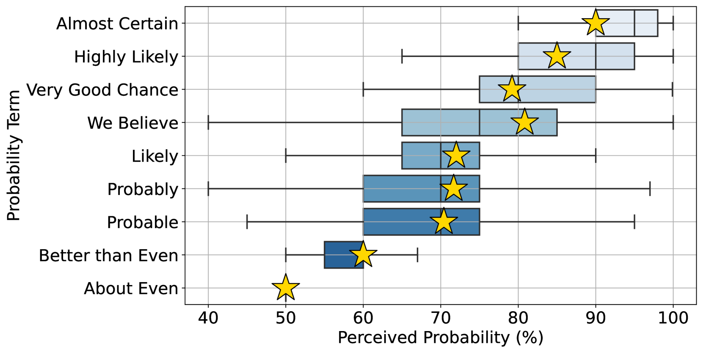
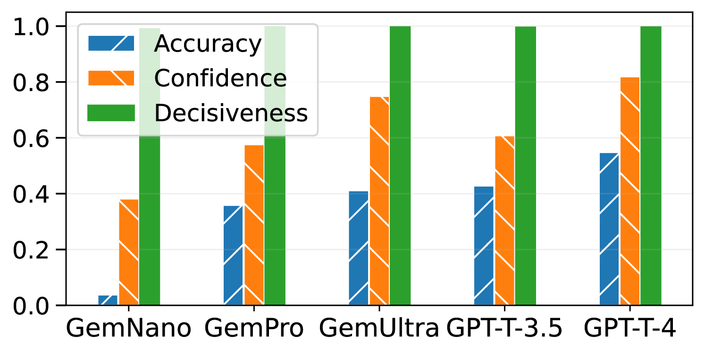
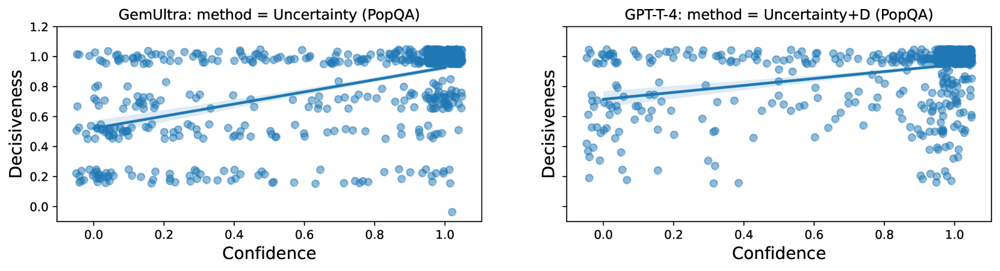
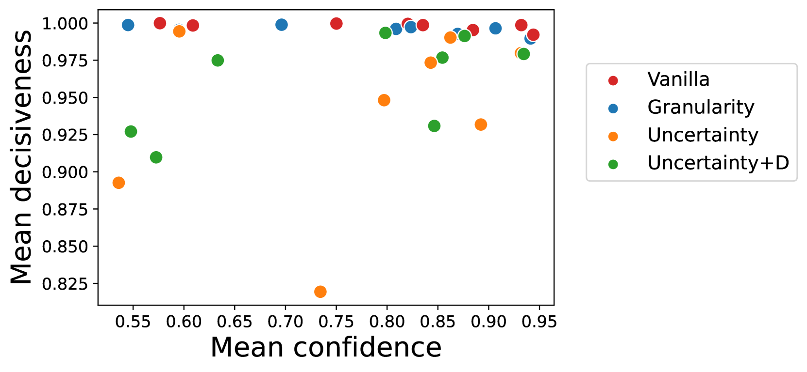
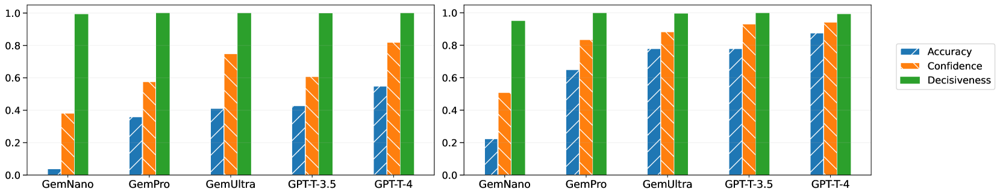

# 大型语言模型是否能准确地以言语传达其内在的不确定性？

发布时间：2024年05月27日

`LLM理论

这篇论文探讨了大型语言模型（LLMs）在表达不确定性方面的能力，并提出了一种评估方法来衡量模型在传达不确定性时的忠实度。这种研究关注的是模型的内在机制和表达方式，属于对LLM理论层面的探讨，因此应归类为LLM理论。` `问答系统`

> Can Large Language Models Faithfully Express Their Intrinsic Uncertainty in Words?

# 摘要

> 我们认为，大型语言模型（LLMs）应能以自然语言表达其内在的不确定性。例如，当LLM对同一问题给出两个相反答案的可能性相同时，其回答应通过如“我不确定，但我认为...”这样的措辞来体现这种不确定性。我们通过衡量模型对其断言的信心与表达这些断言的决断力之间的差距，来定义忠实回答的不确定性。这种基于示例的评估方法能准确判断模型是否恰当地表达了不确定性，既不鼓励过度回避，也不容忍回避不足。我们在多个知识密集型问答任务上测试了多种LLMs在传达不确定性方面的忠实度。结果显示，现代LLMs在这方面表现不佳，需要进一步优化以增强其可信度。

> We posit that large language models (LLMs) should be capable of expressing their intrinsic uncertainty in natural language. For example, if the LLM is equally likely to output two contradicting answers to the same question, then its generated response should reflect this uncertainty by hedging its answer (e.g., "I'm not sure, but I think..."). We formalize faithful response uncertainty based on the gap between the model's intrinsic confidence in the assertions it makes and the decisiveness by which they are conveyed. This example-level metric reliably indicates whether the model reflects its uncertainty, as it penalizes both excessive and insufficient hedging. We evaluate a variety of aligned LLMs at faithfully communicating uncertainty on several knowledge-intensive question answering tasks. Our results provide strong evidence that modern LLMs are poor at faithfully conveying their uncertainty, and that better alignment is necessary to improve their trustworthiness.

[Arxiv](https://arxiv.org/abs/2405.16908)