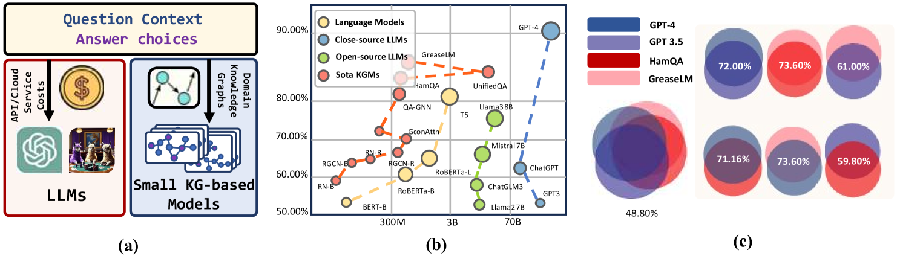
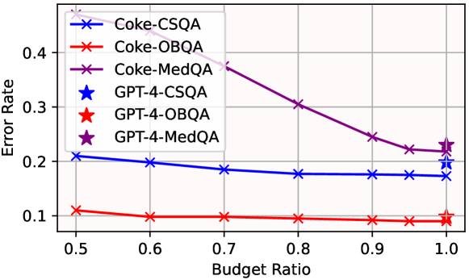
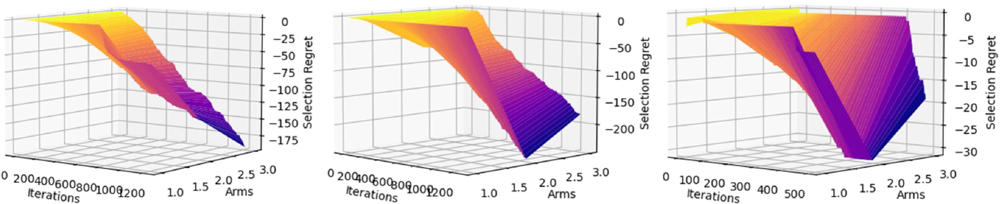
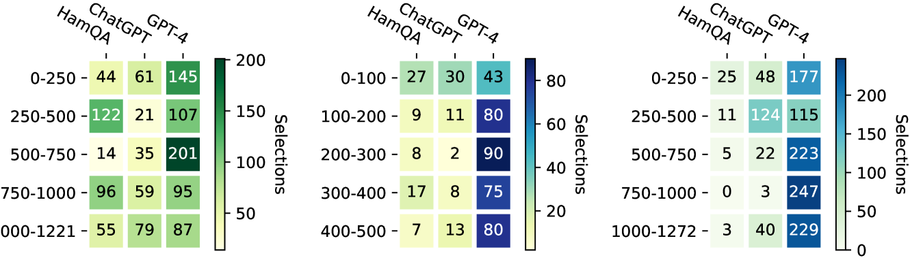
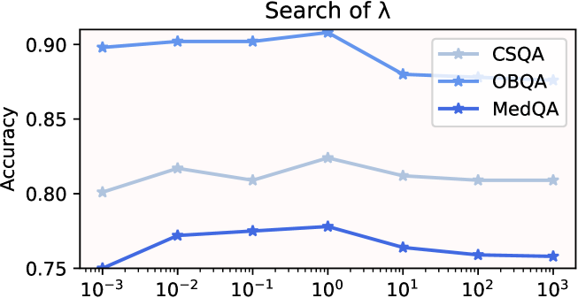

# 大型语言模型在知识驱动问答中的成本效益应用

发布时间：2024年05月27日

`LLM应用

这篇论文主要探讨了如何将大型语言模型（LLMs）与知识图谱上的小型模型（KGMs）结合，以提升基于知识的问答（KBQA）系统的推理准确性并降低成本。论文提出了一种名为Coke策略的新方法，该策略通过定制的多臂老虎机模型在预算限制下最小化对LLMs的调用，并通过上下文感知策略优化模型选择。这种方法在保持较高准确性的同时，显著降低了成本。因此，这篇论文属于LLM应用类别，因为它关注的是如何有效地应用LLMs来解决实际问题，即KBQA系统中的成本和性能优化。` `问答系统` `成本效益分析`

> Cost-efficient Knowledge-based Question Answering with Large Language Models

# 摘要

> 基于知识的问答（KBQA）在众多需要领域知识的场景中得到广泛应用。大型语言模型（LLMs）为KBQA带来了新机遇，但成本高昂且预训练时缺乏特定领域知识。我们提出将LLMs与知识图谱上的小型模型（KGMs）结合，旨在提升推理准确性并降低成本。然而，将这两个目标结合优化颇具挑战，且模型选择因知识多样性而复杂。为此，我们创新性地提出了Coke策略，一种专为KBQA设计的成本效益方案，通过定制的多臂老虎机模型，在预算限制下最小化对LLMs的调用。我们采用集群级Thompson采样设定准确性期望，并通过上下文感知策略优化，根据问题语义精准选择模型。决策受历史失败成本约束，确保成本效益。实验结果显示，Coke在保持2.74%更高准确性的同时，节省了高达20.89%的GPT-4费用，显著推动了性能边界。

> Knowledge-based question answering (KBQA) is widely used in many scenarios that necessitate domain knowledge. Large language models (LLMs) bring opportunities to KBQA, while their costs are significantly higher and absence of domain-specific knowledge during pre-training. We are motivated to combine LLMs and prior small models on knowledge graphs (KGMs) for both inferential accuracy and cost saving. However, it remains challenging since accuracy and cost are not readily combined in the optimization as two distinct metrics. It is also laborious for model selection since different models excel in diverse knowledge. To this end, we propose Coke, a novel cost-efficient strategy for KBQA with LLMs, modeled as a tailored multi-armed bandit problem to minimize calls to LLMs within limited budgets. We first formulate the accuracy expectation with a cluster-level Thompson Sampling for either KGMs or LLMs. A context-aware policy is optimized to further distinguish the expert model subject to the question semantics. The overall decision is bounded by the cost regret according to historical expenditure on failures. Extensive experiments showcase the superior performance of Coke, which moves the Pareto frontier with up to 20.89% saving of GPT-4 fees while achieving a 2.74% higher accuracy on the benchmark datasets.

[Arxiv](https://arxiv.org/abs/2405.17337)