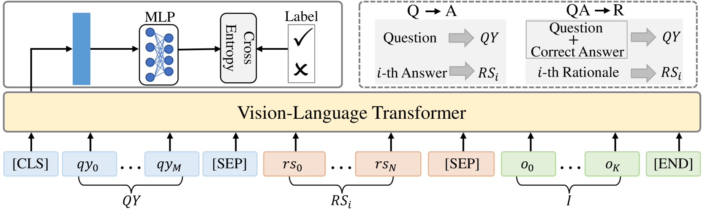
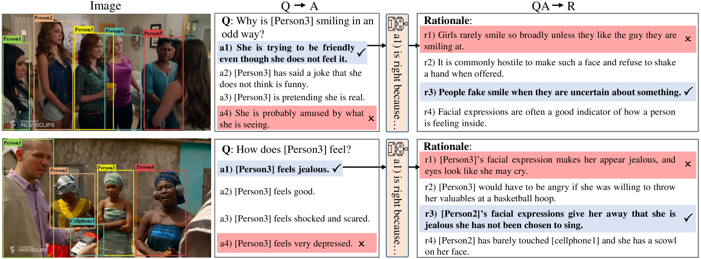
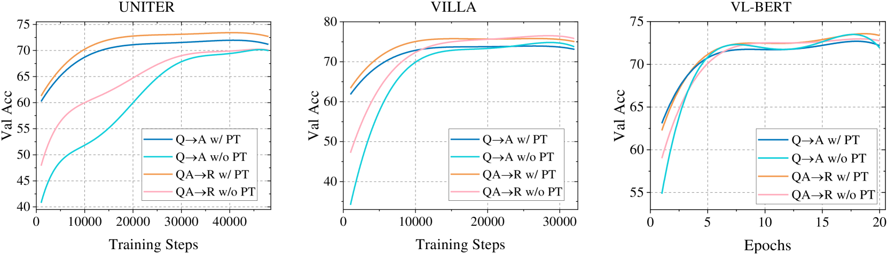
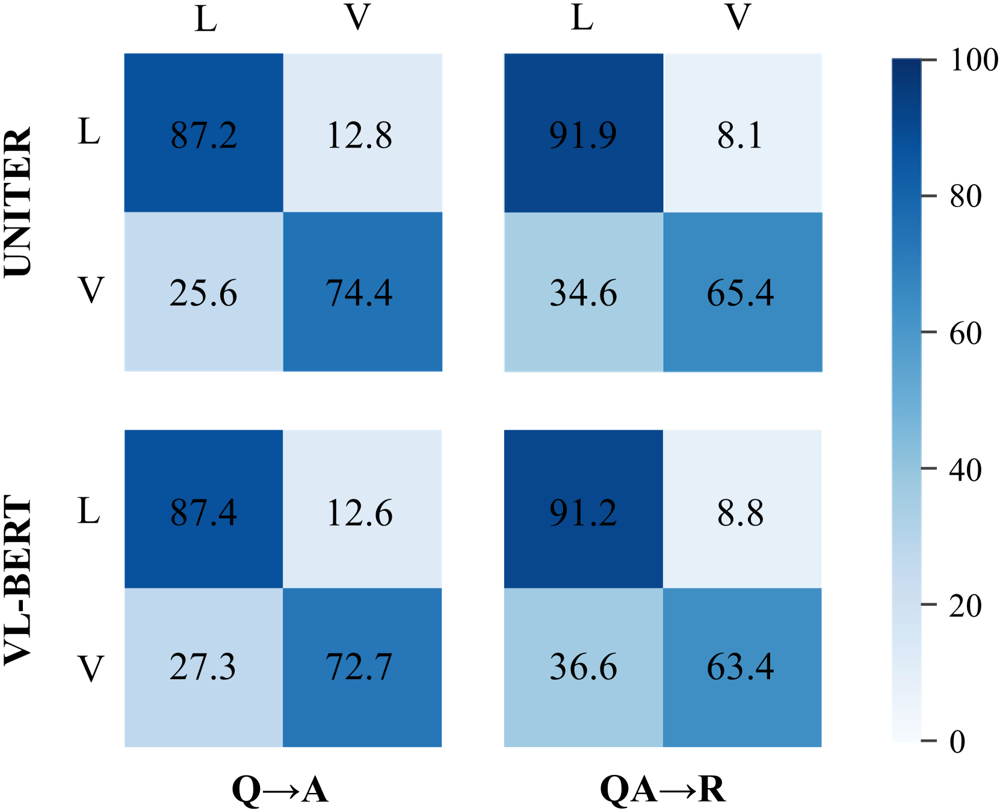
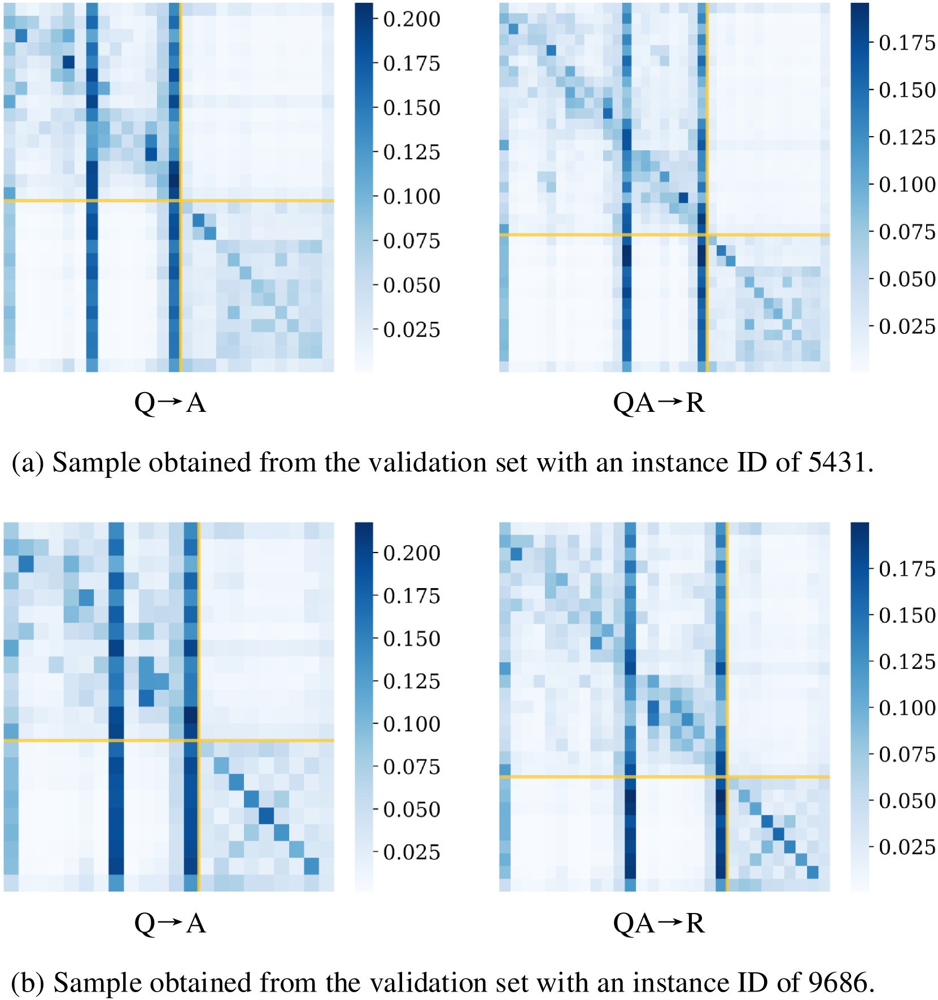
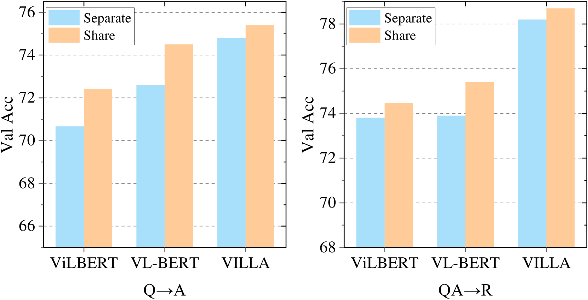
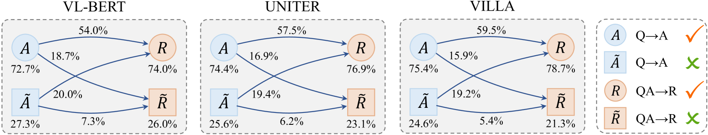
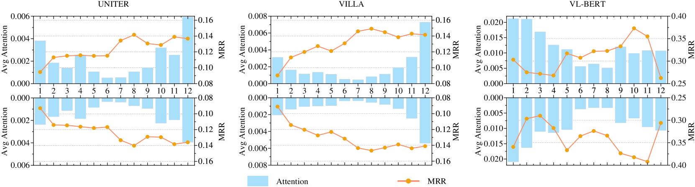

# 视觉-语言 Transformer 是否具备视觉常识？本研究通过实证分析 VCR 任务，探讨这一问题。

发布时间：2024年05月27日

`LLM理论

理由：这篇论文主要探讨了视觉语言转换器（VL转换器）在视觉常识推理（VCR）任务中的局限性，并提出了改进的方向。虽然涉及到了模型的应用（VCR任务），但其核心内容是对现有VL转换器模型的理论分析和批评，以及对未来研究方向的建议，这些内容更偏向于对大型语言模型（LLM）的理论探讨和改进建议，而非具体的应用实例或Agent的设计。因此，将其归类为LLM理论更为合适。` `视觉推理` `人工智能`

> Do Vision-Language Transformers Exhibit Visual Commonsense? An Empirical Study of VCR

# 摘要

> 视觉常识推理（VCR）要求模型在回答视觉场景问题时，提供合理的解释。为此，模型需给出预测答案的合理解释。视觉语言转换器（VL转换器）的最新进展推动了VCR基准数据集的发展，这些模型先在大型视觉文本数据集上预训练，再应用于VCR任务。尽管性能优异，本文指出VL转换器并未真正掌握VCR的核心——视觉常识。实证研究表明，现有VL转换器存在预训练收益有限、语言偏见、模型架构不适用于紧密关联的两个子任务、忽视对象与标签间的重要关联等问题。基于此，我们提出了未来研究方向，包括改进数据集、评估指标和训练策略，以期激发对VCR本质的再思考，助力解决视觉推理的难题。

> Visual Commonsense Reasoning (VCR) calls for explanatory reasoning behind question answering over visual scenes. To achieve this goal, a model is required to provide an acceptable rationale as the reason for the predicted answers. Progress on the benchmark dataset stems largely from the recent advancement of Vision-Language Transformers (VL Transformers). These models are first pre-trained on some generic large-scale vision-text datasets, and then the learned representations are transferred to the downstream VCR task. Despite their attractive performance, this paper posits that the VL Transformers do not exhibit visual commonsense, which is the key to VCR. In particular, our empirical results pinpoint several shortcomings of existing VL Transformers: small gains from pre-training, unexpected language bias, limited model architecture for the two inseparable sub-tasks, and neglect of the important object-tag correlation. With these findings, we tentatively suggest some future directions from the aspect of dataset, evaluation metric, and training tricks. We believe this work could make researchers revisit the intuition and goals of VCR, and thus help tackle the remaining challenges in visual reasoning.

[Arxiv](https://arxiv.org/abs/2405.16934)