# EMERGE：融合 RAG 技术，优化多模态电子健康记录的预测模型构建

发布时间：2024年05月27日

`RAG

理由：这篇论文介绍了一个基于检索增强生成（RAG）的框架EMERGE，用于提升多模态电子健康记录（EHR）数据的预测能力。该框架利用大型语言模型（LLMs）从时间序列数据和临床笔记中提取实体，并与专业医学知识图谱对齐，以增强医学知识的准确性和一致性。此外，EMERGE还通过自适应多模态融合网络将提取的知识与其他模态数据融合，用于生成患者健康状况的任务相关摘要。论文中的实验结果表明，EMERGE在临床预测任务中表现出色，这表明该论文主要关注的是RAG技术在医疗领域的应用。因此，将其分类为RAG。` `精准医疗`

> EMERGE: Integrating RAG for Improved Multimodal EHR Predictive Modeling

# 摘要

> 多模态电子健康记录（EHR）数据的整合显著提升了临床预测能力。然而，现有模型在使用临床笔记和多变量时间序列EHR数据时，往往缺乏精确临床任务所需的医学背景。为此，我们提出了EMERGE框架，这是一个基于检索增强生成（RAG）的先进系统，旨在提升多模态EHR的预测能力。EMERGE通过大型语言模型（LLMs）从时间序列数据和临床笔记中提取实体，并与专业PrimeKG对齐，确保了医学知识的一致性。此外，我们不仅关注三元组关系，还包含了实体的详细定义和描述，以丰富语义信息。提取的知识用于生成患者健康状况的任务相关摘要，这些摘要通过自适应多模态融合网络与其他模态数据融合。在MIMIC-III和MIMIC-IV数据集上的实验表明，EMERGE在院内死亡率和30天再入院预测任务中表现出色，超越了传统模型。详细的消融研究和分析证实了EMERGE框架中每个模块的有效性及其对数据稀疏性的强鲁棒性。EMERGE不仅提升了多模态EHR数据的应用，还弥合了复杂医学背景与临床预测之间的差距，为精准医疗提供了有力支持。

> The integration of multimodal Electronic Health Records (EHR) data has notably advanced clinical predictive capabilities. However, current models that utilize clinical notes and multivariate time-series EHR data often lack the necessary medical context for precise clinical tasks. Previous methods using knowledge graphs (KGs) primarily focus on structured knowledge extraction. To address this, we propose EMERGE, a Retrieval-Augmented Generation (RAG) driven framework aimed at enhancing multimodal EHR predictive modeling. Our approach extracts entities from both time-series data and clinical notes by prompting Large Language Models (LLMs) and aligns them with professional PrimeKG to ensure consistency. Beyond triplet relationships, we include entities' definitions and descriptions to provide richer semantics. The extracted knowledge is then used to generate task-relevant summaries of patients' health statuses. These summaries are fused with other modalities utilizing an adaptive multimodal fusion network with cross-attention. Extensive experiments on the MIMIC-III and MIMIC-IV datasets for in-hospital mortality and 30-day readmission tasks demonstrate the superior performance of the EMERGE framework compared to baseline models. Comprehensive ablation studies and analyses underscore the efficacy of each designed module and the framework's robustness to data sparsity. EMERGE significantly enhances the use of multimodal EHR data in healthcare, bridging the gap with nuanced medical contexts crucial for informed clinical predictions.

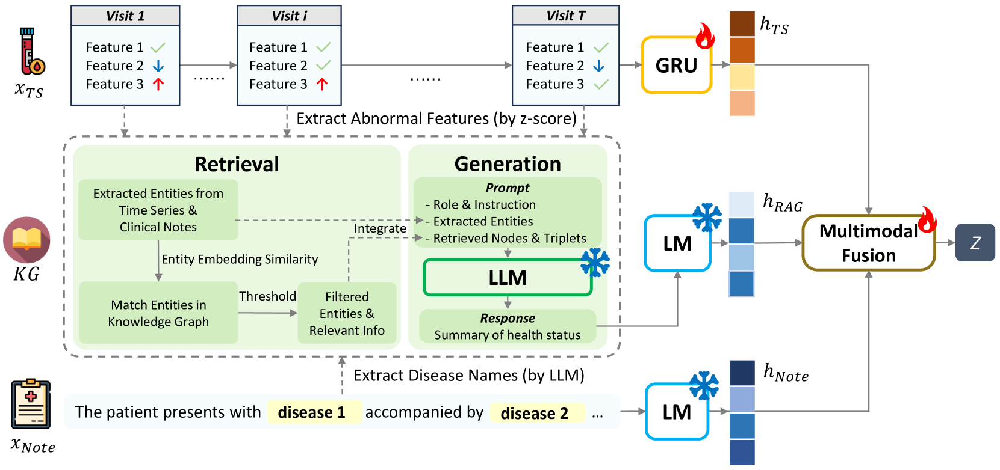

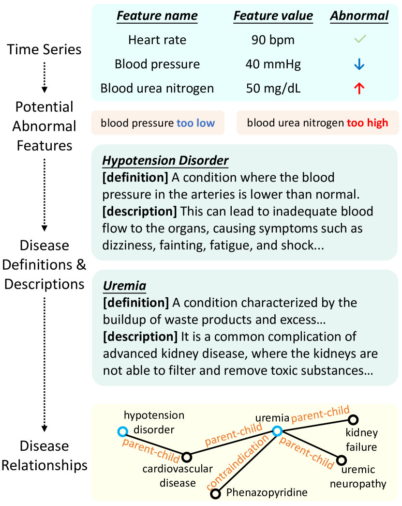

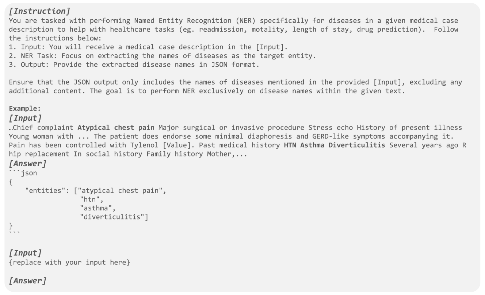

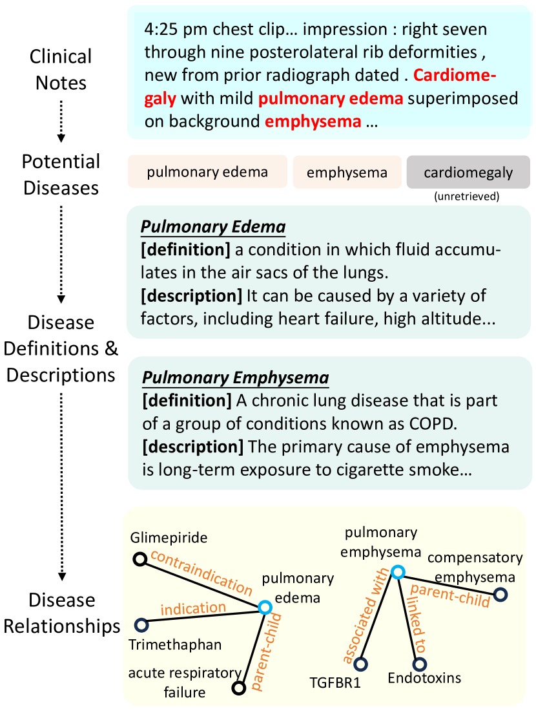

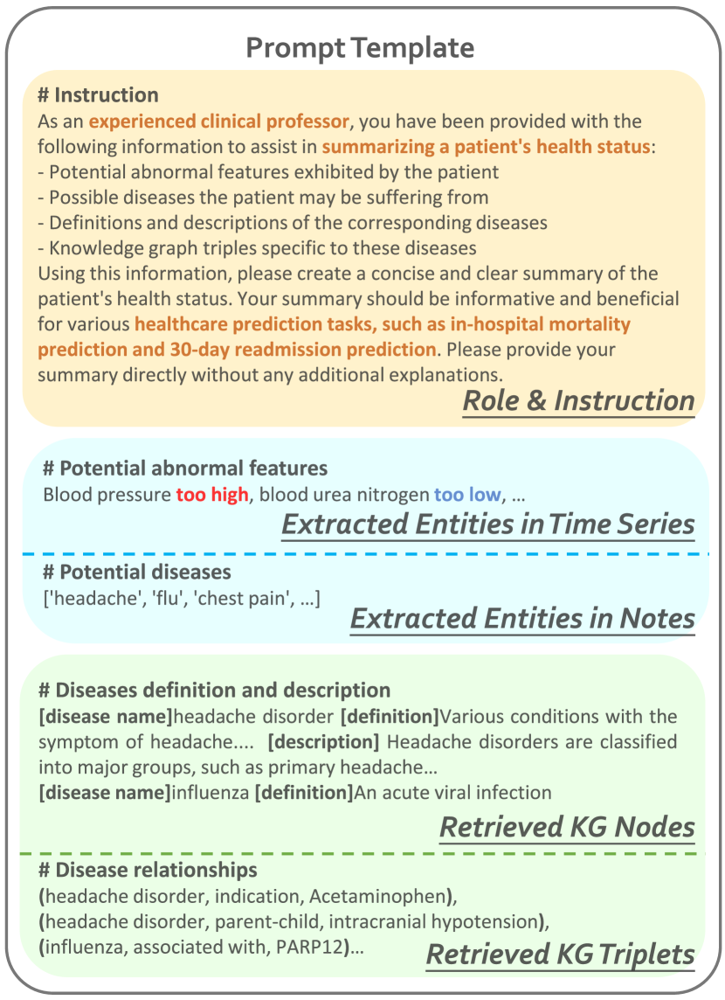

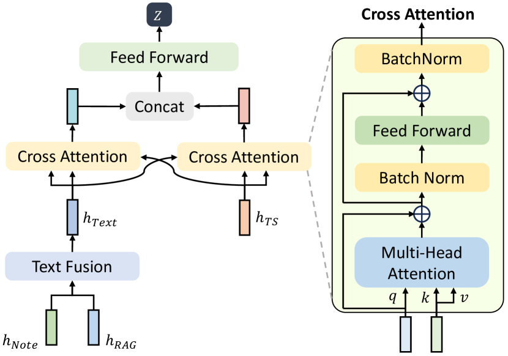

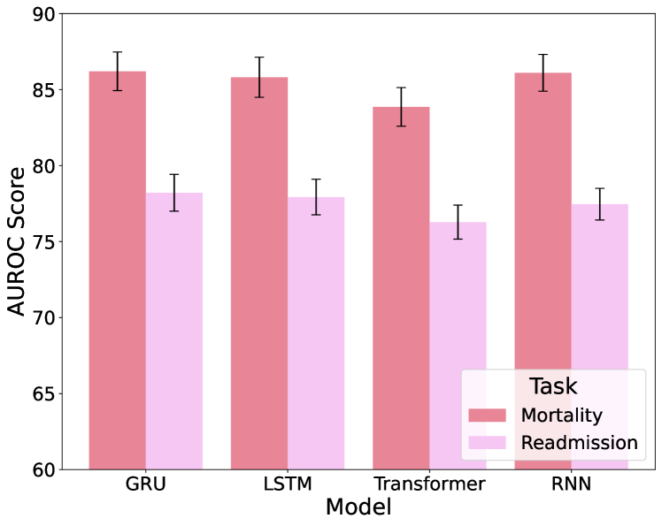

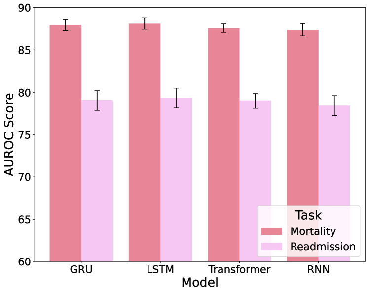

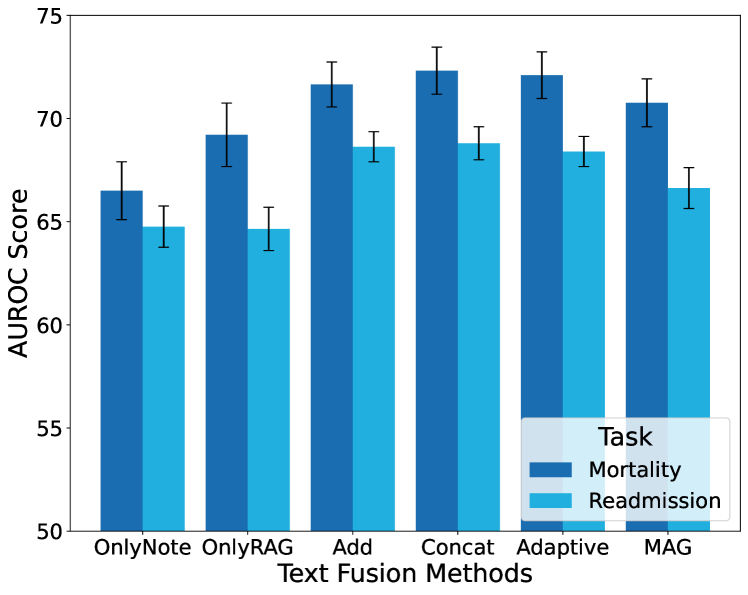

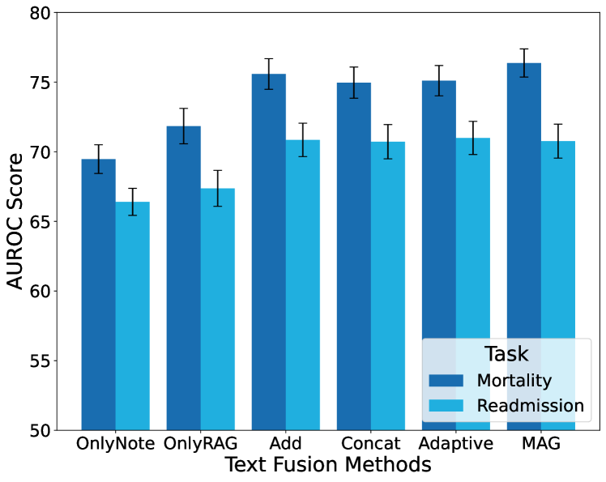

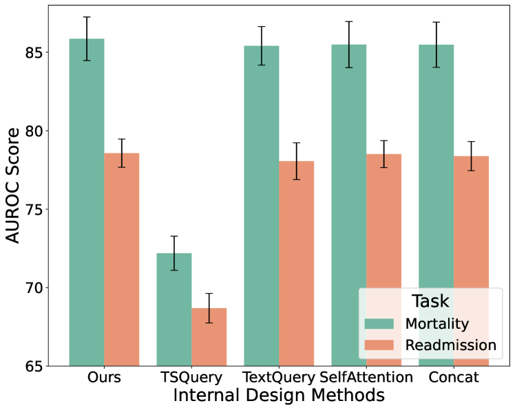

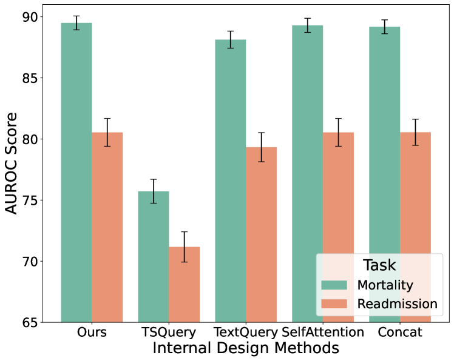

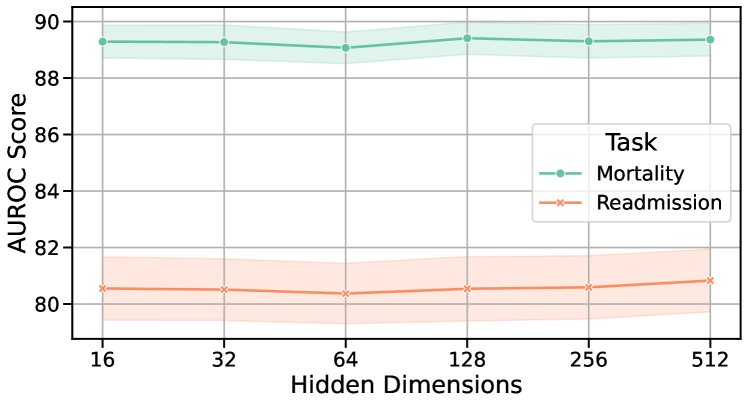

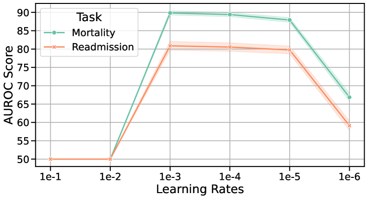

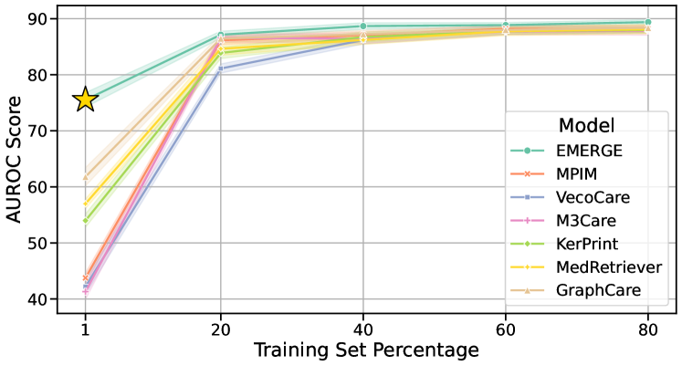

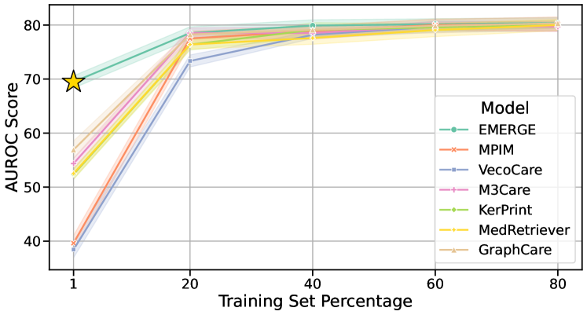

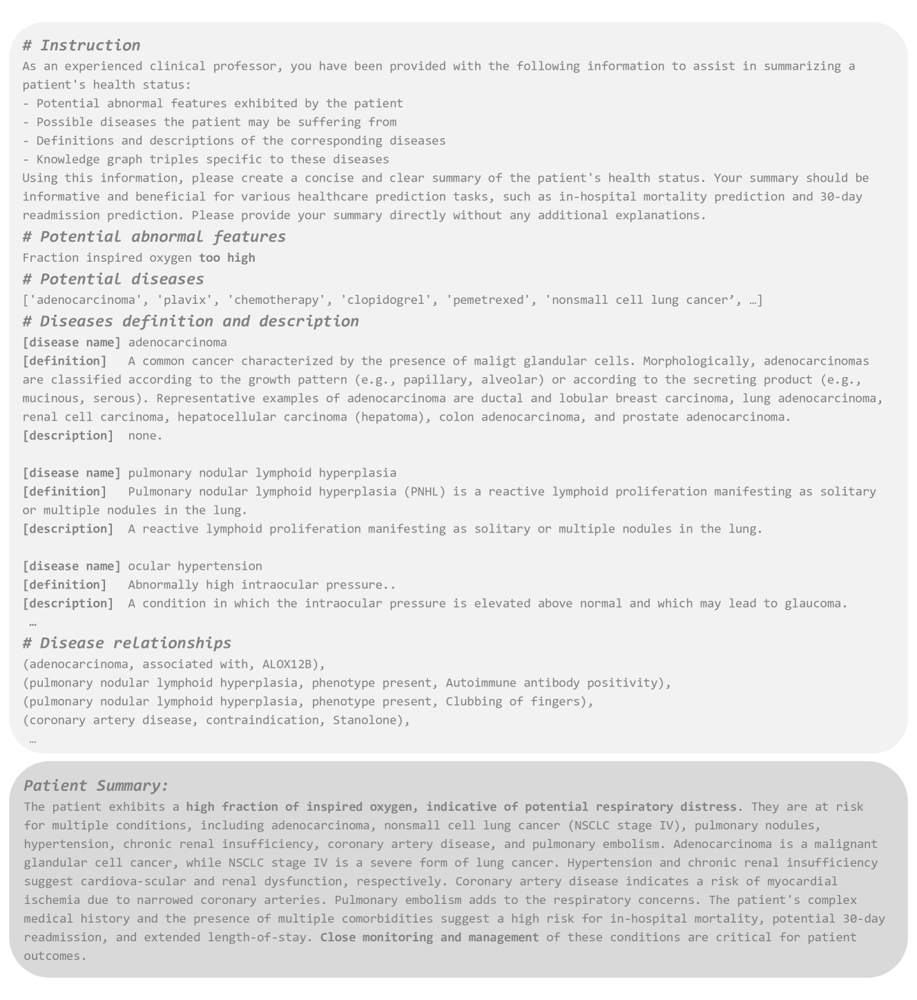

[Arxiv](https://arxiv.org/abs/2406.00036)