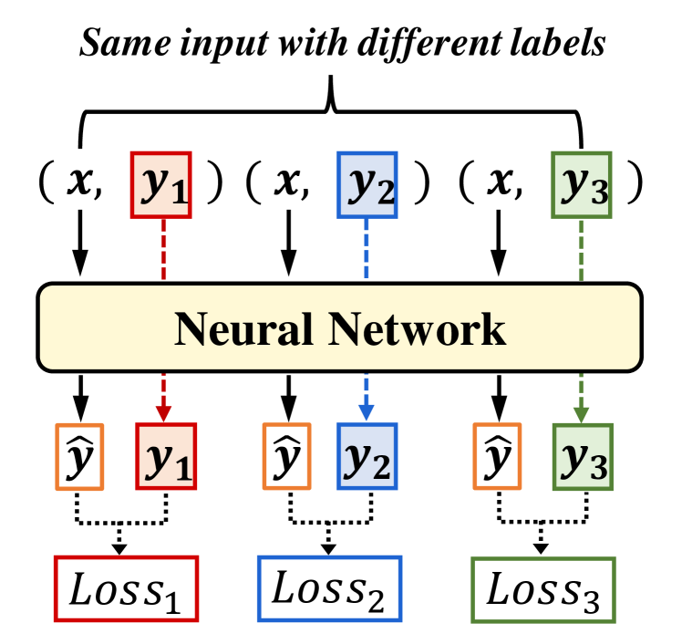
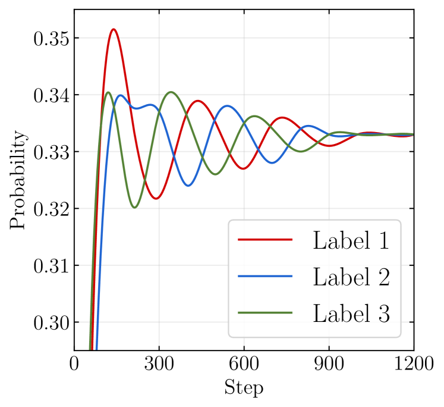
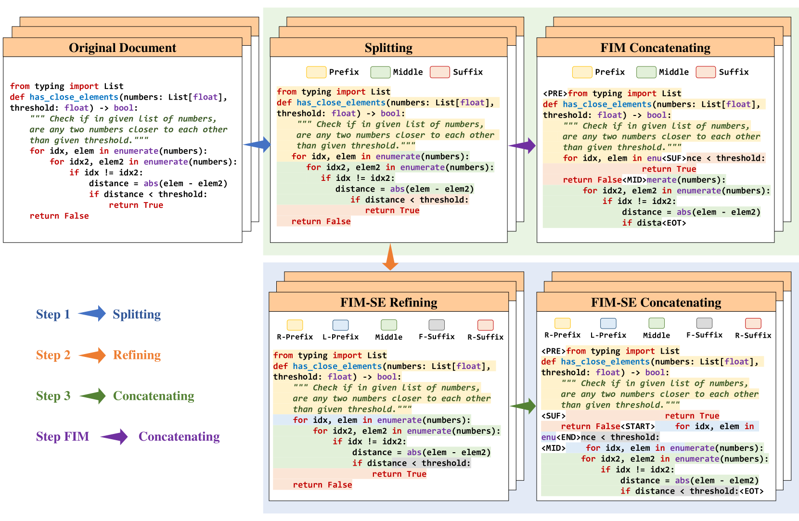
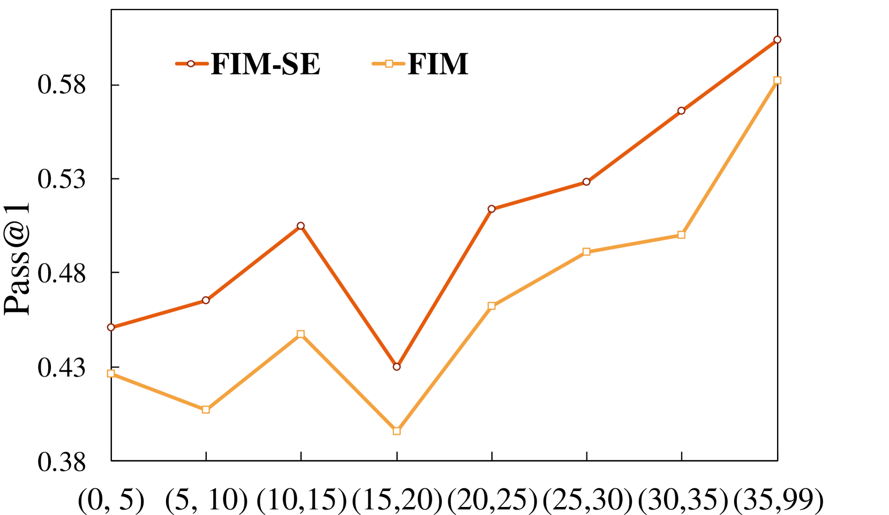

# 消除子词，提升字符级文本填充的效能

发布时间：2024年05月27日

`LLM应用

这篇论文介绍了一种名为 FIM-SE 的方法，用于解决字符级填充任务中的问题。该方法通过引入特殊的起始和结束字符约束，以及在行级格式中避免预测子令牌，从而提高了字符级填充任务的性能。这种方法直接应用于大型语言模型（LLM）的实际应用场景中，特别是在处理文本填充任务时，因此属于LLM应用分类。` `数据填充`

> Empowering Character-level Text Infilling by Eliminating Sub-Tokens

# 摘要

> 在填充任务中，子令牌常出现在词的分割点，如前缀、中间和后缀的边界。传统方法在令牌级别训练模型，导致字符级填充任务的推理性能不佳。有些方法尝试字符级填充，但依赖于预测子令牌，这因模型对子令牌的高困惑度而降低了性能。本文提出的 FIM-SE 方法，即带有起始和结束字符约束的中间填充，通过行级格式避免预测子令牌，有效解决了字符级填充问题。我们还引入了两个特殊令牌，以指导生成不完整行的余下部分。实验证明，我们的方法显著优于以往方法。相关代码已发布于 https://github.com/SenseLLM/FIM-SE。

> In infilling tasks, sub-tokens, representing instances where a complete token is segmented into two parts, often emerge at the boundaries of prefixes, middles, and suffixes. Traditional methods focused on training models at the token level, leading to sub-optimal performance in character-level infilling tasks during the inference stage. Alternately, some approaches considered character-level infilling, but they relied on predicting sub-tokens in inference, yet this strategy diminished ability in character-level infilling tasks due to the large perplexity of the model on sub-tokens. In this paper, we introduce FIM-SE, which stands for Fill-In-the-Middle with both Starting and Ending character constraints. The proposed method addresses character-level infilling tasks by utilizing a line-level format to avoid predicting any sub-token in inference. In addition, we incorporate two special tokens to signify the rest of the incomplete lines, thereby enhancing generation guidance. Extensive experiments demonstrate that our proposed approach surpasses previous methods, offering a significant advantage. Code is available at https://github.com/SenseLLM/FIM-SE.

[Arxiv](https://arxiv.org/abs/2405.17103)