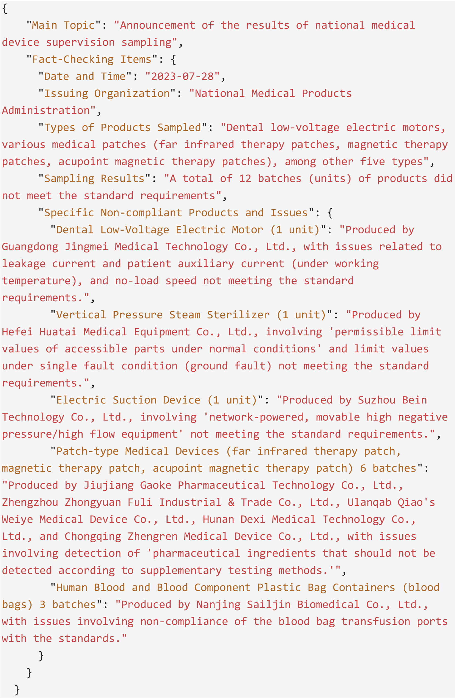

# 借助自我学习，大型语言模型得以自主构建知识检索的索引器，这一过程不仅提升了模型的自主性，也增强了其知识处理的能力。

发布时间：2024年05月27日

`RAG

理由：这篇论文主要介绍了一种名为 Pseudo-Graph Retrieval-Augmented Generation (PG-RAG) 的新框架，该框架旨在改进大型语言模型 (LLMs) 的知识注入过程。PG-RAG 通过创建一个伪图数据库来模拟人类的学习和检索行为，从而提高 LLMs 在问答任务中的性能。这种方法直接关联到 Retrieval-Augmented Generation (RAG) 的概念，即通过检索增强生成过程来提升语言模型的性能。因此，这篇论文应归类为RAG。` `问答系统` `知识图谱`

> Empowering Large Language Models to Set up a Knowledge Retrieval Indexer via Self-Learning

# 摘要

> Retrieval-Augmented Generation (RAG) 为大型语言模型 (LLMs) 注入实时知识提供了一种经济高效的方法。然而，构建和验证高质量知识库的过程颇为繁琐。我们提出的 Pseudo-Graph Retrieval-Augmented Generation (PG-RAG) 框架，将 LLMs 比作学生，通过提供大量原始阅读材料，鼓励其自主阅读并用自己的语言记录事实信息，形成一个简洁有序的伪图数据库。在检索时，PG-RAG 模仿人类翻阅笔记的行为，寻找事实路径并深入相关上下文。遵循“多数人选择的路径最佳”的原则，PG-RAG 整合了高度证实的事实路径，为 LLMs 提供了一个结构化和精炼的子图。我们在三个专业问答数据集上验证了 PG-RAG 的效果，其在单文档任务中显著优于当前最佳基线 KGP-LLaMA，平均性能提升达 11.6%，特别是在 BLEU 分数和 QE-F1 指标上分别提升了约 14.3% 和 23.7%。在多文档场景中，PG-RAG 的平均指标至少比最佳基线高 2.35%，BLEU 分数和 QE-F1 指标分别稳定提升了约 7.55% 和 12.75%。我们的代码已开源：https://github.com/IAAR-Shanghai/PGRAG。

> Retrieval-Augmented Generation (RAG) offers a cost-effective approach to injecting real-time knowledge into large language models (LLMs). Nevertheless, constructing and validating high-quality knowledge repositories require considerable effort. We propose a pre-retrieval framework named Pseudo-Graph Retrieval-Augmented Generation (PG-RAG), which conceptualizes LLMs as students by providing them with abundant raw reading materials and encouraging them to engage in autonomous reading to record factual information in their own words. The resulting concise, well-organized mental indices are interconnected through common topics or complementary facts to form a pseudo-graph database. During the retrieval phase, PG-RAG mimics the human behavior in flipping through notes, identifying fact paths and subsequently exploring the related contexts. Adhering to the principle of the path taken by many is the best, it integrates highly corroborated fact paths to provide a structured and refined sub-graph assisting LLMs. We validated PG-RAG on three specialized question-answering datasets. In single-document tasks, PG-RAG significantly outperformed the current best baseline, KGP-LLaMA, across all key evaluation metrics, with an average overall performance improvement of 11.6%. Specifically, its BLEU score increased by approximately 14.3%, and the QE-F1 metric improved by 23.7%. In multi-document scenarios, the average metrics of PG-RAG were at least 2.35% higher than the best baseline. Notably, the BLEU score and QE-F1 metric showed stable improvements of around 7.55% and 12.75%, respectively. Our code: https://github.com/IAAR-Shanghai/PGRAG.

[Arxiv](https://arxiv.org/abs/2405.16933)