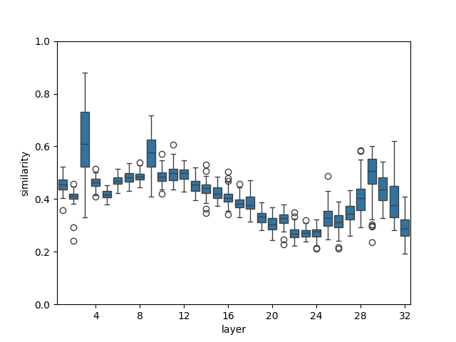
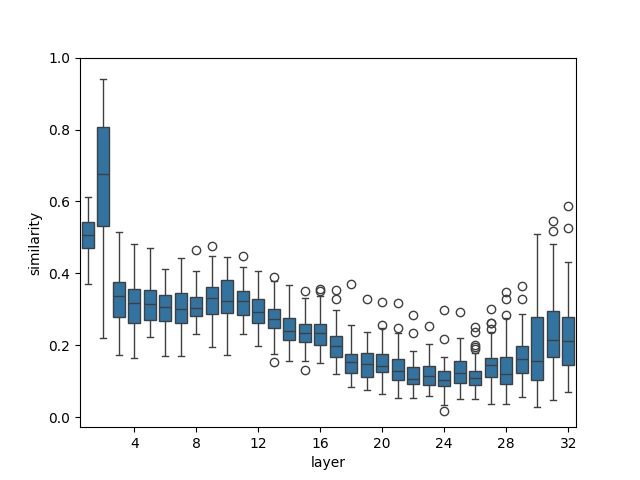
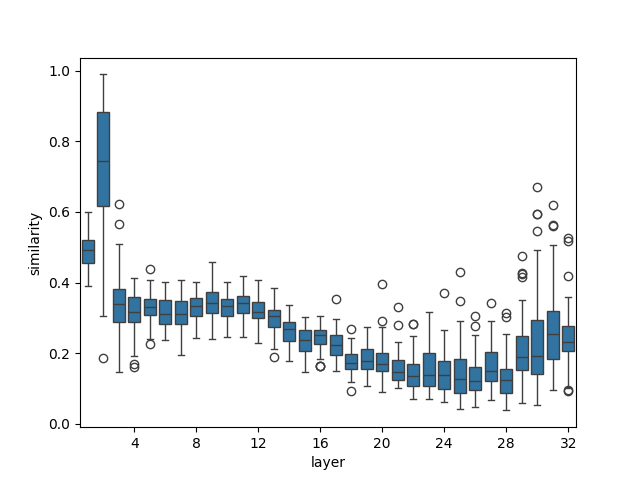
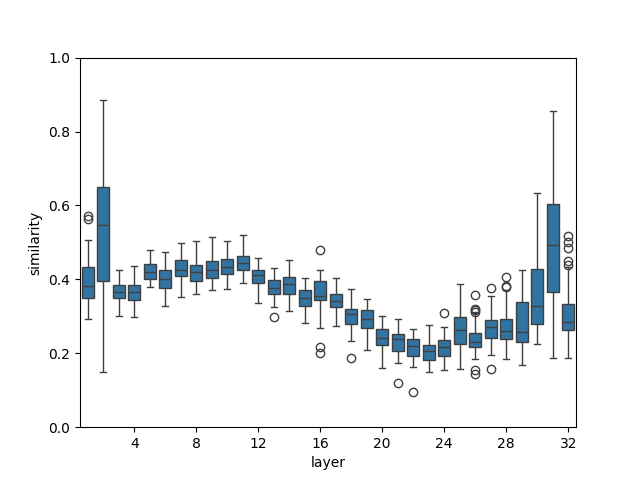
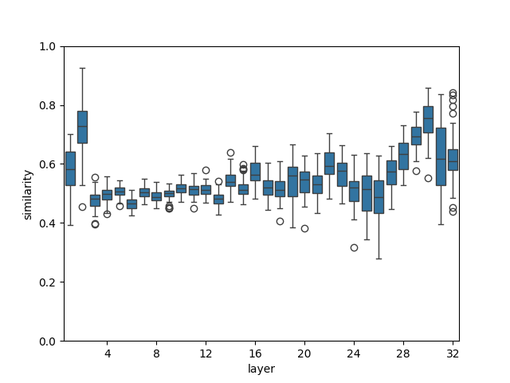

# 揭示语言模型参数的激活奥秘

发布时间：2024年05月27日

`LLM理论

理由：这篇论文主要探讨了大型语言模型（LLMs）内部参数的激活行为，提出了一种基于梯度的度量方法来评估模型参数的激活程度，并通过实验验证了不同层次参数在不同输入情况下的激活模式。这些研究内容涉及对LLMs内部工作机制的深入理解，属于理论层面的探讨，因此归类为LLM理论。` `模型优化`

> Exploring Activation Patterns of Parameters in Language Models

# 摘要

> 多数研究将大型语言模型看作黑箱，对其内部运作机制缺乏深入洞察。为此，我们提出了一种基于梯度的度量，用以评估模型参数的激活程度。通过这一度量，我们获得了三个初步洞见：(1) 当输入同属一领域时，浅层参数活跃度高，对输出影响显著；而深层参数则相对稀疏激活。(2) 跨领域输入时，浅层参数的激活模式相似度高于深层。(3) 深层中，激活参数的分布相似性与数据相关性正相关。为了验证这些发现，我们进行了三项实验：(1) 首先，针对第一个发现，我们为不同层设定不同剪枝比例，发现此举能优化模型剪枝效果。(2) 其次，我们发现基于特定校准集剪枝的模型在处理相关任务时表现更佳，证实了第二个发现。(3) 最后，通过STS-B和SICK基准测试，我们观察到语义一致的句子在深层共享相似的参数激活模式，与第三个发现相吻合。我们的研究为理解LLMs中参数激活行为提供了新视角，并期待这些发现能激发更多实际应用的创新。

> Most work treats large language models as black boxes without in-depth understanding of their internal working mechanism. In order to explain the internal representations of LLMs, we propose a gradient-based metric to assess the activation level of model parameters. Based on this metric, we obtain three preliminary findings. (1) When the inputs are in the same domain, parameters in the shallow layers will be activated densely, which means a larger portion of parameters will have great impacts on the outputs. In contrast, parameters in the deep layers are activated sparsely. (2) When the inputs are across different domains, parameters in shallow layers exhibit higher similarity in the activation behavior than deep layers. (3) In deep layers, the similarity of the distributions of activated parameters is positively correlated to the empirical data relevance. Further, we develop three validation experiments to solidify these findings. (1) Firstly, starting from the first finding, we attempt to configure different prune ratios for different layers, and find this method can benefit model pruning. (2) Secondly, we find that a pruned model based on one calibration set can better handle tasks related to the calibration task than those not related, which validate the second finding. (3) Thirdly, Based on the STS-B and SICK benchmark, we find that two sentences with consistent semantics tend to share similar parameter activation patterns in deep layers, which aligns with our third finding. Our work sheds light on the behavior of parameter activation in LLMs, and we hope these findings will have the potential to inspire more practical applications.

[Arxiv](https://arxiv.org/abs/2405.17799)