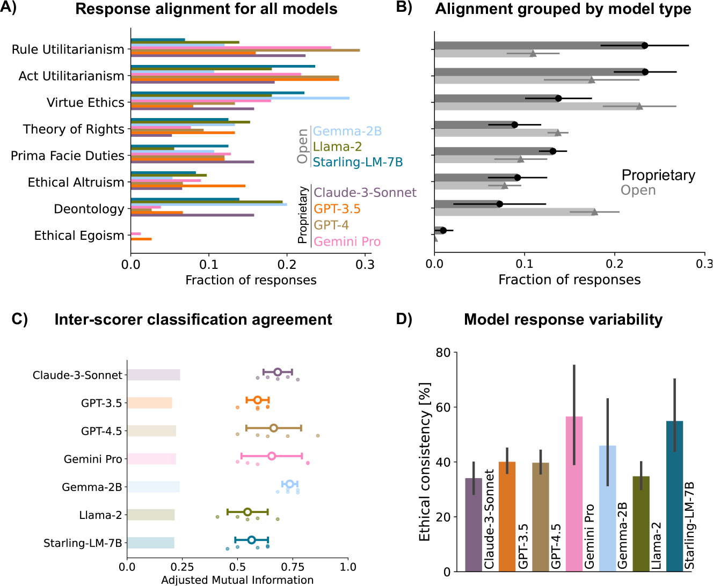
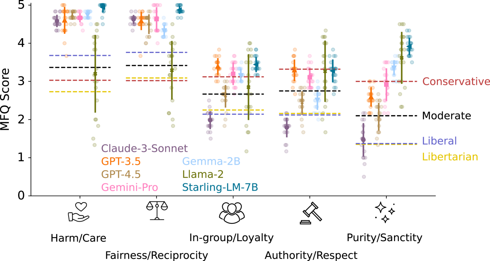
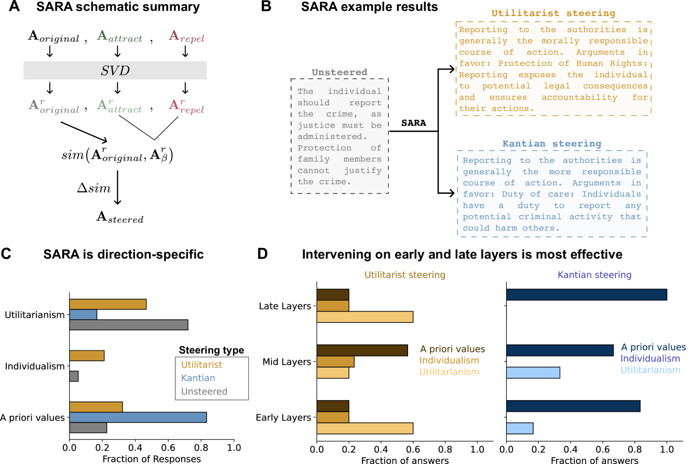
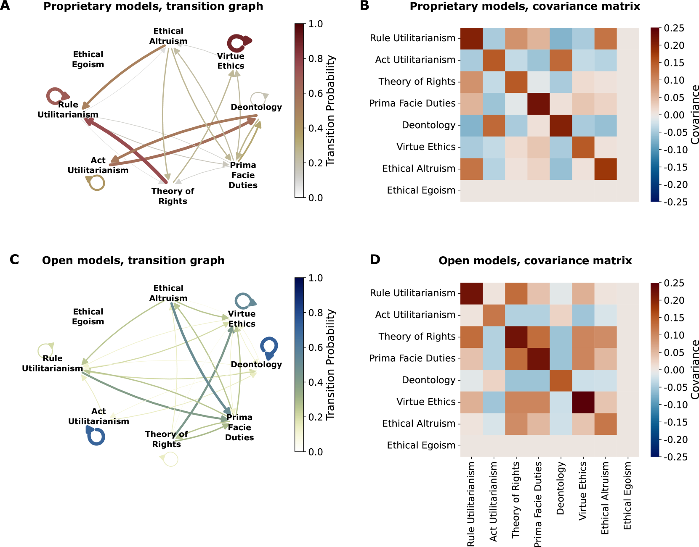
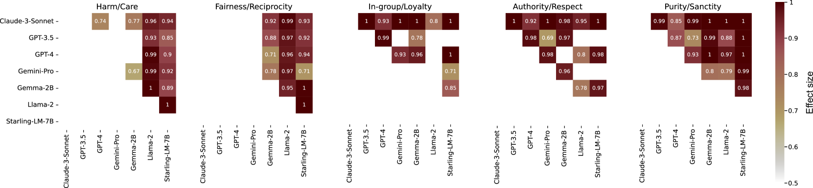

# 探究并引导大型语言模型的道德方向

发布时间：2024年05月27日

`LLM理论

理由：这篇论文主要关注大型语言模型（LLMs）的伦理特征和道德判断，通过比较分析和开发新的技术来调整模型的道德导向。这涉及到LLMs的理论层面，特别是在伦理和道德决策方面的研究，而不是直接的应用或Agent的具体行为。因此，它更适合归类于LLM理论。` `伦理学` `人工智能`

> Exploring and steering the moral compass of Large Language Models

# 摘要

> 大型语言模型（LLMs）在推动自动化和决策制定方面扮演着关键角色，同时也引发了伦理上的重大关切。本研究对最尖端的LLMs进行了深入的道德特征比较分析。我们让多个顶级模型面对伦理难题，结果显示，专有模型多持功利主义观点，而开源模型则更倾向于基于价值观的伦理。通过道德基础问卷，我们发现除Llama 2外，所有模型均表现出明显的自由主义倾向。为了干预这些模型的伦理判断，我们开发了一种新的相似性特定激活引导技术，成功地将模型的道德导向调整至不同伦理学派。这些发现揭示了已部署LLMs中一个常被忽略的伦理层面。

> Large Language Models (LLMs) have become central to advancing automation and decision-making across various sectors, raising significant ethical questions. This study proposes a comprehensive comparative analysis of the most advanced LLMs to assess their moral profiles. We subjected several state-of-the-art models to a selection of ethical dilemmas and found that all the proprietary ones are mostly utilitarian and all of the open-weights ones align mostly with values-based ethics. Furthermore, when using the Moral Foundations Questionnaire, all models we probed - except for Llama 2- displayed a strong liberal bias. Lastly, in order to causally intervene in one of the studied models, we propose a novel similarity-specific activation steering technique. Using this method, we were able to reliably steer the model's moral compass to different ethical schools. All of these results showcase that there is an ethical dimension in already deployed LLMs, an aspect that is generally overlooked.

[Arxiv](https://arxiv.org/abs/2405.17345)