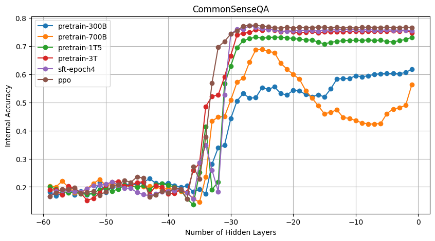
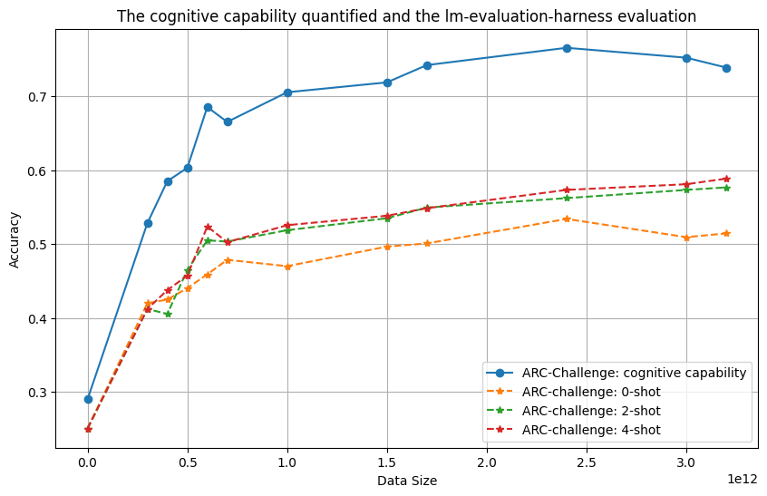

# 通过线性表示，探索大型语言模型从认知到表达的演进之旅

发布时间：2024年05月27日

`LLM理论

这篇论文主要探讨了大型语言模型（如百川-7B和百川-33B）中的认知与表达能力的演化及其相互影响。研究内容涉及模型的预训练、监督微调及人类反馈强化学习等阶段，以及这些能力的发展轨迹的理论基础和模型架构的关系。此外，还评估了小样本学习等策略以弥合认知与表达能力间的差距。这些内容主要关注于LLM的理论层面，包括模型内部机制的分析和理论探讨，因此适合归类为LLM理论。` `人工智能`

> Exploring the LLM Journey from Cognition to Expression with Linear Representations

# 摘要

> 本文深入分析了大型语言模型（如百川-7B和百川-33B）中认知与表达能力的演化及其相互影响。通过预训练、监督微调及人类反馈强化学习三个阶段，我们定义并探讨了这些能力。认知能力指模型内部神经元输出向量传递信息的质量与数量，类似人类认知的神经信号处理。表达能力则是模型生成单词级输出的能力。研究发现，认知能力在预训练阶段基本形成，而表达能力则在后续阶段显著提升。统计分析显示，两者间存在显著相关，暗示认知能力可能制约表达潜力。此外，本文还探讨了这些发展轨迹的理论基础及其与模型架构的关系，并评估了如小样本学习等策略，以弥合认知与表达能力间的差距。此研究揭示了隐藏空间与输出空间间的联系，为理解训练过程的可解释性与可控性提供了新视角。

> This paper presents an in-depth examination of the evolution and interplay of cognitive and expressive capabilities in large language models (LLMs), with a specific focus on Baichuan-7B and Baichuan-33B, an advanced bilingual (Chinese and English) LLM series. We define and explore the model's cognitive and expressive capabilities through linear representations across three critical phases: Pretraining, Supervised Fine-Tuning (SFT), and Reinforcement Learning from Human Feedback (RLHF). Cognitive capability is defined as the quantity and quality of information conveyed by the neuron output vectors within the network, similar to the neural signal processing in human cognition. Expressive capability is defined as the model's capability to produce word-level output. Our findings unveil a sequential development pattern, where cognitive abilities are largely established during Pretraining, whereas expressive abilities predominantly advance during SFT and RLHF. Statistical analyses confirm a significant correlation between the two capabilities, suggesting that cognitive capacity may limit expressive potential. The paper also explores the theoretical underpinnings of these divergent developmental trajectories and their connection to the LLMs' architectural design. Moreover, we evaluate various optimization-independent strategies, such as few-shot learning and repeated sampling, which bridge the gap between cognitive and expressive capabilities. This research reveals the potential connection between the hidden space and the output space, contributing valuable insights into the interpretability and controllability of their training processes.

[Arxiv](https://arxiv.org/abs/2405.16964)