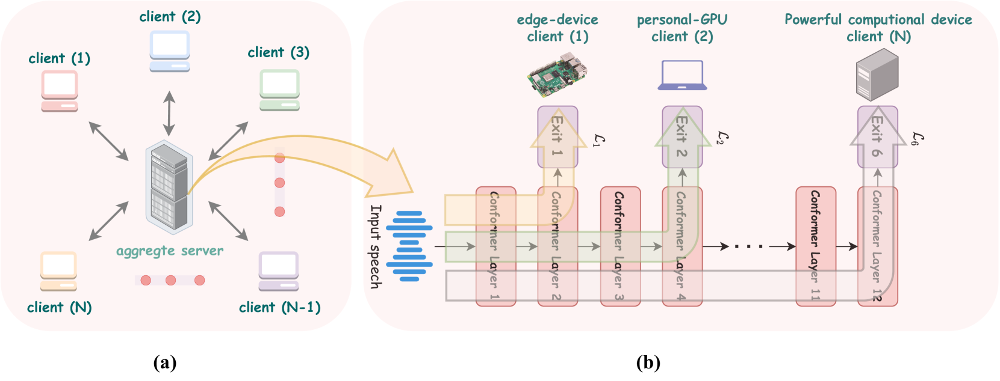
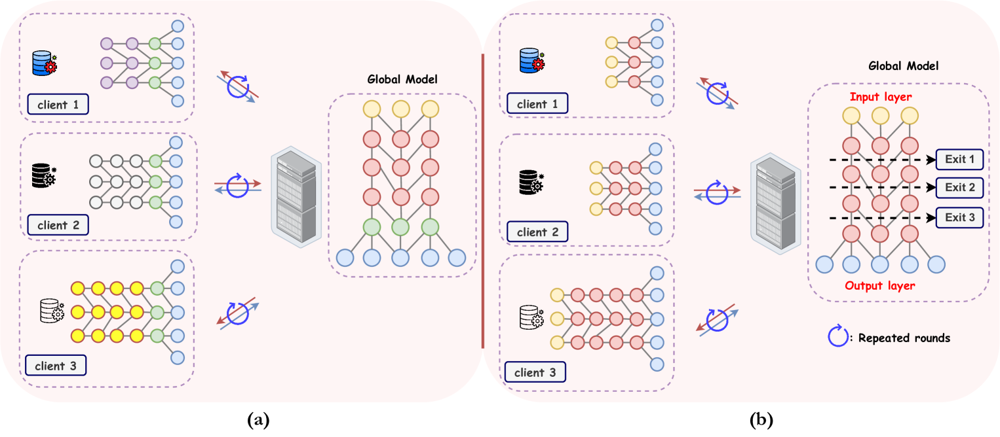
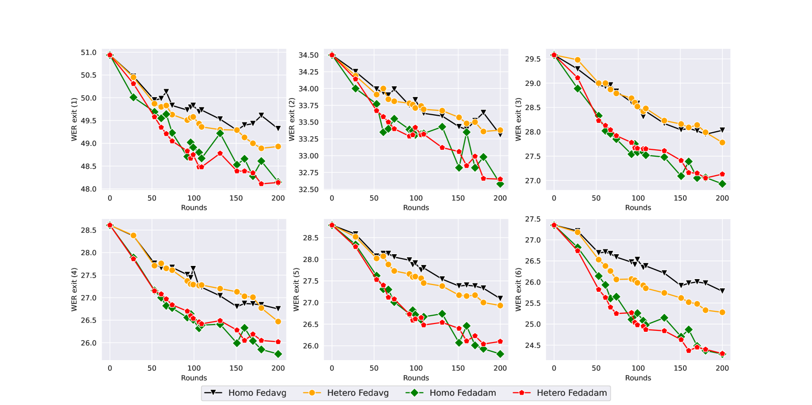
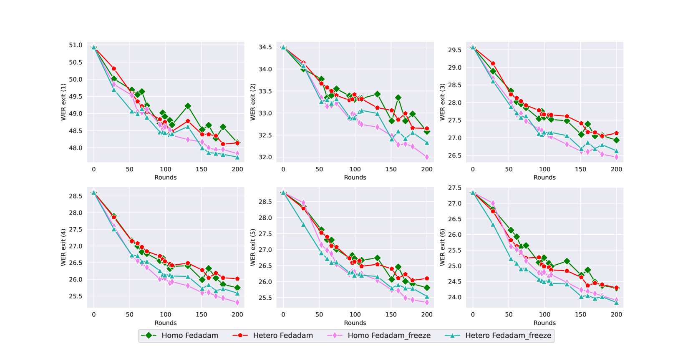
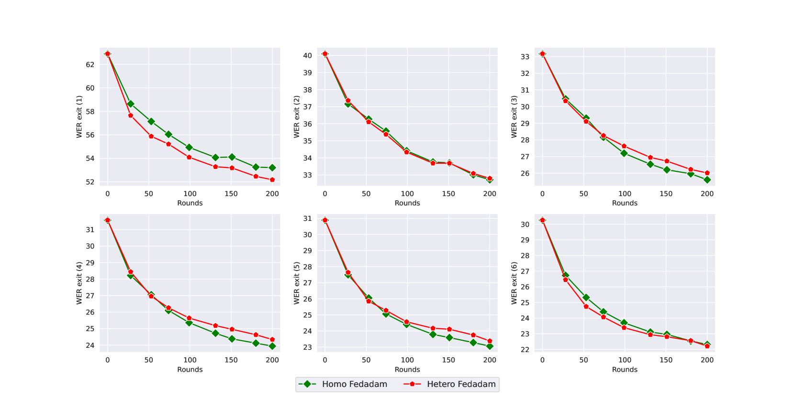
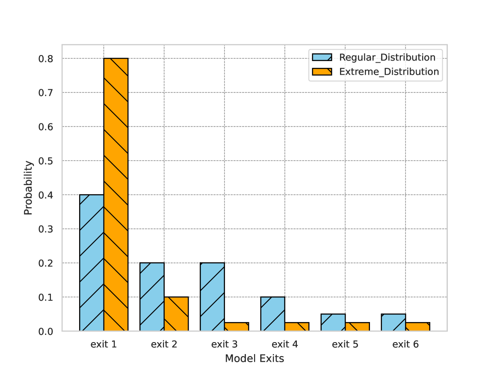
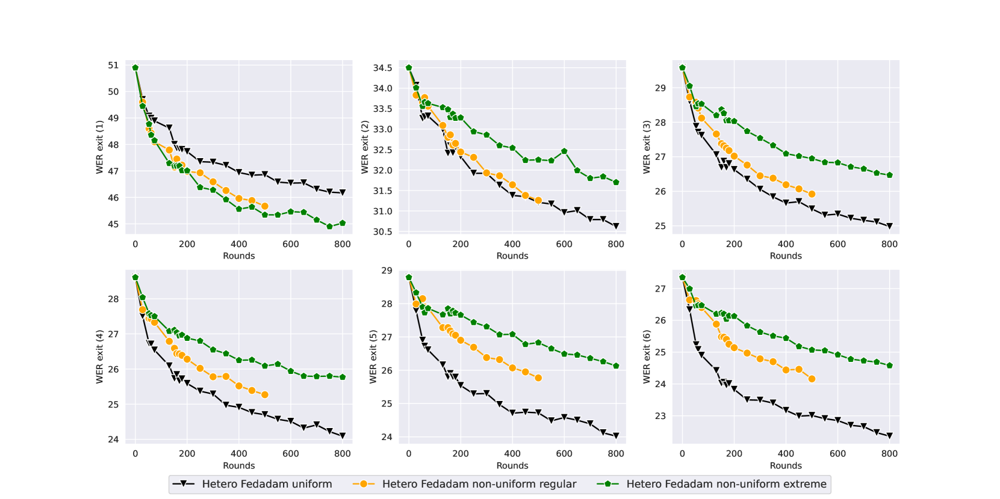

# 利用早期退出架构，联合动态模型以优化异构客户端上的自动语音识别性能

发布时间：2024年05月27日

`Agent

理由：这篇论文主要关注的是在联邦学习框架下，如何通过动态架构和早期退出机制来适应不同客户端设备的资源限制和多样性，以实现模型的有效训练和应用。这种动态调整模型处理流程的方法，可以看作是一种智能代理（Agent）的行为，因为它能够根据环境和输入条件自主地做出决策和调整。因此，这篇论文更适合归类到Agent分类中。` `联邦学习` `语音识别`

> Federating Dynamic Models using Early-Exit Architectures for Automatic Speech Recognition on Heterogeneous Clients

# 摘要

> 自动语音识别模型的训练依赖于大量语音数据，但数据的收集既繁琐又涉及隐私问题。联邦学习作为一种去中心化技术，能在保护数据本地化的同时，共同训练出共享模型。然而，客户端设备的资源限制给大型模型的应用带来挑战，且设备的多样性使得单一模型难以适配所有设备。本研究与传统使用多架构模型的方法不同，提出采用动态架构，通过早期退出机制，根据输入和操作条件灵活调整模型处理流程。这一方法简化了模型在多设备上的应用，并使得本地训练后的模型联邦化更为直接。实验证明，我们的方法不仅有效，还能与基础联邦学习策略良好结合。

> Automatic speech recognition models require large amounts of speech recordings for training. However, the collection of such data often is cumbersome and leads to privacy concerns. Federated learning has been widely used as an effective decentralized technique that collaboratively learns a shared prediction model while keeping the data local on different clients. Unfortunately, client devices often feature limited computation and communication resources leading to practical difficulties for large models. In addition, the heterogeneity that characterizes edge devices makes it sub-optimal to generate a single model that fits all of them. Differently from the recent literature, where multiple models with different architectures are used, in this work, we propose using dynamical architectures which, employing early-exit solutions, can adapt their processing (i.e. traversed layers) depending on the input and on the operation conditions. This solution falls in the realm of partial training methods and brings two benefits: a single model is used on a variety of devices; federating the models after local training is straightforward. Experiments on public datasets show that our proposed approach is effective and can be combined with basic federated learning strategies.

[Arxiv](https://arxiv.org/abs/2405.17376)