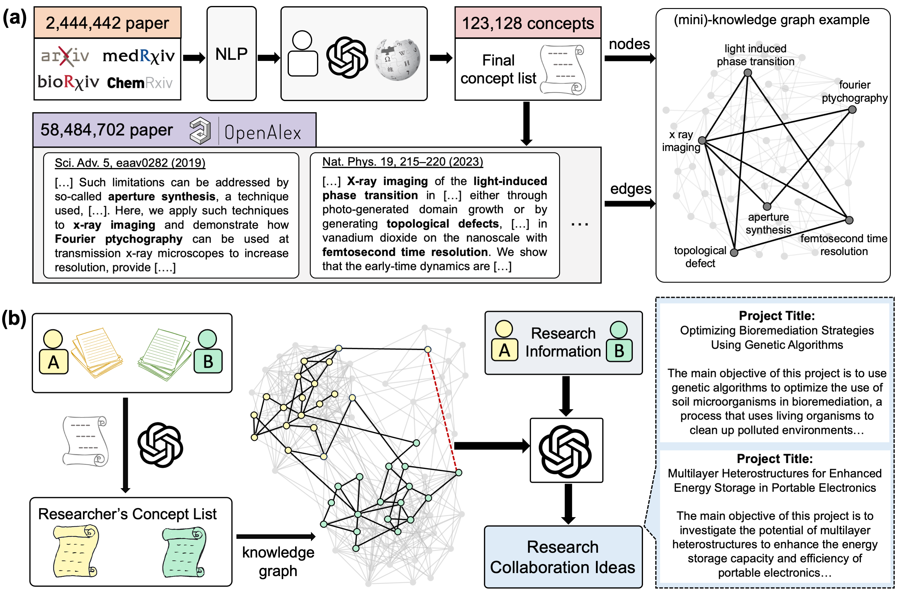
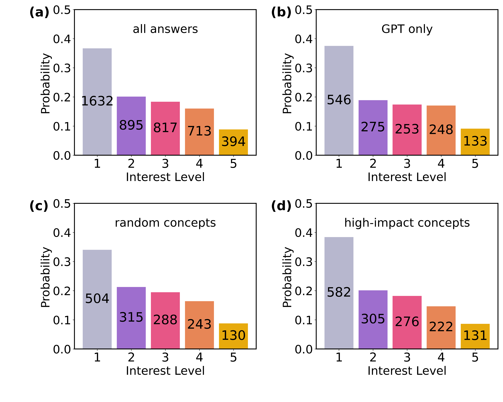

# 借助知识图谱与大型语言模型，我们探索并评估了新颖的研究想法，这些想法经过人类专家的严格审视。

发布时间：2024年05月27日

`Agent

这篇论文介绍了一个名为 SciMuse 的系统，该系统利用大规模的知识图谱和 GPT-4 接口来生成个性化的研究灵感，并通过实际的用户评估来优化这些灵感。这个系统可以被视为一个智能代理（Agent），因为它能够自主地处理信息、生成创意，并与用户（在这个案例中是研究者）进行交互以提供服务。因此，这篇论文更适合归类到Agent分类中。` `知识图谱`

> Generation and human-expert evaluation of interesting research ideas using knowledge graphs and large language models

# 摘要

> 高级AI系统，凭借其对数百万研究论文的访问权限，能够激发人类难以独立构思的新研究想法。但这些AI创意究竟有多吸引人，我们又该如何提升其质量呢？我们推出的SciMuse系统，利用一个由5800多万篇科学论文构建的动态知识图谱，通过GPT-4接口，为研究者量身定制研究灵感。我们邀请了马克斯·普朗克学会的100多位研究组长，对4000多个个性化研究想法进行了大规模的兴趣评估。这一评估揭示了科学兴趣与知识图谱核心属性之间的关联。我们发现，通过高效的机器学习，可以精准预测研究兴趣，从而优化创意的吸引力。这项研究标志着向人工科学灵感源泉迈进的一步，它有望激发前所未有的科研合作，并为科学家开辟新的探索路径。

> Advanced artificial intelligence (AI) systems with access to millions of research papers could inspire new research ideas that may not be conceived by humans alone. However, how interesting are these AI-generated ideas, and how can we improve their quality? Here, we introduce SciMuse, a system that uses an evolving knowledge graph built from more than 58 million scientific papers to generate personalized research ideas via an interface to GPT-4. We conducted a large-scale human evaluation with over 100 research group leaders from the Max Planck Society, who ranked more than 4,000 personalized research ideas based on their level of interest. This evaluation allows us to understand the relationships between scientific interest and the core properties of the knowledge graph. We find that data-efficient machine learning can predict research interest with high precision, allowing us to optimize the interest-level of generated research ideas. This work represents a step towards an artificial scientific muse that could catalyze unforeseen collaborations and suggest interesting avenues for scientists.

[Arxiv](https://arxiv.org/abs/2405.17044)