# Instruct-ReID++：探索通用指令引导下的人物再识别技术

发布时间：2024年05月27日

`Agent

这篇论文主要探讨了instruct-ReID任务，这是一个要求模型根据图像或语言指令进行图像检索的新任务。论文中提出的方法和模型（如IRM和IRM++）旨在处理多种检索任务，并在一个大规模的基准测试集OmniReID++上进行了评估。这个任务和相关的研究可以被视为一个Agent的应用，因为它涉及到一个智能系统（Agent）根据指令执行任务，即检索特定的人物图像。这与Agent的定义相符，Agent通常指的是能够感知环境并采取行动以达到目标的系统。因此，这篇论文应被归类为Agent。` `计算机视觉` `图像检索`

> Instruct-ReID++: Towards Universal Purpose Instruction-Guided Person Re-identification

# 摘要

> 人类智能能根据视觉和语言描述精准检索人物，但计算机视觉领域目前仅针对特定场景下的ReID任务进行研究，限制了其实际应用。本文创新性地提出了instruct-ReID任务，要求模型依据图像或语言指令进行图像检索，这是通用ReID领域的首次尝试，将现有6种ReID任务视为特殊指令下的案例。为推动instruct-ReID的研究，我们建立了大规模的OmniReID++基准，包含丰富的数据和多样的评估方式，如任务特定与任务无关的评估设置。针对任务特定的评估，我们设计了IRM基线模型，利用自适应三元损失处理多种检索任务。在任务无关的评估中，我们进一步开发了IRM++，引入记忆库辅助学习，从与任务无关的图库集中检索目标人物图像。在OmniReID++基准上的广泛测试显示，我们的方法在10个测试集上取得了领先成果。相关数据集、模型和代码将公开于https://github.com/hwz-zju/Instruct-ReID。

> Human intelligence can retrieve any person according to both visual and language descriptions. However, the current computer vision community studies specific person re-identification (ReID) tasks in different scenarios separately, which limits the applications in the real world. This paper strives to resolve this problem by proposing a novel instruct-ReID task that requires the model to retrieve images according to the given image or language instructions. Instruct-ReID is the first exploration of a general ReID setting, where existing 6 ReID tasks can be viewed as special cases by assigning different instructions. To facilitate research in this new instruct-ReID task, we propose a large-scale OmniReID++ benchmark equipped with diverse data and comprehensive evaluation methods e.g., task specific and task-free evaluation settings. In the task-specific evaluation setting, gallery sets are categorized according to specific ReID tasks. We propose a novel baseline model, IRM, with an adaptive triplet loss to handle various retrieval tasks within a unified framework. For task-free evaluation setting, where target person images are retrieved from task-agnostic gallery sets, we further propose a new method called IRM++ with novel memory bank-assisted learning. Extensive evaluations of IRM and IRM++ on OmniReID++ benchmark demonstrate the superiority of our proposed methods, achieving state-of-the-art performance on 10 test sets. The datasets, the model, and the code will be available at https://github.com/hwz-zju/Instruct-ReID

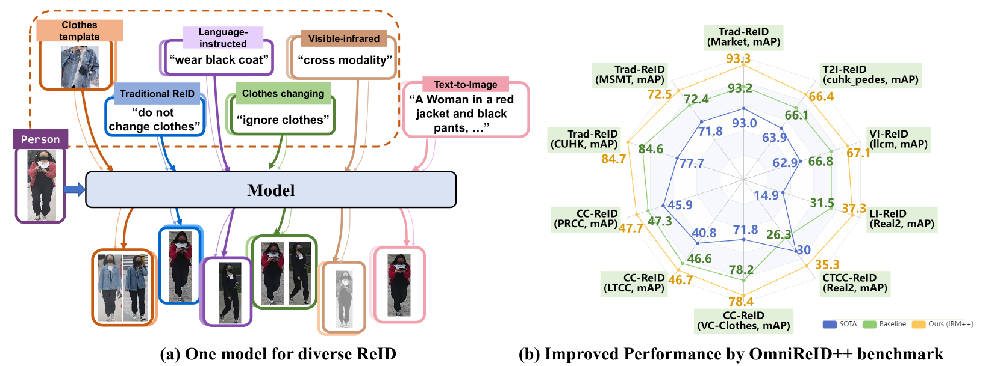

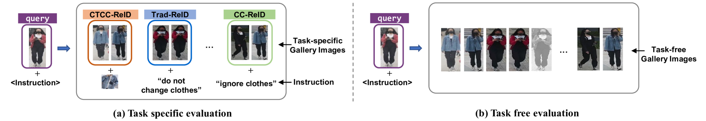

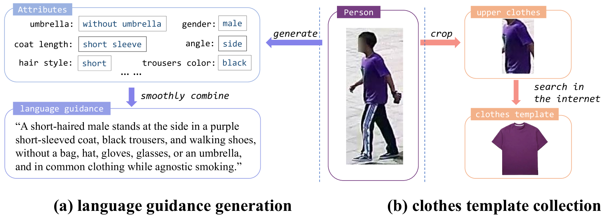

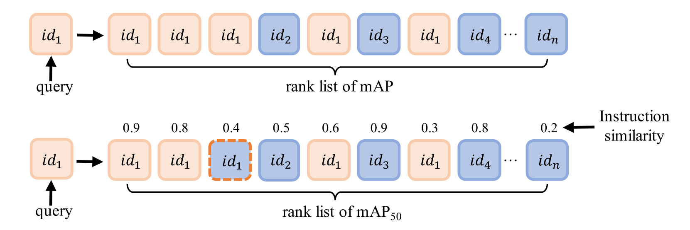

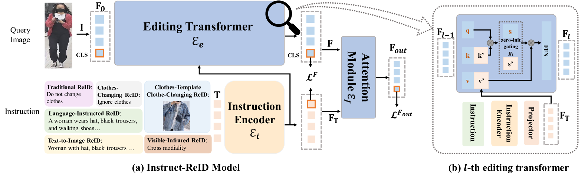

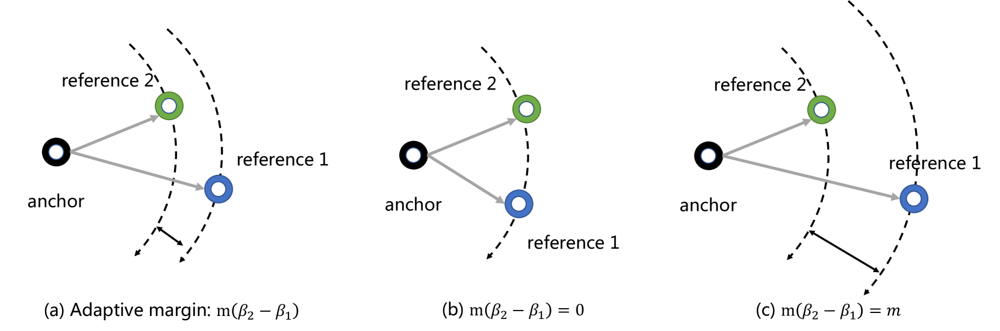

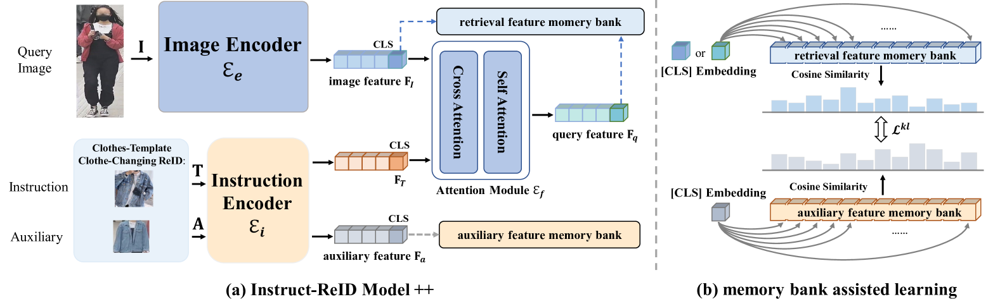

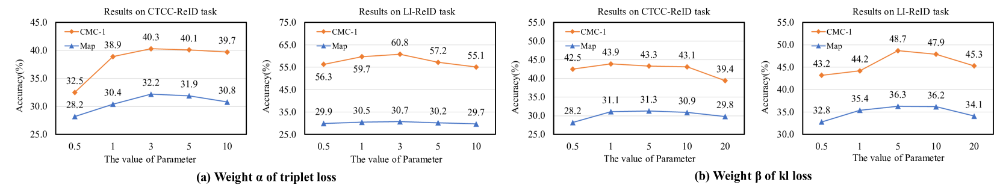

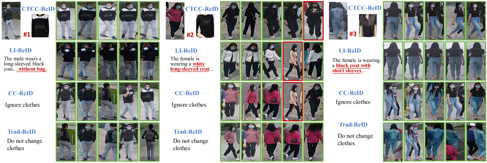

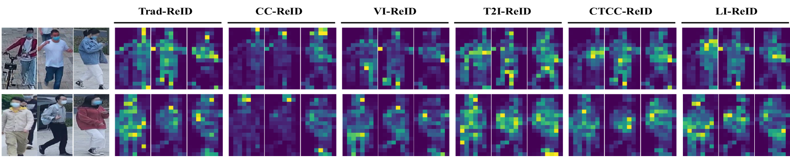

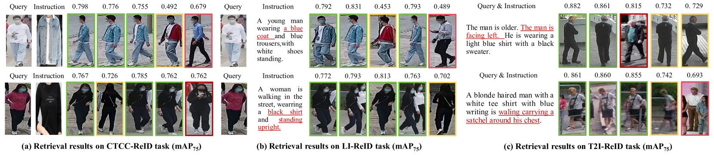

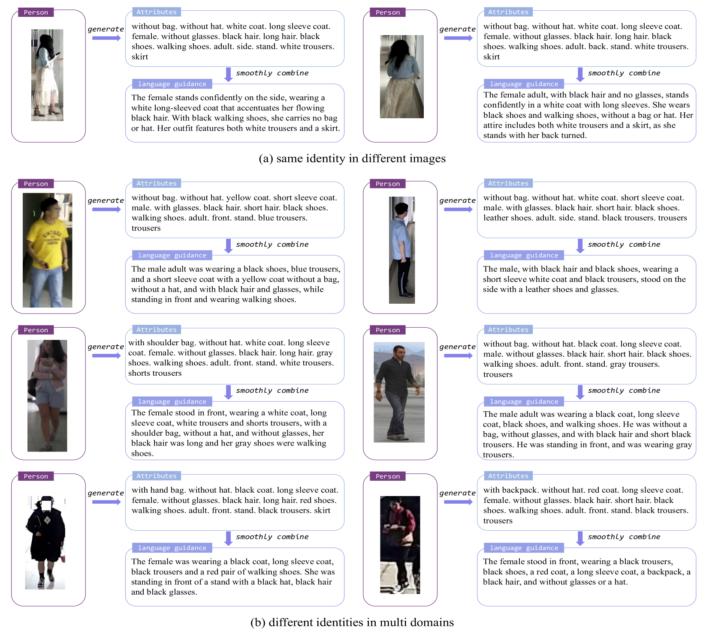

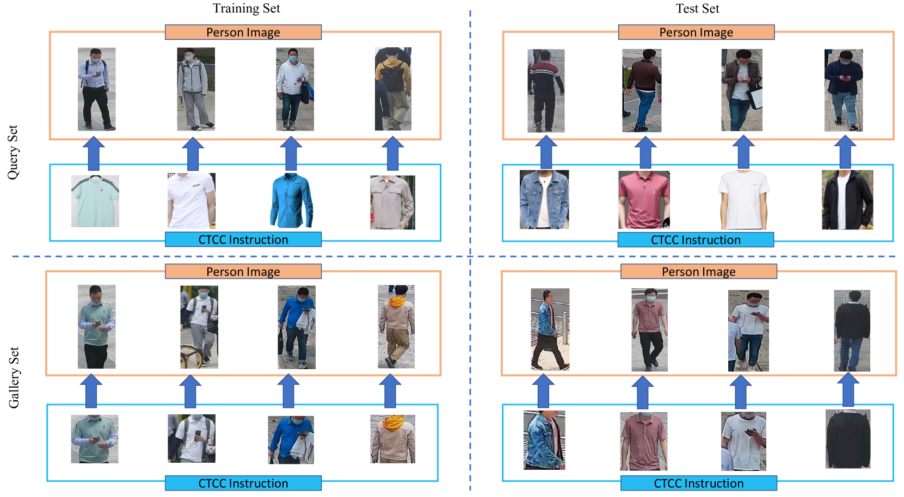

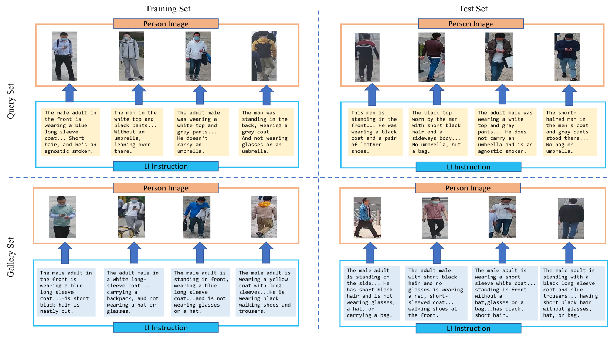

[Arxiv](https://arxiv.org/abs/2405.17790)