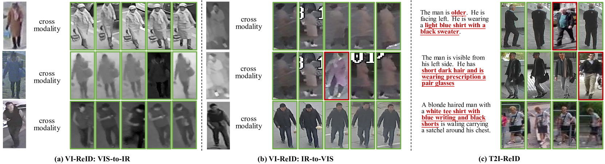

# Instruct-ReID++：探索通用指令引导下的人员再识别技术

发布时间：2024年05月27日

`Agent

这篇论文主要介绍了一种新的任务——instruct-ReID，它允许模型根据图像或语言指令进行图像检索。这种任务的提出是为了扩展计算机视觉领域中的个体再识别（ReID）研究，使其不再局限于特定场景，而是能够更广泛地应用于各种指令下的图像检索。此外，论文还构建了一个大规模的基准数据集OmniReID++，并提出了IRM和IRM++模型来处理这一任务。这些内容表明，论文的核心在于开发和评估一个能够根据指令执行任务的智能Agent，因此将其归类为Agent。` `计算机视觉` `图像检索`

> Instruct-ReID++: Towards Universal Purpose Instruction-Guided Person Re-identification

# 摘要

> 人类智能能根据视觉和语言描述精准检索个体，但计算机视觉领域目前仅限于特定场景下的个体再识别（ReID）研究，这限制了其实际应用。本文提出了一种创新的instruct-ReID任务，旨在让模型依据图像或语言指令进行图像检索，这是通用ReID领域的首次尝试，将现有6种ReID任务视为特定指令下的特例。为推动instruct-ReID的研究，我们构建了大规模的OmniReID++基准，包含丰富的数据和全面的评估手段，包括任务特定和任务无关的评估设置。在任务特定的评估中，图库集按特定ReID任务分类，我们推出了IRM基线模型，采用自适应三元损失以适应多种检索任务。对于任务无关的评估，我们进一步开发了IRM++，利用创新的记忆库辅助学习。在OmniReID++基准上的广泛测试显示，我们的方法在10个测试集上取得了领先成果。相关数据集、模型和代码将公开于https://github.com/hwz-zju/Instruct-ReID。

> Human intelligence can retrieve any person according to both visual and language descriptions. However, the current computer vision community studies specific person re-identification (ReID) tasks in different scenarios separately, which limits the applications in the real world. This paper strives to resolve this problem by proposing a novel instruct-ReID task that requires the model to retrieve images according to the given image or language instructions. Instruct-ReID is the first exploration of a general ReID setting, where existing 6 ReID tasks can be viewed as special cases by assigning different instructions. To facilitate research in this new instruct-ReID task, we propose a large-scale OmniReID++ benchmark equipped with diverse data and comprehensive evaluation methods e.g., task specific and task-free evaluation settings. In the task-specific evaluation setting, gallery sets are categorized according to specific ReID tasks. We propose a novel baseline model, IRM, with an adaptive triplet loss to handle various retrieval tasks within a unified framework. For task-free evaluation setting, where target person images are retrieved from task-agnostic gallery sets, we further propose a new method called IRM++ with novel memory bank-assisted learning. Extensive evaluations of IRM and IRM++ on OmniReID++ benchmark demonstrate the superiority of our proposed methods, achieving state-of-the-art performance on 10 test sets. The datasets, the model, and the code will be available at https://github.com/hwz-zju/Instruct-ReID

[Arxiv](https://arxiv.org/abs/2405.17790)