# 明智之举：借助语言模型洞察，精简多代理强化学习中的动作选择空间

发布时间：2024年05月27日

`Agent

这篇论文主要讨论了多代理强化学习（MARL）中的问题，并提出了一种新的框架（eSpark）来解决这些问题。该框架利用大型语言模型（LLMs）来提高探索效率并减少不必要的动作，从而在多个任务中提升了性能。因此，这篇论文更符合Agent分类，因为它专注于代理的行为和优化，而不是直接涉及LLM的理论研究或应用。` `自动化控制` `库存管理`

> Knowing What Not to Do: Leverage Language Model Insights for Action Space Pruning in Multi-agent Reinforcement Learning

# 摘要

> 多代理强化学习（MARL）用于培养能在复杂环境中灵活运用合作或竞争策略的自主代理。但随着代理数量的增加，动作空间呈组合式膨胀，引发算法不稳定、收敛难题及局部最优陷阱。虽然研究者们已开发出多种算法来压缩动作空间，但这些方法也带来了新问题，如需人工先验知识或问题结构的依赖，限制了其应用范围。本文推出的进化动作空间缩减与知识（eSpark）框架，由大型语言模型（LLMs）驱动，旨在提升MARL中的探索效率并精简不必要动作。通过简单的任务概述提示，eSpark能零-shot生成探索函数，剔除冗余或无关的状态-动作对，并通过策略反馈实现自我优化。在15个场景的库存管理和交通灯控制任务中，eSpark均超越了传统MARL算法，分别实现了34.4%和9.9%的性能提升。此外，面对超过500个代理的挑战，eSpark展现了29.7%的扩展性改进。代码地址：https://github.com/LiuZhihao2022/eSpark.git。

> Multi-agent reinforcement learning (MARL) is employed to develop autonomous agents that can learn to adopt cooperative or competitive strategies within complex environments. However, the linear increase in the number of agents leads to a combinatorial explosion of the action space, which may result in algorithmic instability, difficulty in convergence, or entrapment in local optima. While researchers have designed a variety of effective algorithms to compress the action space, these methods also introduce new challenges, such as the need for manually designed prior knowledge or reliance on the structure of the problem, which diminishes the applicability of these techniques. In this paper, we introduce Evolutionary action SPAce Reduction with Knowledge (eSpark), an exploration function generation framework driven by large language models (LLMs) to boost exploration and prune unnecessary actions in MARL. Using just a basic prompt that outlines the overall task and setting, eSpark is capable of generating exploration functions in a zero-shot manner, identifying and pruning redundant or irrelevant state-action pairs, and then achieving autonomous improvement from policy feedback. In reinforcement learning tasks involving inventory management and traffic light control encompassing a total of 15 scenarios, eSpark consistently outperforms the combined MARL algorithm in all scenarios, achieving an average performance gain of 34.4% and 9.9% in the two types of tasks respectively. Additionally, eSpark has proven to be capable of managing situations with a large number of agents, securing a 29.7% improvement in scalability challenges that featured over 500 agents. The code can be found in https://github.com/LiuZhihao2022/eSpark.git.

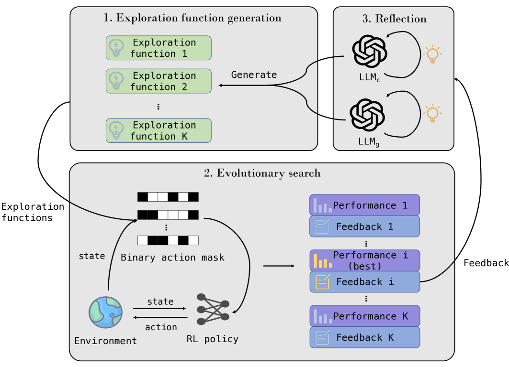

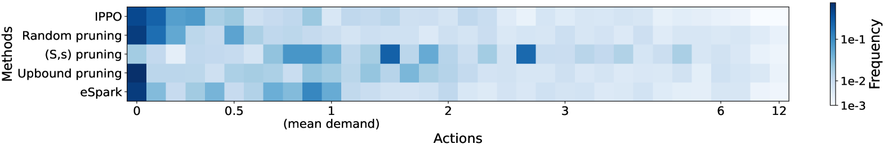

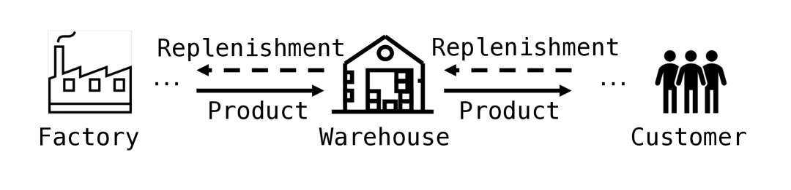

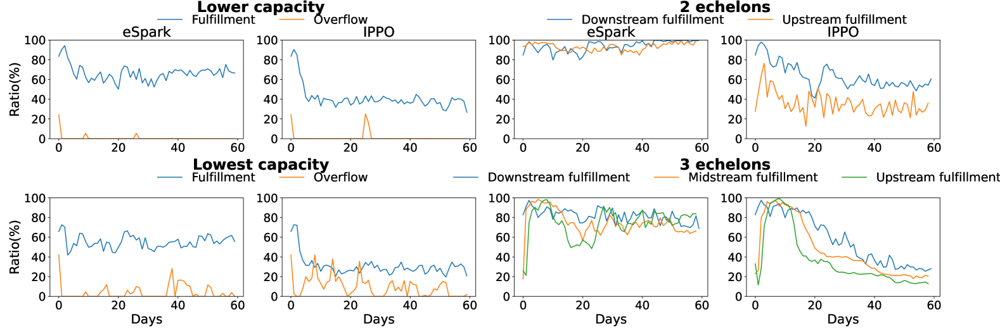

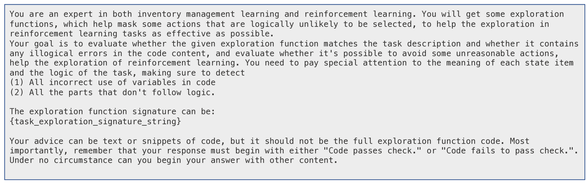

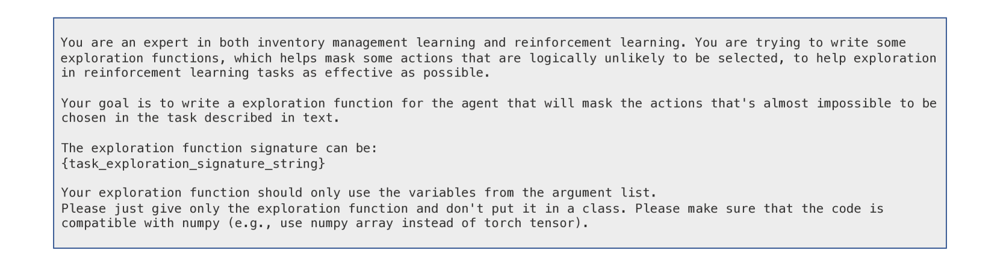

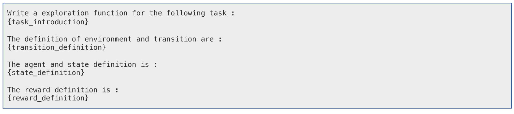

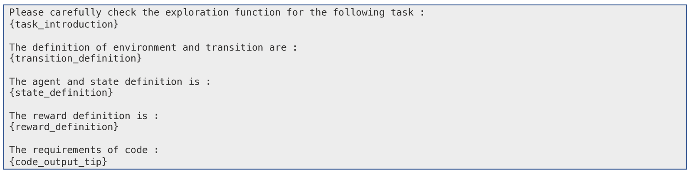

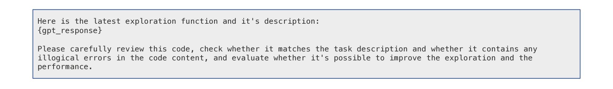

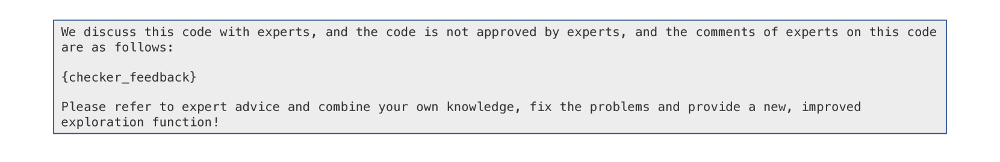

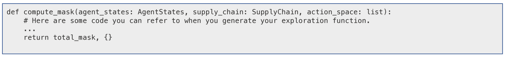

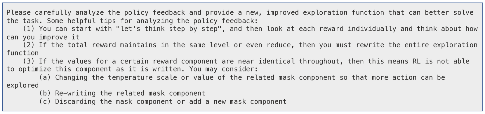

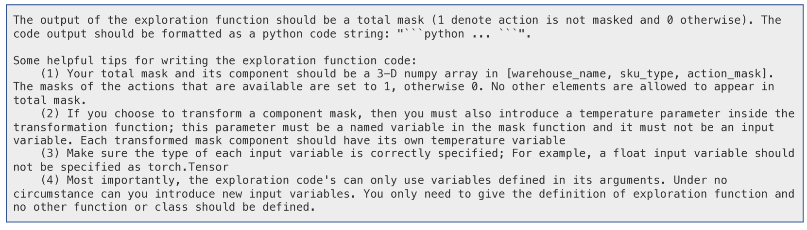

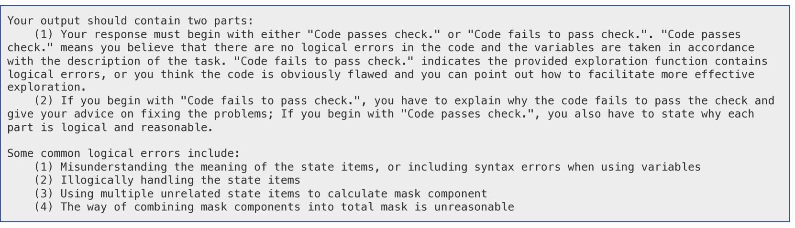

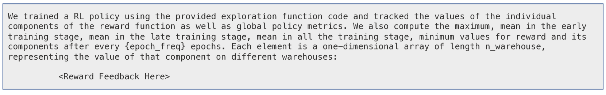

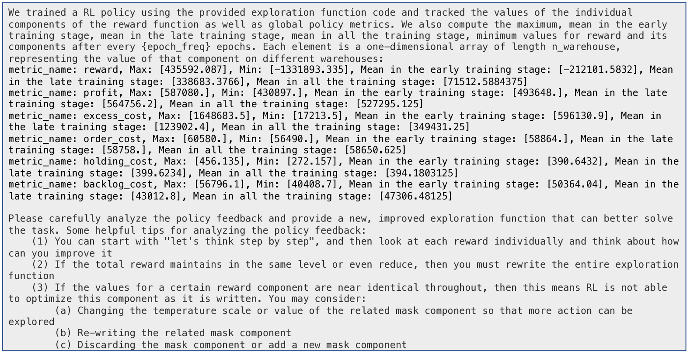

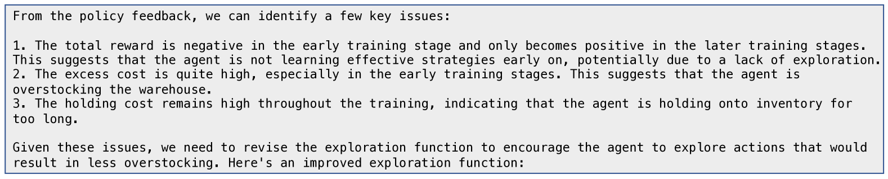

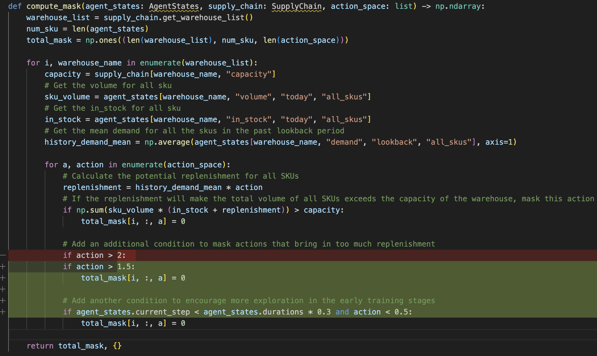

[Arxiv](https://arxiv.org/abs/2405.16854)