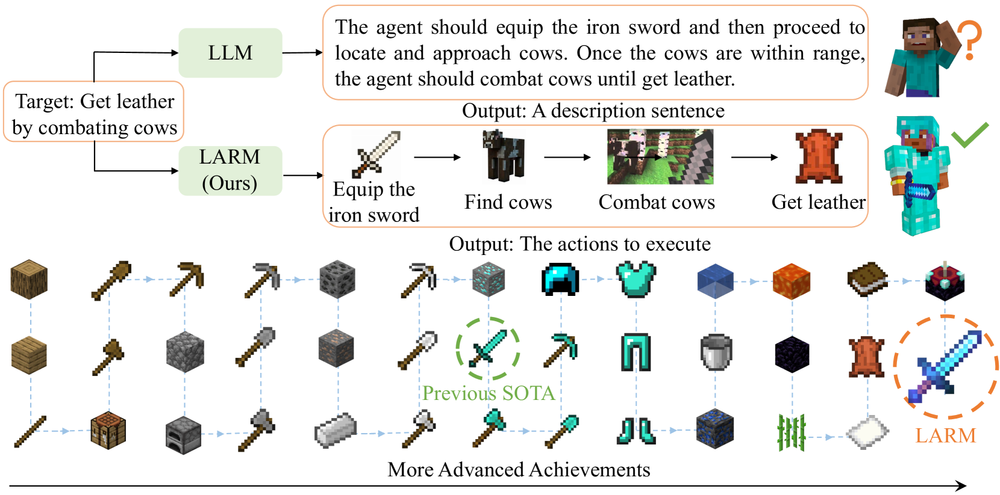
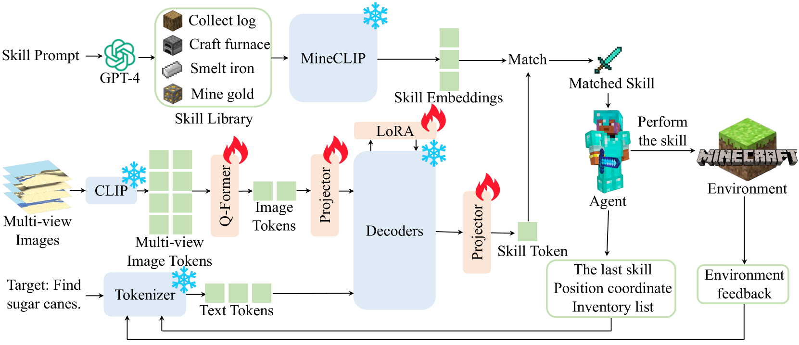
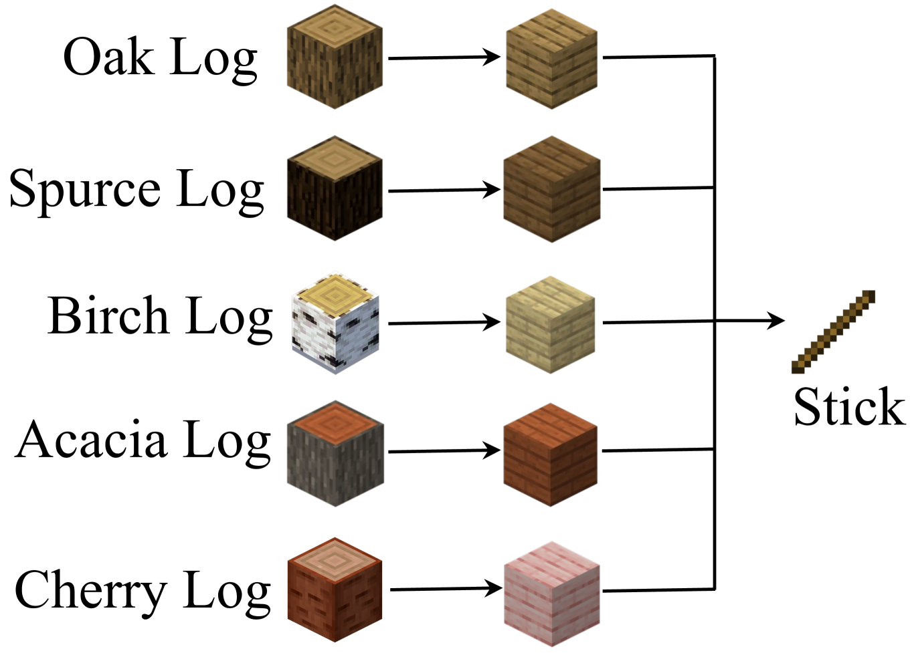
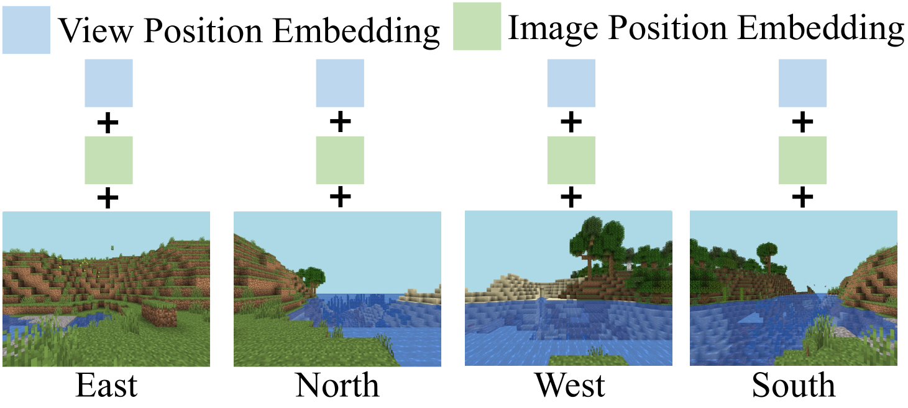
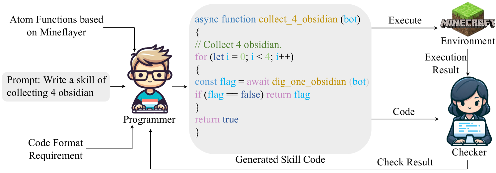
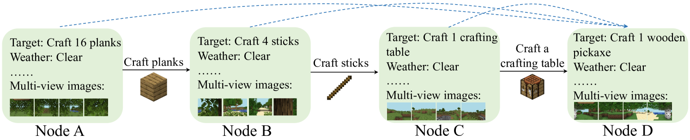
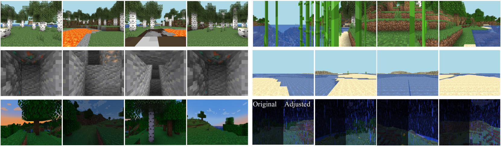
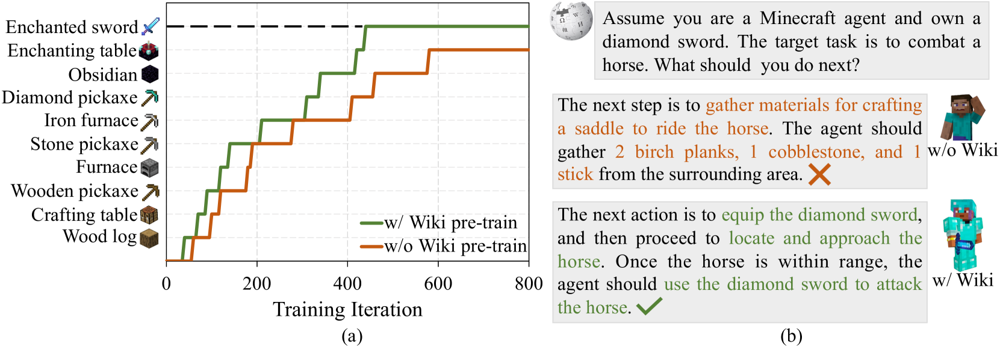
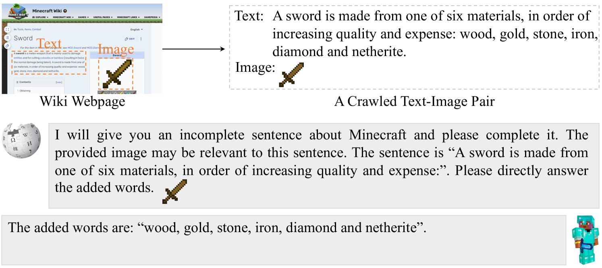

# LARM：长时程具身智能的大型自回归模型

发布时间：2024年05月27日

`Agent

这篇论文主要介绍了具身智能体（Agent）在现实世界互动中的挑战，并提出了一种结合文本和多视角图像输入的大型自回归模型（LARM）来解决这些挑战。论文中提到的LARM模型通过自回归方式精准预测行动，并在Minecraft游戏中展示了其高效的能力。因此，这篇论文更符合Agent分类，因为它专注于智能体的开发和应用，特别是在处理复杂任务和提高反应速度方面的创新。` `人工智能`

> LARM: Large Auto-Regressive Model for Long-Horizon Embodied Intelligence

# 摘要

> 具身智能体因需与现实世界互动，必须拥有丰富的先验知识、长远的规划视野和敏捷的反应速度。尽管基于大型语言模型（LLM）的智能体近期表现出色，但仍面临挑战，如LLM输出的描述性语句在指导具体行动时可能模糊不清。为此，我们推出了大型自回归模型（LARM），它结合文本与多视角图像输入，以自回归方式精准预测行动。我们为LARM量身定制了新型数据格式——自回归节点传输结构，并配套创建了数据集。通过两阶段训练，LARM在Minecraft中成功获取了复杂的附魔装备，其决策链的复杂度远超以往最佳方法，且速度提升了6.8倍。

> Due to the need to interact with the real world, embodied agents are required to possess comprehensive prior knowledge, long-horizon planning capability, and a swift response speed. Despite recent large language model (LLM) based agents achieving promising performance, they still exhibit several limitations. For instance, the output of LLMs is a descriptive sentence, which is ambiguous when determining specific actions. To address these limitations, we introduce the large auto-regressive model (LARM). LARM leverages both text and multi-view images as input and predicts subsequent actions in an auto-regressive manner. To train LARM, we develop a novel data format named auto-regressive node transmission structure and assemble a corresponding dataset. Adopting a two-phase training regimen, LARM successfully harvests enchanted equipment in Minecraft, which demands significantly more complex decision-making chains than the highest achievements of prior best methods. Besides, the speed of LARM is 6.8x faster.

[Arxiv](https://arxiv.org/abs/2405.17424)