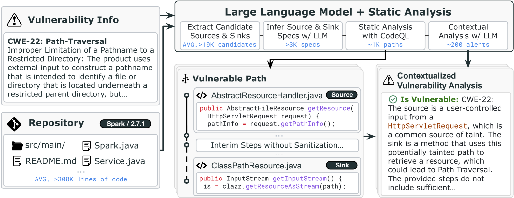
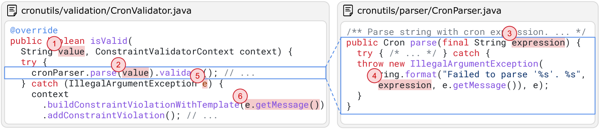
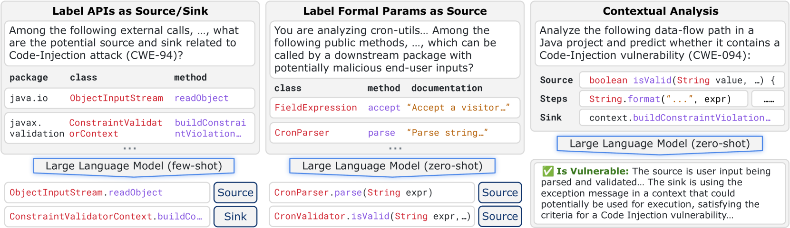
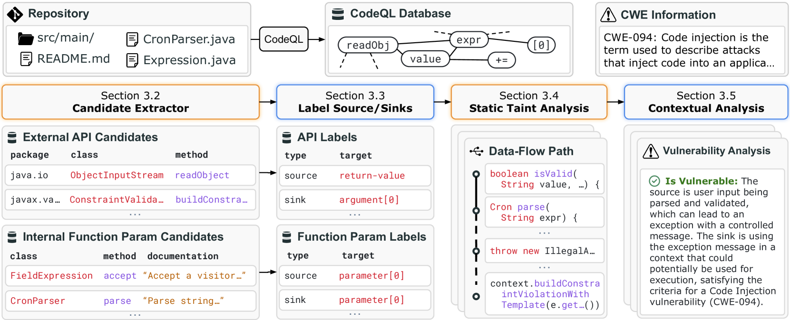
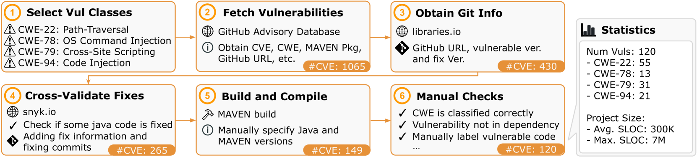
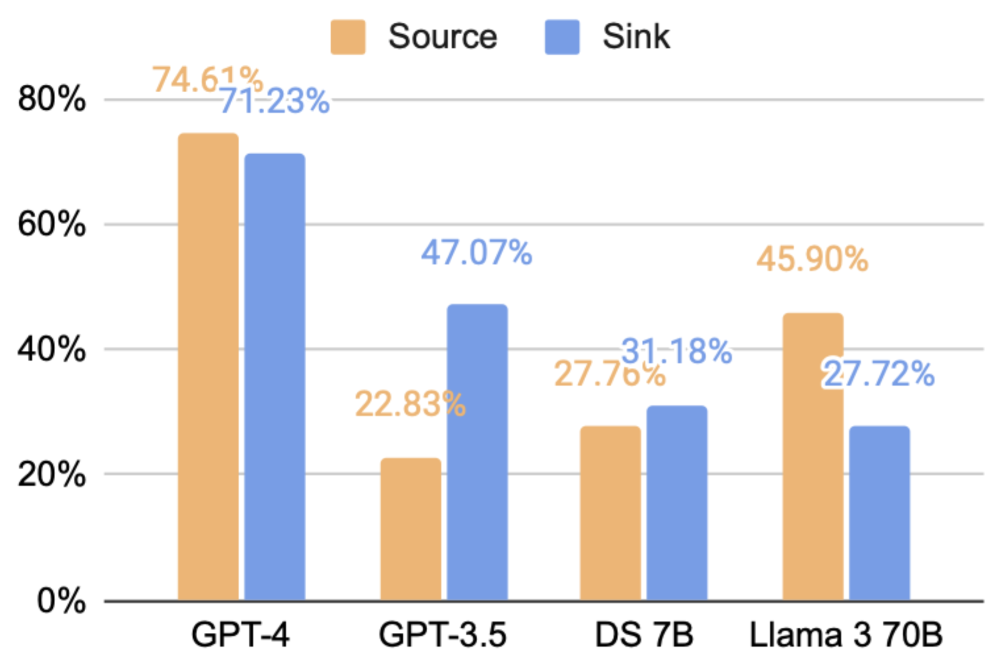
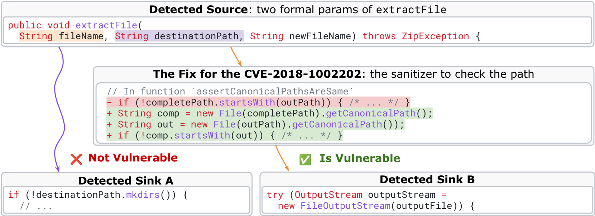

# 利用LLM辅助静态分析，精准检测安全漏洞

发布时间：2024年05月27日

`LLM应用

这篇论文介绍了一种名为IRIS的新方法，它结合了大型语言模型（LLMs）和静态分析技术，用于检测软件中的安全漏洞。这种方法特别针对复杂的代码推理任务，尤其是在分析整个代码库时。论文中还提到了一个专门为此目的设计的CWE-Bench-Java数据集，并展示了IRIS在实际测试中的优越性能，包括高准确率和低误报率。因此，这篇论文属于LLM应用类别，因为它展示了LLMs在实际软件安全分析中的应用和效果。` `软件安全` `代码分析`

> LLM-Assisted Static Analysis for Detecting Security Vulnerabilities

# 摘要

> 软件常伴安全漏洞之忧，而现有的程序分析工具对此的检测效果有限。大型语言模型（LLMs）虽在代码生成上表现出色，却难以进行复杂的代码推理以识别这些漏洞，尤其当任务涉及整个代码库的分析时。为此，我们创新性地提出了IRIS，一种结合LLMs与静态分析的首创方法，旨在通过全面代码库推理来精准定位安全漏洞。我们精心打造了CWE-Bench-Java数据集，涵盖120个真实Java项目中的验证漏洞，这些项目代码量庞大，平均达30万行，最多至700万行。在测试中，IRIS利用GPT-4成功识别出69个漏洞，远超最先进静态分析工具的27个。更令人瞩目的是，IRIS大幅降低了误报率，最佳情况下减少了80%以上。

> Software is prone to security vulnerabilities. Program analysis tools to detect them have limited effectiveness in practice. While large language models (or LLMs) have shown impressive code generation capabilities, they cannot do complex reasoning over code to detect such vulnerabilities, especially because this task requires whole-repository analysis. In this work, we propose IRIS, the first approach that systematically combines LLMs with static analysis to perform whole-repository reasoning to detect security vulnerabilities. We curate a new dataset, CWE-Bench-Java, comprising 120 manually validated security vulnerabilities in real-world Java projects. These projects are complex, with an average of 300,000 lines of code and a maximum of up to 7 million. Out of 120 vulnerabilities in CWE-Bench-Java, IRIS detects 69 using GPT-4, while the state-of-the-art static analysis tool only detects 27. Further, IRIS also significantly reduces the number of false alarms (by more than 80% in the best case).

[Arxiv](https://arxiv.org/abs/2405.17238)