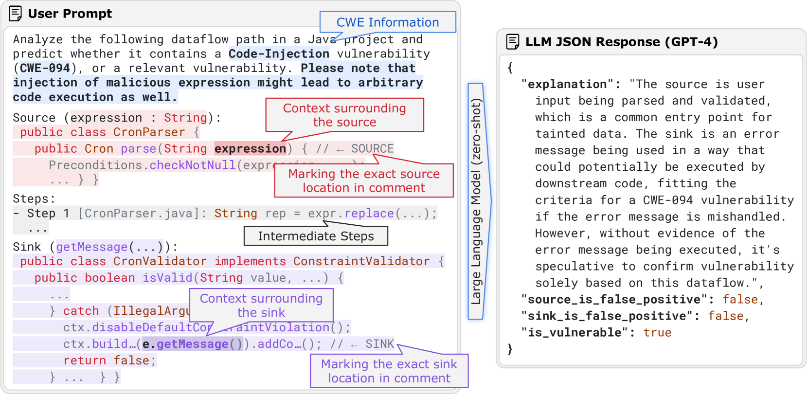

# 利用LLM辅助静态分析，精准检测安全漏洞

发布时间：2024年05月27日

`LLM应用

理由：这篇论文介绍了一个名为IRIS的系统，它结合了大型语言模型（LLM）和静态分析技术，用于检测软件中的安全漏洞。这种方法利用了LLM在代码生成方面的优势，并将其应用于代码推理和漏洞检测，特别是在处理大型代码库时。因此，这项工作属于LLM在实际应用中的一个具体案例，即在软件安全分析领域的应用。` `软件安全` `代码分析`

> LLM-Assisted Static Analysis for Detecting Security Vulnerabilities

# 摘要

> 软件常伴安全漏洞，而现有的程序分析工具对此的检测效果有限。大型语言模型虽在代码生成上表现卓越，却难以进行复杂的代码推理以识别这些漏洞，尤其是当任务涉及整个代码库的分析时。为此，我们推出了IRIS，这是首个将大型语言模型与静态分析相结合的系统方法，旨在通过全面代码库推理来精准定位安全漏洞。我们创建了CWE-Bench-Java数据集，涵盖了120个在真实Java项目中验证过的安全漏洞，这些项目代码量庞大，平均达30万行，最多至700万行。在测试中，IRIS利用GPT-4成功识别了69个漏洞，远超最先进静态分析工具的27个。更令人瞩目的是，IRIS大幅降低了误报率，最高减少了80%以上。

> Software is prone to security vulnerabilities. Program analysis tools to detect them have limited effectiveness in practice. While large language models (or LLMs) have shown impressive code generation capabilities, they cannot do complex reasoning over code to detect such vulnerabilities, especially because this task requires whole-repository analysis. In this work, we propose IRIS, the first approach that systematically combines LLMs with static analysis to perform whole-repository reasoning to detect security vulnerabilities. We curate a new dataset, CWE-Bench-Java, comprising 120 manually validated security vulnerabilities in real-world Java projects. These projects are complex, with an average of 300,000 lines of code and a maximum of up to 7 million. Out of 120 vulnerabilities in CWE-Bench-Java, IRIS detects 69 using GPT-4, while the state-of-the-art static analysis tool only detects 27. Further, IRIS also significantly reduces the number of false alarms (by more than 80% in the best case).

[Arxiv](https://arxiv.org/abs/2405.17238)