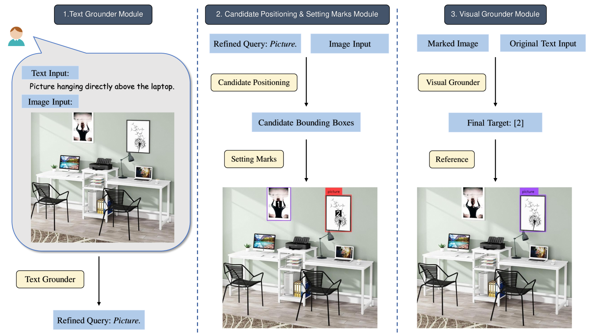
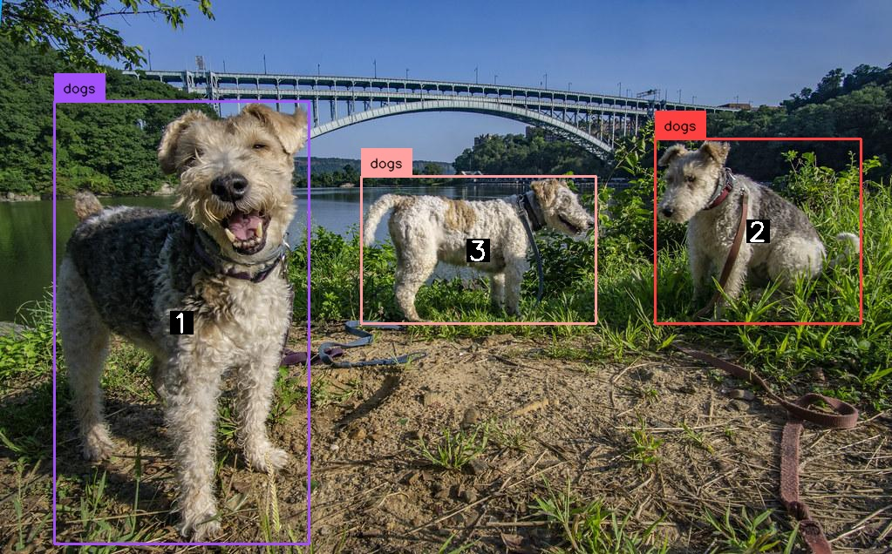
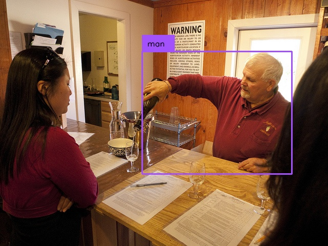

# LLM-Optic：探索大型语言模型在通用视觉基础任务中的潜能

发布时间：2024年05月27日

`LLM应用

这篇论文介绍了一种名为LLM-Optic的新方法，该方法利用大型语言模型（LLMs）来增强视觉定位技术对复杂查询的理解能力。这种方法通过将LLM作为“文本定位器”来解析复杂查询，并结合预训练的视觉定位模型和大型多模态模型（LMM）来实现精确的视觉定位。这种方法的特点在于其无需额外训练或微调即可实现通用视觉定位，并能识别任意语言描述的对象。因此，这篇论文属于LLM应用类别，因为它展示了如何将LLM技术应用于解决实际问题，即视觉定位技术中的复杂查询处理。` `计算机视觉`

> LLM-Optic: Unveiling the Capabilities of Large Language Models for Universal Visual Grounding

# 摘要

> 视觉定位技术，将文本查询与图像特定区域精准对接，虽有进展，但面对复杂查询仍显力不从心。为此，我们创新推出LLM-Optic，一种利用大型语言模型（LLMs）作为“光学透镜”的方法，旨在提升模型对复杂查询的理解，如涉及多对象、复杂文本结构及空间关系的场景。LLM-Optic首先运用LLM作为“文本定位器”，解析复杂查询并精准捕捉用户所需对象。随后，预训练的视觉定位模型依据精炼后的查询生成候选边界框。接着，LLM-Optic通过数字标记，将文本与图像区域紧密相连，跨越模态界限。最后，大型多模态模型（LMM）作为“视觉定位器”，精选出与原始查询最契合的标记对象。借助LLM-Optic，我们实现了无需额外训练或微调的通用视觉定位，能够识别任意语言描述的对象。在多个高难度基准测试中，LLM-Optic展现了顶尖的零-shot视觉定位能力。

> Visual grounding is an essential tool that links user-provided text queries with query-specific regions within an image. Despite advancements in visual grounding models, their ability to comprehend complex queries remains limited. To overcome this limitation, we introduce LLM-Optic, an innovative method that utilizes Large Language Models (LLMs) as an optical lens to enhance existing visual grounding models in comprehending complex text queries involving intricate text structures, multiple objects, or object spatial relationships, situations that current models struggle with. LLM-Optic first employs an LLM as a Text Grounder to interpret complex text queries and accurately identify objects the user intends to locate. Then a pre-trained visual grounding model is used to generate candidate bounding boxes given the refined query by the Text Grounder. After that, LLM-Optic annotates the candidate bounding boxes with numerical marks to establish a connection between text and specific image regions, thereby linking two distinct modalities. Finally, it employs a Large Multimodal Model (LMM) as a Visual Grounder to select the marked candidate objects that best correspond to the original text query. Through LLM-Optic, we have achieved universal visual grounding, which allows for the detection of arbitrary objects specified by arbitrary human language input. Importantly, our method achieves this enhancement without requiring additional training or fine-tuning. Extensive experiments across various challenging benchmarks demonstrate that LLM-Optic achieves state-of-the-art zero-shot visual grounding capabilities.

[Arxiv](https://arxiv.org/abs/2405.17104)