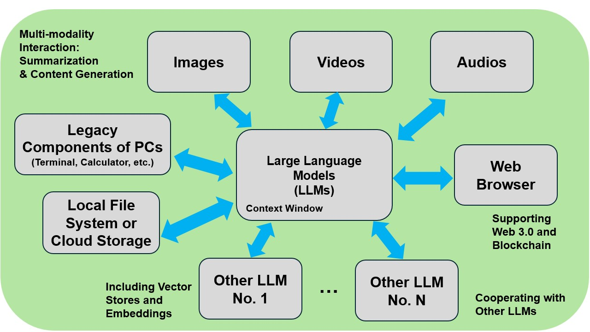
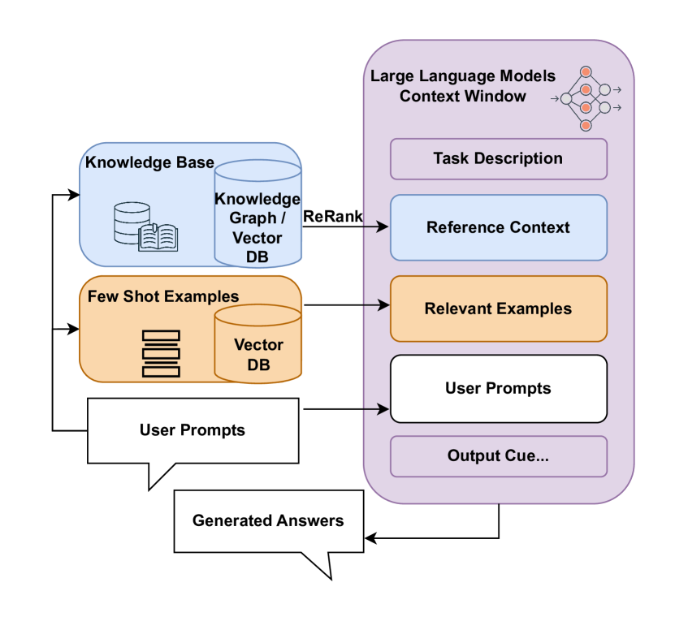
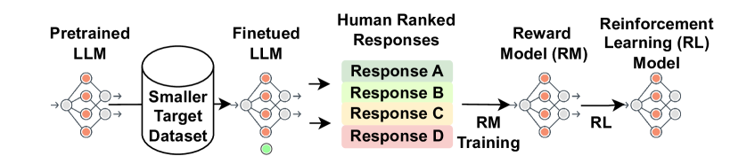
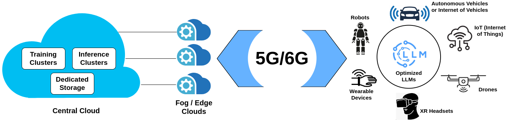

# 大型语言模型（LLMs）：探讨其部署、代币经济及可持续性议题

发布时间：2024年05月27日

`RAG

这篇论文主要探讨了大型语言模型（LLMs）的部署策略、经济效益及可持续性挑战，特别关注了检索增强生成（RAG）与微调两种部署方式的比较，以及训练与推理中对xPUs的需求分析。此外，论文还从用户体验（QoE）角度评估了LLM服务的性能与成本平衡，并展望了未来LLM处理的混合架构及其环境影响。因此，这篇论文更符合RAG分类，因为它专注于LLM的部署和增强生成技术。` `人机交互` `可持续发展`

> Large Language Models (LLMs): Deployment, Tokenomics and Sustainability

# 摘要

> 大型语言模型（LLMs）的迅猛发展，如GPT-4o的多模态能力展示，极大地推动了人机交互的进步。本文深入探讨了LLMs的部署策略、经济效益及可持续性挑战。我们详细比较了检索增强生成（RAG）与微调两种部署方式的优劣，并量化分析了训练与推理中对xPUs的需求。同时，从用户体验（QoE）角度出发，我们评估了LLM服务中性能与成本的平衡。最后，我们展望了未来LLM处理的混合架构，并关注其环境影响，特别是碳足迹问题。这些讨论为我们提供了关于LLMs负责任开发与部署的全面战略视角。

> The rapid advancement of Large Language Models (LLMs) has significantly impacted human-computer interaction, epitomized by the release of GPT-4o, which introduced comprehensive multi-modality capabilities. In this paper, we first explored the deployment strategies, economic considerations, and sustainability challenges associated with the state-of-the-art LLMs. More specifically, we discussed the deployment debate between Retrieval-Augmented Generation (RAG) and fine-tuning, highlighting their respective advantages and limitations. After that, we quantitatively analyzed the requirement of xPUs in training and inference. Additionally, for the tokenomics of LLM services, we examined the balance between performance and cost from the quality of experience (QoE)'s perspective of end users. Lastly, we envisioned the future hybrid architecture of LLM processing and its corresponding sustainability concerns, particularly in the environmental carbon footprint impact. Through these discussions, we provided a comprehensive overview of the operational and strategic considerations essential for the responsible development and deployment of LLMs.

[Arxiv](https://arxiv.org/abs/2405.17147)