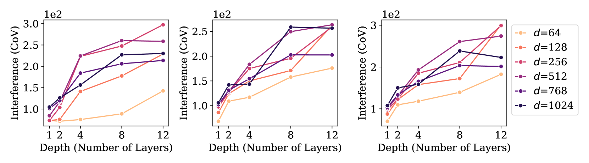
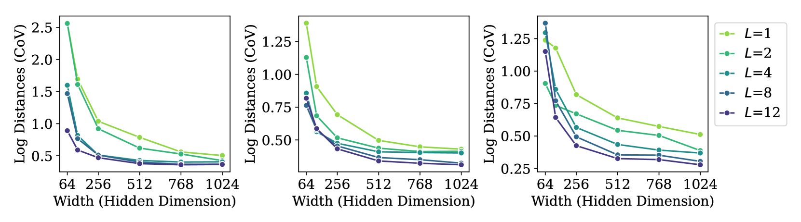
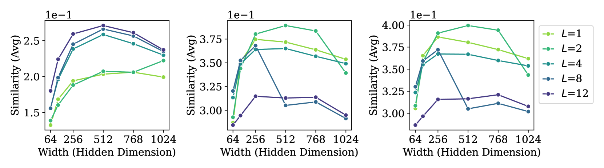

# 语言模型危机：探究大型语言模型中的神经崩溃现象

发布时间：2024年05月27日

`LLM理论

这篇论文主要探讨了神经崩溃（$\mathcal{NC}$）现象在因果语言模型（CLMs）中的表现及其与模型泛化能力的关系。它研究了模型规模和训练过程对$\mathcal{NC}$现象的影响，并探讨了$\mathcal{NC}$与泛化之间的潜在联系。这些内容属于对大型语言模型（LLMs）理论层面的研究，因此应归类为LLM理论。` `语言建模` `机器学习`

> Linguistic Collapse: Neural Collapse in (Large) Language Models

# 摘要

> 神经崩溃（$\mathcal{NC}$）现象揭示了分类任务中顶层表示如何收敛至类别均值，这些均值等范数、等角度并与分类器对齐，与模型的泛化和鲁棒性紧密相关。这一现象在特定条件下尤为明显：模型训练至零损失，使用无噪声的平衡类别标签，且类别数量不超过模型的隐藏维度。近期研究尝试在不具备这些条件的情况下探索$\mathcal{NC}$，以期利用理想几何形状的优势。语言建模领域尤为引人注目，因其“通过令牌预测训练”的分类任务中，上述条件均不成立：词汇不平衡且超出嵌入维度；不同令牌可能产生相似的上下文嵌入；大型语言模型（LLMs）通常仅经历少数训练周期。本文通过实证研究，探讨了因果语言模型（CLMs）架构和训练的缩放如何影响其向$\mathcal{NC}$的演进。我们发现，随着模型规模的扩大，$\mathcal{NC}$特性与泛化能力之间存在关联。此外，有迹象表明$\mathcal{NC}$与泛化之间存在某种独立于规模的联系。我们的研究强调了$\mathcal{NC}$现象的普遍性，并将其应用于更具挑战性的语言建模领域。未来，我们希望通过深入研究$\mathcal{NC}$，增进对LLMs及神经网络的理解，并基于$\mathcal{NC}$相关特性优化现有模型架构。

> Neural collapse ($\mathcal{NC}$) is a phenomenon observed in classification tasks where top-layer representations collapse into their class means, which become equinorm, equiangular and aligned with the classifiers. These behaviors -- associated with generalization and robustness -- would manifest under specific conditions: models are trained towards zero loss, with noise-free labels belonging to balanced classes, which do not outnumber the model's hidden dimension. Recent studies have explored $\mathcal{NC}$ in the absence of one or more of these conditions to extend and capitalize on the associated benefits of ideal geometries. Language modeling presents a curious frontier, as \textit{training by token prediction} constitutes a classification task where none of the conditions exist: the vocabulary is imbalanced and exceeds the embedding dimension; different tokens might correspond to similar contextual embeddings; and large language models (LLMs) in particular are typically only trained for a few epochs. This paper empirically investigates the impact of scaling the architectures and training of causal language models (CLMs) on their progression towards $\mathcal{NC}$. We find that $\mathcal{NC}$ properties that develop with scaling are linked to generalization. Moreover, there is evidence of some relationship between $\mathcal{NC}$ and generalization independent of scale. Our work therefore underscores the generality of $\mathcal{NC}$ as it extends to the novel and more challenging setting of language modeling. Downstream, we seek to inspire further research on the phenomenon to deepen our understanding of LLMs -- and neural networks at large -- and improve existing architectures based on $\mathcal{NC}$-related properties.

[Arxiv](https://arxiv.org/abs/2405.17767)