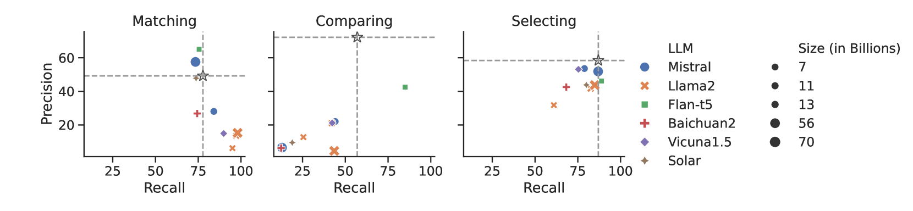
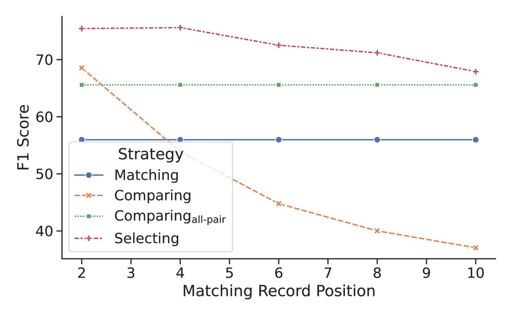

# 匹配、比较还是选择？探究大型语言模型在实体匹配领域的应用。

发布时间：2024年05月27日

`LLM应用

这篇论文主要探讨了基于大型语言模型（LLMs）的实体匹配技术，并提出了一个创新的组合实体匹配（ComEM）框架。该研究关注的是如何利用LLMs优化实体匹配过程，并通过实验验证了其性能和成本效益。因此，这篇论文属于LLM应用类别，因为它专注于将LLMs应用于实体匹配这一具体任务中，并提出了实际的解决方案和改进措施。` `数据管理` `信息检索`

> Match, Compare, or Select? An Investigation of Large Language Models for Entity Matching

# 摘要

> 实体匹配（EM）在实体解析中扮演着至关重要的角色。近期，基于大型语言模型（LLMs）的实体匹配技术展现出巨大潜力，但现有方法多采用二元匹配模式，忽视了记录间的全局一致性。本文深入探讨了多种基于LLM的实体匹配策略，特别关注了记录间的交互作用。我们详细比较了匹配、比较和选择这三种策略，并分析了它们在不同情境下的优势与挑战。基于这些分析，我们提出了一个创新的组合实体匹配（ComEM）框架，该框架巧妙结合了多种策略与LLMs，旨在优化匹配过程。实验证明，ComEM不仅大幅提升了多个数据集上的性能，还显著降低了实际应用中的成本。

> Entity matching (EM) is a critical step in entity resolution. Recently, entity matching based on large language models (LLMs) has shown great promise. However, current LLM-based entity matching approaches typically follow a binary matching paradigm that ignores the global consistency between different records. In this paper, we investigate various methodologies for LLM-based entity matching that incorporate record interactions from different perspectives. Specifically, we comprehensively compare three representative strategies: matching, comparing, and selecting, and analyze their respective advantages and challenges in diverse scenarios. Based on our findings, we further design a compositional entity matching (ComEM) framework that leverages the composition of multiple strategies and LLMs. In this way, ComEM can benefit from the advantages of different sides and achieve improvements in both effectiveness and efficiency. Experimental results show that ComEM not only achieves significant performance gains on various datasets but also reduces the cost of LLM-based entity matching in real-world application.

[Arxiv](https://arxiv.org/abs/2405.16884)