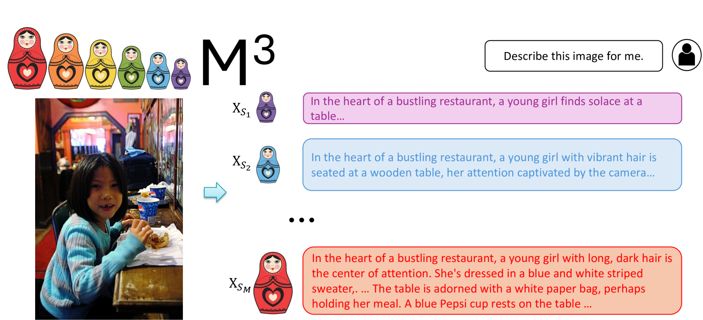
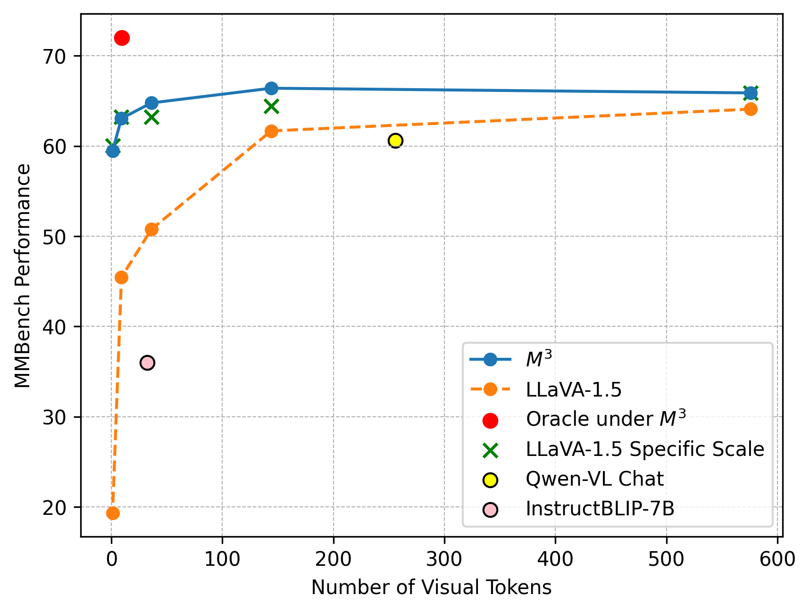
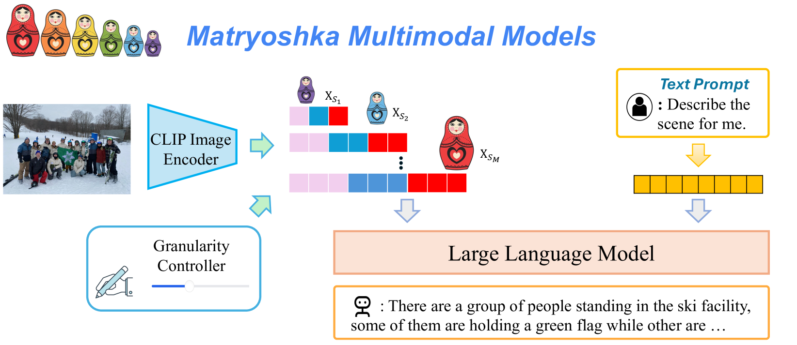
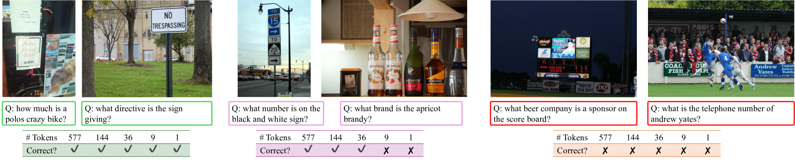
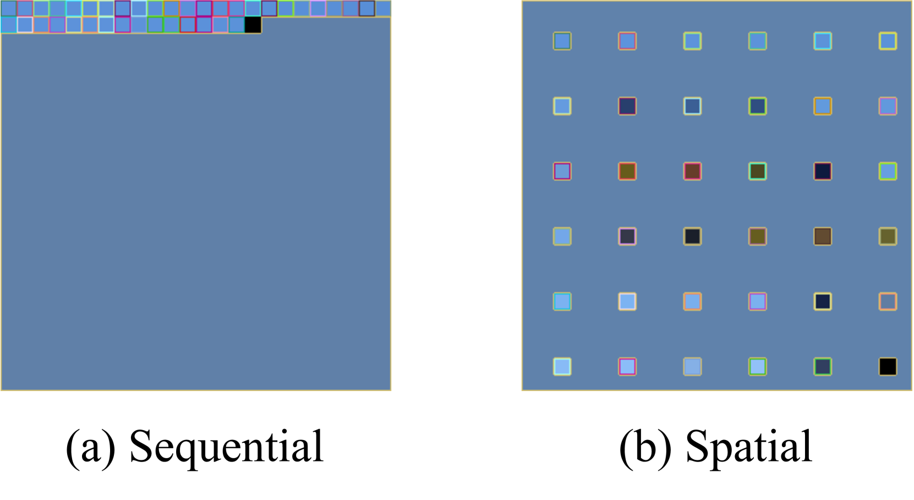
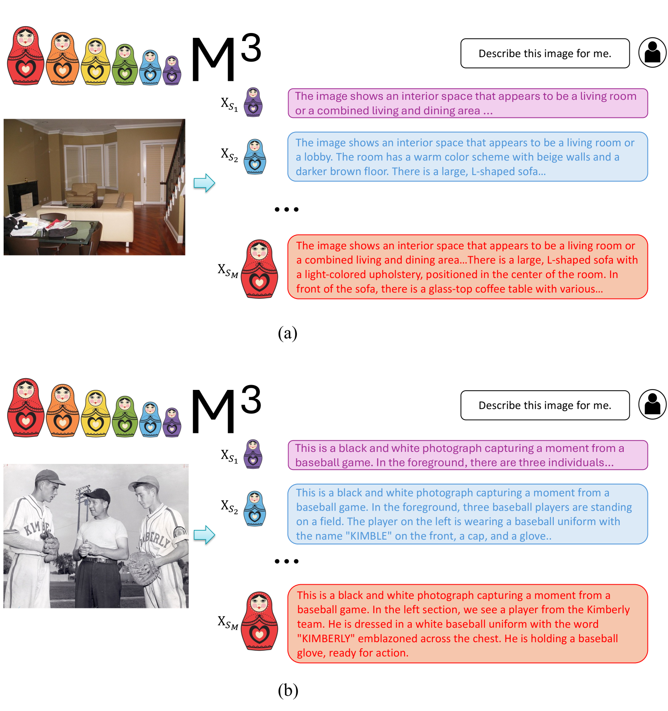

# 套娃式多模态模型

发布时间：2024年05月27日

`LLM应用

这篇论文介绍了一种名为M3的新型多模态模型，该模型通过嵌套视觉令牌集合来捕捉多级视觉信息，以提高处理高分辨率图像和视频时的效率。论文中提到的M3模型具有在推理时调整视觉令牌数量的能力，以及在分析现有数据集时发现令牌数量与准确性之间的关系。这些特性表明，该论文主要关注于大型语言模型（LLM）在多模态应用中的实际应用和改进，因此属于LLM应用分类。` `计算机视觉` `人工智能`

> Matryoshka Multimodal Models

# 摘要

> 大型多模态模型如LLaVA在视觉语言推理上表现卓越，但其在处理高分辨率图像和视频等密集视觉场景时，由于令牌数量过多而效率低下。现有的令牌剪枝/合并方法虽有，却无法灵活地在信息密度与效率间权衡。受俄罗斯套娃启发，我们提出M3：Matryoshka多模态模型，它通过嵌套视觉令牌集合捕捉多级视觉信息。M3的优势包括：(1) 在推理时可针对内容复杂度调整视觉令牌数量；(2) 分析现有数据集所需粒度，发现COCO基准仅需约9个令牌即可达到全令牌的准确性；(3) 探索样本级别上性能与令牌长度的最佳平衡，揭示了现有表示与理论上限间的显著差距。

> Large Multimodal Models (LMMs) such as LLaVA have shown strong performance in visual-linguistic reasoning. These models first embed images into a fixed large number of visual tokens and then feed them into a Large Language Model (LLM). However, this design causes an excessive number of tokens for dense visual scenarios such as high-resolution images and videos, leading to great inefficiency. While token pruning/merging methods do exist, they produce a single length output for each image and do not afford flexibility in trading off information density v.s. efficiency. Inspired by the concept of Matryoshka Dolls, we propose M3: Matryoshka Multimodal Models, which learns to represent visual content as nested sets of visual tokens that capture information across multiple coarse-to-fine granularities. Our approach offers several unique benefits for LMMs: (1) One can explicitly control the visual granularity per test instance during inference, e.g. , adjusting the number of tokens used to represent an image based on the anticipated complexity or simplicity of the content; (2) M3 provides a framework for analyzing the granularity needed for existing datasets, where we find that COCO-style benchmarks only need around ~9 visual tokens to obtain accuracy similar to that of using all 576 tokens; (3) Our approach provides a foundation to explore the best trade-off between performance and visual token length at sample level, where our investigation reveals that a large gap exists between the oracle upper bound and current fixed-scale representations.

[Arxiv](https://arxiv.org/abs/2405.17430)