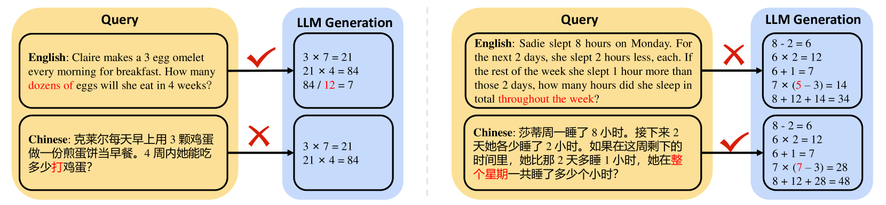
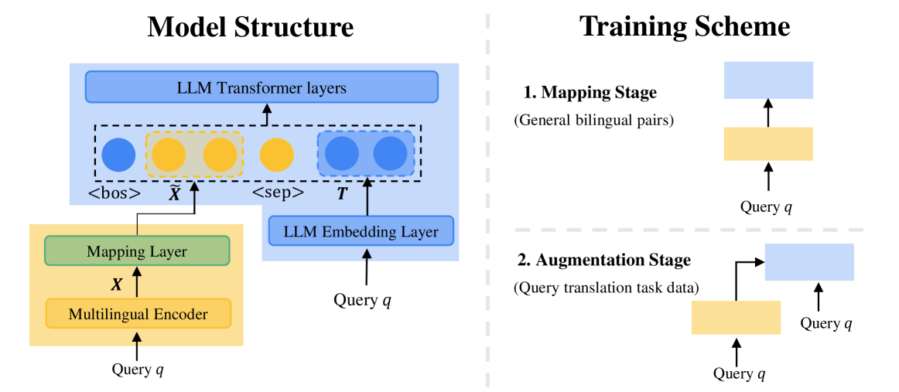
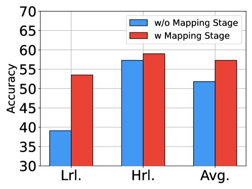
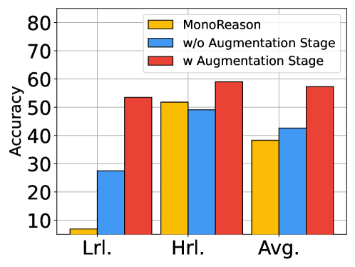
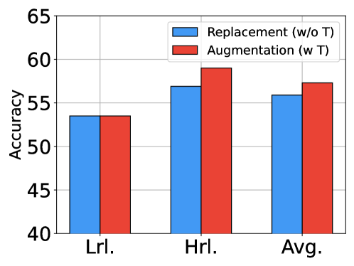
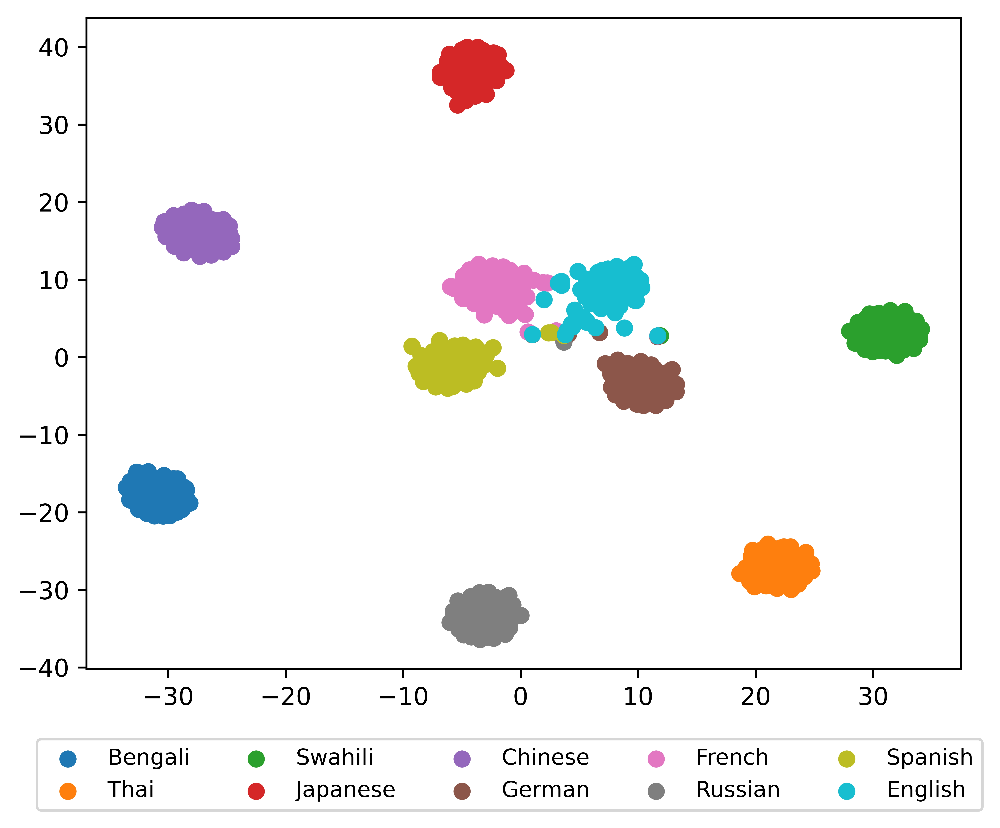
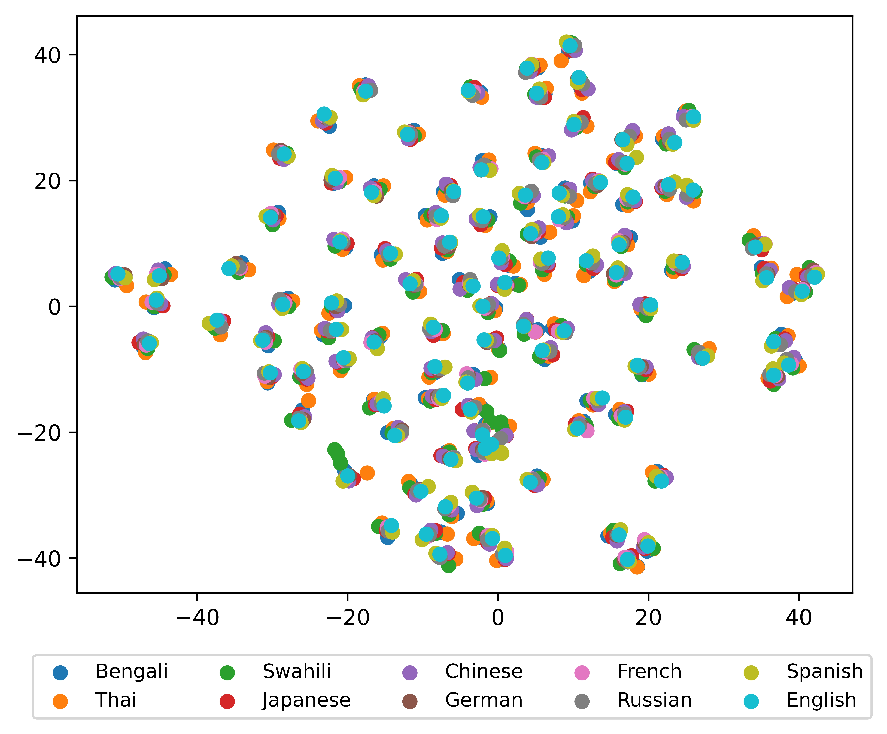

# MindMerger：非英语语言中大型语言模型推理能力的高效增强

发布时间：2024年05月27日

`LLM应用

这篇论文摘要描述了一种名为MindMerger的方法，旨在提升大型语言模型（LLMs）在多语言环境下的推理和语言理解能力。该方法通过融合LLMs与外部多语言模型的语言理解能力，并采用两步训练策略来优化性能。这种方法特别强调了在资源较少的语言中的性能提升，显示了其在多语言推理和语言理解任务中的有效性。因此，这篇论文属于LLM应用类别，因为它专注于实际应用中如何改进和利用LLMs的能力。` `多语言处理` `人工智能`

> MindMerger: Efficient Boosting LLM Reasoning in non-English Languages

# 摘要

> 大型语言模型（LLMs）的推理能力至关重要，但英语与非英语语言之间存在明显鸿沟。为此，一些研究通过微调LLMs来重新学习非英语语言的推理，而另一些则通过使用外部模型的英语翻译输出来规避LLMs理解非英语的难题。然而，这些方法往往未能充分利用LLMs固有的高级推理和语言理解能力。为了更有效地挖掘LLMs的推理与语言理解潜能，我们提出了MindMerger方法，它将LLMs与多语言模型的外部语言理解能力融合，显著提升了多语言推理性能。我们还设计了一个两步训练策略：首先将外部能力嵌入LLMs，随后训练LLMs协同利用这些外部与内置能力。实验结果显示，在多个多语言推理及语言理解数据集上，MindMerger均超越了所有基线，尤其在资源较少的语言中表现突出。在不更新LLMs参数的前提下，MGSM数据集上，所有语言及资源匮乏语言的平均准确率分别提升了6.7%和8.0%。

> Reasoning capabilities are crucial for Large Language Models (LLMs), yet a notable gap exists between English and non-English languages. To bridge this disparity, some works fine-tune LLMs to relearn reasoning capabilities in non-English languages, while others replace non-English inputs with an external model's outputs such as English translation text to circumvent the challenge of LLM understanding non-English. Unfortunately, these methods often underutilize the built-in skilled reasoning and useful language understanding capabilities of LLMs. In order to better utilize the minds of reasoning and language understanding in LLMs, we propose a new method, namely MindMerger, which merges LLMs with the external language understanding capabilities from multilingual models to boost the multilingual reasoning performance. Furthermore, a two-step training scheme is introduced to first train to embeded the external capabilities into LLMs and then train the collaborative utilization of the external capabilities and the built-in capabilities in LLMs. Experiments on three multilingual reasoning datasets and a language understanding dataset demonstrate that MindMerger consistently outperforms all baselines, especially in low-resource languages. Without updating the parameters of LLMs, the average accuracy improved by 6.7% and 8.0% across all languages and low-resource languages on the MGSM dataset, respectively.

[Arxiv](https://arxiv.org/abs/2405.17386)