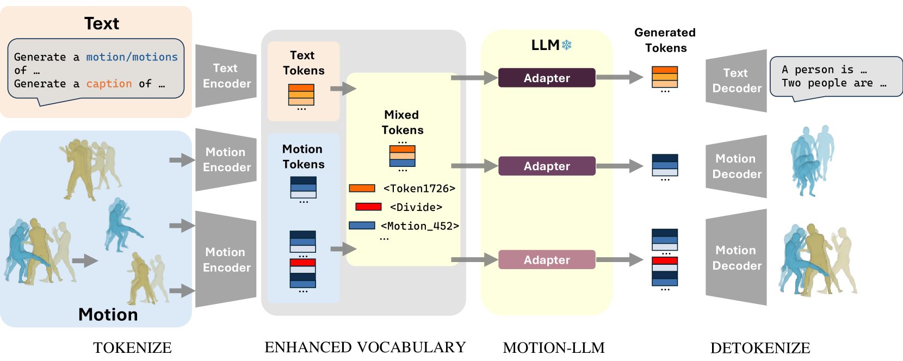
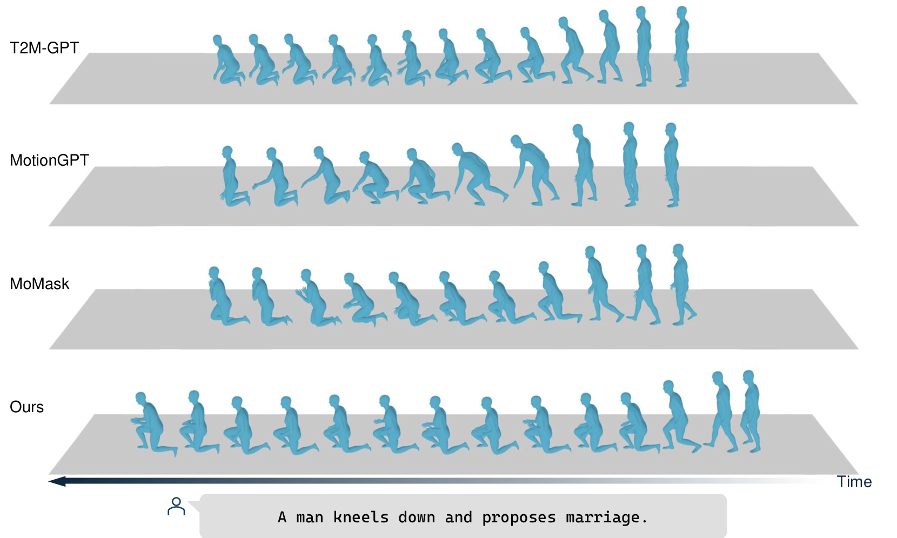
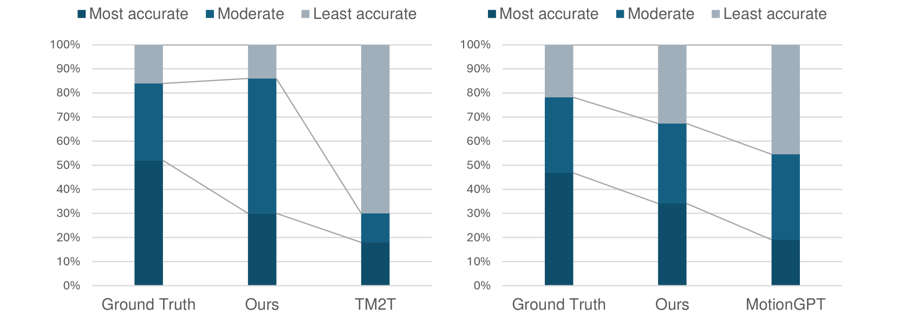
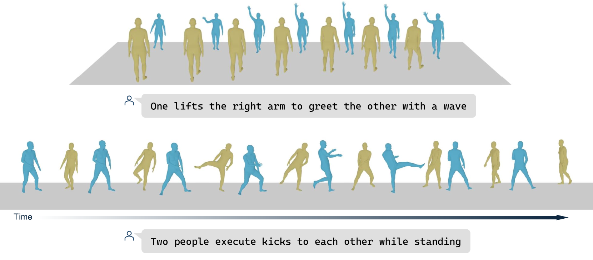
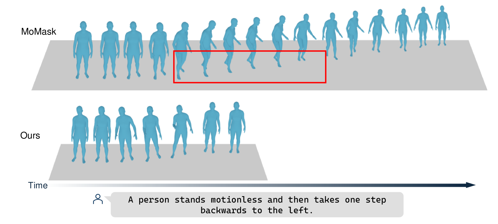
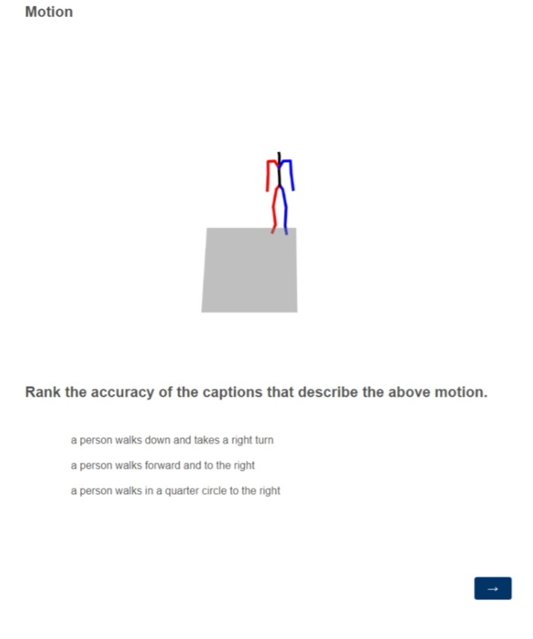

# MotionLLM：借助大型语言模型，探索多模态运动与语言的深度学习

发布时间：2024年05月27日

`LLM应用

这篇论文介绍了MotionLLM，一个利用多模态大型语言模型（MM-LLMs）进行动作生成的框架。它通过微调预训练模型，不仅支持单人动作生成，还能扩展至多人动作及动作描述。这种方法通过将动作转换为LLM可识别的离散令牌，并构建了一个融合动作与文本的词汇库，展示了LLM在多模态应用中的应用潜力。因此，这篇论文属于LLM应用分类。` `动作生成` `虚拟现实`

> MotionLLM: Multimodal Motion-Language Learning with Large Language Models

# 摘要

> 多模态大型语言模型（MM-LLMs）的最新进展在跨模态应用中展现了卓越的泛化与鲁棒性。以往的研究虽已通过特定架构实现3D单人动作生成，但多受限于此。借鉴MM-LLMs的成功，我们开发了MotionLLM，这一简洁框架通过微调预训练模型，不仅支持单人动作生成，还能扩展至多人动作及动作描述。我们巧妙地将动作转换为LLM可识别的离散令牌，构建了一个融合动作与文本的词汇库。仅动用LLMs的1-3%参数，我们的单人动作生成效果已媲美扩散模型及其他基于变换器的模型。此外，该方法灵活可扩展，通过自回归生成，轻松实现多人动作生成。项目详情请访问：https://knoxzhao.github.io/MotionLLM。

> Recent advancements in Multimodal Large Language Models (MM-LLMs) have demonstrated promising potential in terms of generalization and robustness when applied to different modalities. While previous works have already achieved 3D human motion generation using various approaches including language modeling, they mostly % are mostly carefully designed use specialized architecture and are restricted to single-human motion generation. Inspired by the success of MM-LLMs, we propose MotionLLM, a simple and general framework that can achieve single-human, multi-human motion generation, and motion captioning by fine-tuning pre-trained LLMs. Specifically, we encode and quantize motions into discrete LLM-understandable tokens, which results in a unified vocabulary consisting of both motion and text tokens. With only 1--3% parameters of the LLMs trained by using adapters, our single-human motion generation achieves comparable results to those diffusion models and other trained-from-scratch transformer-based models. Additionally, we show that our approach is scalable and flexible, allowing easy extension to multi-human motion generation through autoregressive generation of single-human motions. Project page: https://knoxzhao.github.io/MotionLLM

[Arxiv](https://arxiv.org/abs/2405.17013)