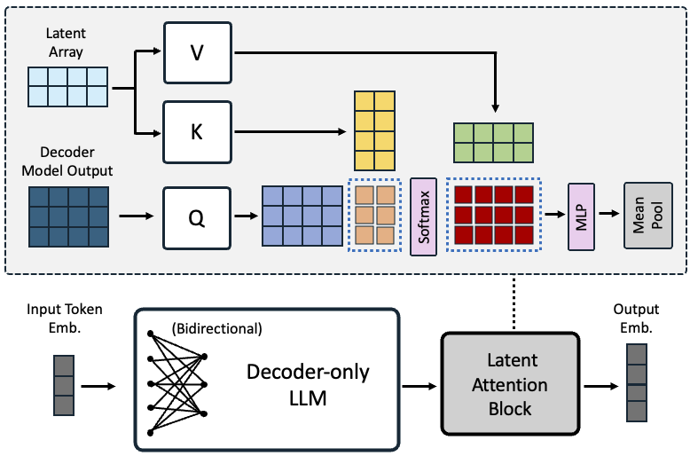

# NV-Embed：提升大型语言模型作为通用嵌入模型训练技术的革新方法

发布时间：2024年05月27日

`LLM应用

这篇论文介绍了NV-Embed模型，这是一种基于解码器的大型语言模型（LLM）嵌入模型，它在通用文本嵌入任务中超越了基于BERT或T5的模型。论文详细描述了模型的架构设计、训练策略以及其在检索和下游任务中的性能提升。此外，论文还提到了模型在公开数据集上的表现，并宣布将模型开源。这些内容主要关注于LLM的实际应用和性能优化，因此将其归类为LLM应用。` `信息检索`

> NV-Embed: Improved Techniques for Training LLMs as Generalist Embedding Models

# 摘要

> 仅基于解码器的大型语言模型（LLM）嵌入模型，在通用文本嵌入任务中已开始超越基于BERT或T5的模型，特别是在密集向量检索方面。我们推出的NV-Embed模型，通过创新的架构设计和训练策略，大幅提升了LLM的多功能性，同时保持了其简洁与可复现性。模型中引入的潜在注意力层，有效提升了检索及下游任务的准确性。在训练过程中，我们移除了因果注意力掩码，以增强表示学习。采用的两阶段对比指令调优方法，首先在检索数据集上进行对比训练，随后融入多种非检索数据集，不仅提升了非检索任务的准确性，也增强了检索性能。凭借这些技术，NV-Embed模型在公开数据上取得了69.32的创纪录高分，在MTEB基准中位列第一，涵盖56项任务，包括检索、重排序、分类、聚类和语义文本相似性。此外，在BEIR的15个检索任务中，该模型也获得了59.36的最高分。我们将在https://huggingface.co/nvidia/NV-Embed-v1开源此模型。

> Decoder-only large language model (LLM)-based embedding models are beginning to outperform BERT or T5-based embedding models in general-purpose text embedding tasks, including dense vector-based retrieval. In this work, we introduce the NV-Embed model with a variety of architectural designs and training procedures to significantly enhance the performance of LLM as a versatile embedding model, while maintaining its simplicity and reproducibility. For model architecture, we propose a latent attention layer to obtain pooled embeddings, which consistently improves retrieval and downstream task accuracy compared to mean pooling or using the last <EOS> token embedding from LLMs. To enhance representation learning, we remove the causal attention mask of LLMs during contrastive training. For model training, we introduce a two-stage contrastive instruction-tuning method. It first applies contrastive training with instructions on retrieval datasets, utilizing in-batch negatives and curated hard negative examples. At stage-2, it blends various non-retrieval datasets into instruction tuning, which not only enhances non-retrieval task accuracy but also improves retrieval performance. Combining these techniques, our NV-Embed model, using only publicly available data, has achieved a record-high score of 69.32, ranking No. 1 on the Massive Text Embedding Benchmark (MTEB) (as of May 24, 2024), with 56 tasks, encompassing retrieval, reranking, classification, clustering, and semantic textual similarity tasks. Notably, our model also attains the highest score of 59.36 on 15 retrieval tasks in the MTEB benchmark (also known as BEIR). We will open-source the model at: https://huggingface.co/nvidia/NV-Embed-v1.

[Arxiv](https://arxiv.org/abs/2405.17428)