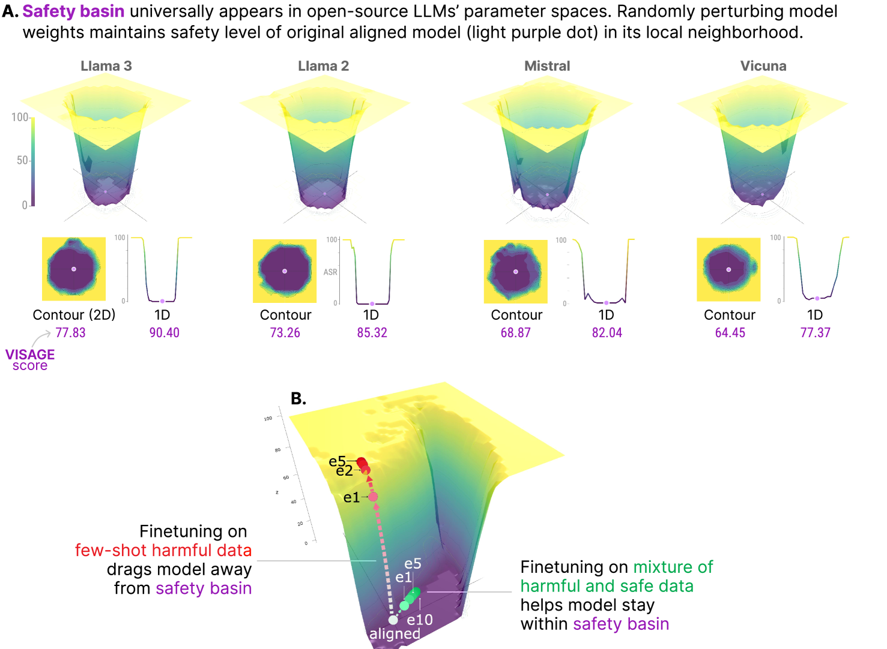
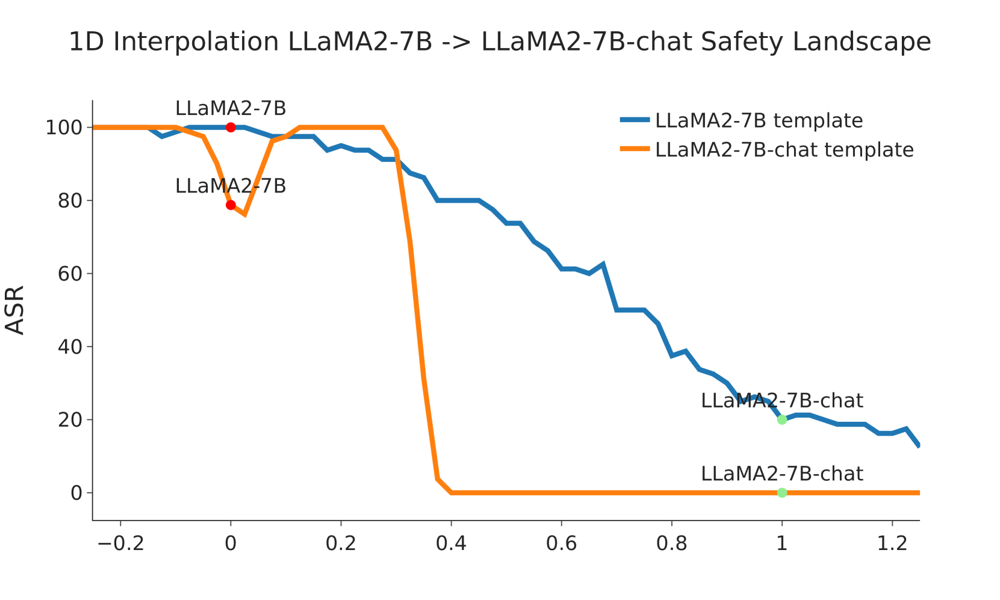
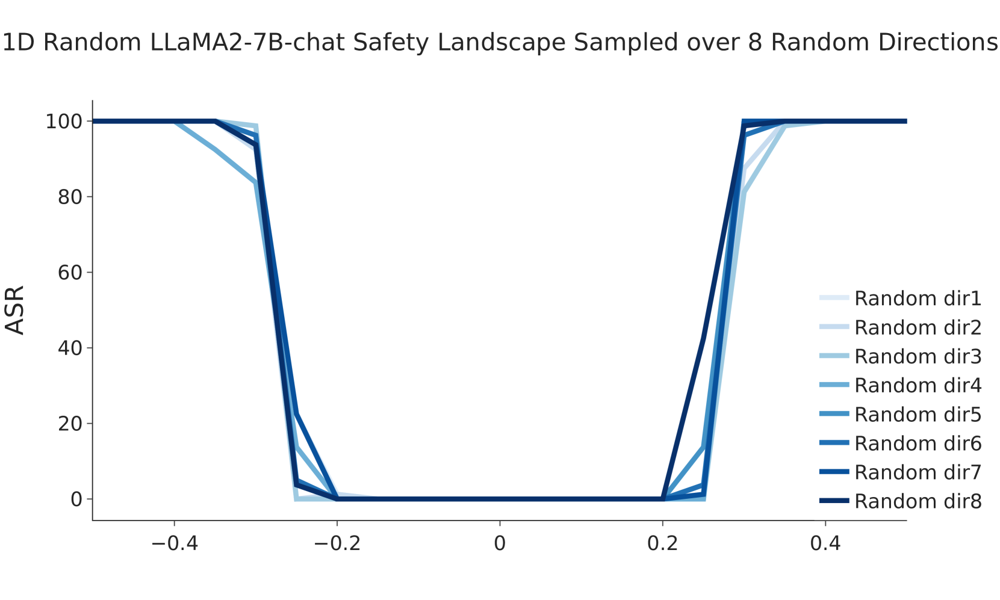
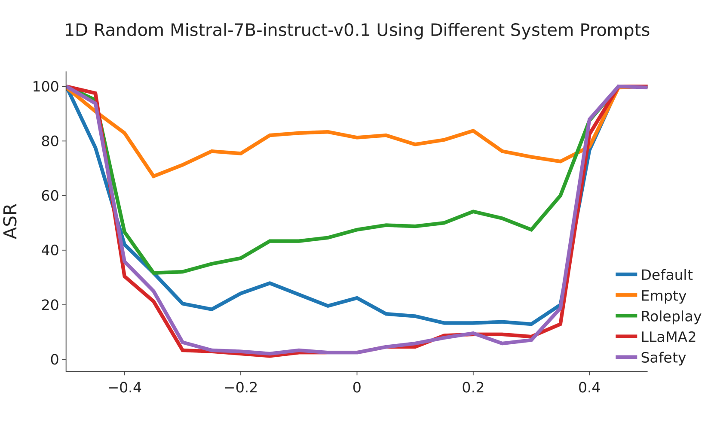
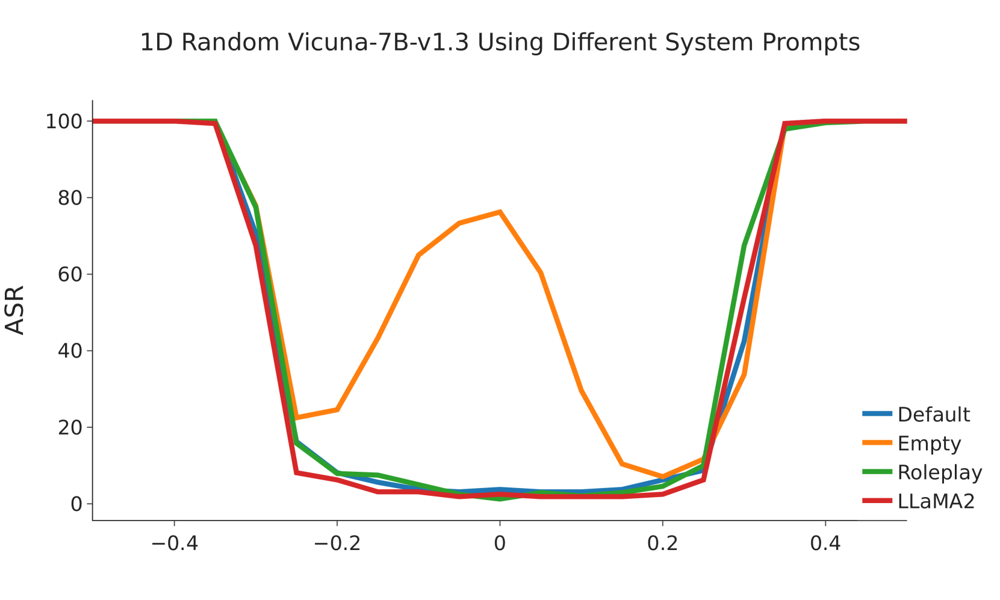
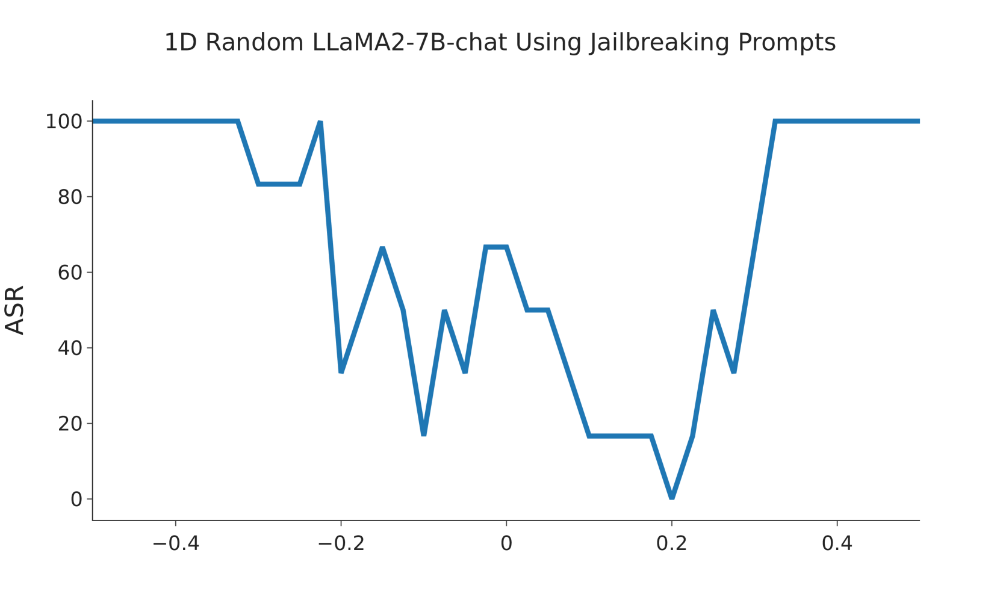
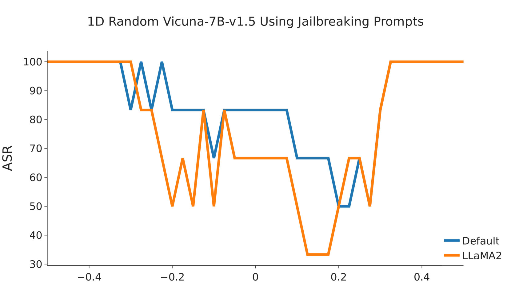

# 探索安全领域：评估微调大型语言模型中的风险

发布时间：2024年05月27日

`LLM理论

这篇论文主要探讨了大型语言模型（LLMs）的安全性问题，特别是在微调过程中可能出现的安全风险。论文提出了“安全盆地”的概念，并开发了新的安全指标VISAGE来评估微调对LLMs安全性的影响。这些研究内容更偏向于LLM的理论分析和安全性评估，因此归类为LLM理论。` `人工智能安全` `模型微调`

> Navigating the Safety Landscape: Measuring Risks in Finetuning Large Language Models

# 摘要

> 安全对齐是确保大型语言模型（LLMs）行为符合人类偏好并限制有害行为的关键，但研究表明，仅通过少数对抗性设计的训练样本微调就可能破坏这一机制。我们旨在通过探索LLM安全景观来评估微调LLMs的风险。我们发现了一个普遍存在于流行开源LLMs模型参数空间中的新现象——“安全盆地”：即使随机扰动模型权重，也能在局部保持原始模型的安全水平。这一发现促使我们提出了新的VISAGE安全指标，通过分析安全景观来评估LLM微调的安全性。通过可视化安全景观，我们能洞察微调如何将模型拖离安全盆地从而影响安全。此外，LLM安全景观凸显了系统提示在模型保护中的关键作用，并表明这种保护在安全盆地内的扰动模型中得以传递。这些发现为未来LLM安全研究提供了新的视角。

> Safety alignment is the key to guiding the behaviors of large language models (LLMs) that are in line with human preferences and restrict harmful behaviors at inference time, but recent studies show that it can be easily compromised by finetuning with only a few adversarially designed training examples. We aim to measure the risks in finetuning LLMs through navigating the LLM safety landscape. We discover a new phenomenon observed universally in the model parameter space of popular open-source LLMs, termed as "safety basin": randomly perturbing model weights maintains the safety level of the original aligned model in its local neighborhood. Our discovery inspires us to propose the new VISAGE safety metric that measures the safety in LLM finetuning by probing its safety landscape. Visualizing the safety landscape of the aligned model enables us to understand how finetuning compromises safety by dragging the model away from the safety basin. LLM safety landscape also highlights the system prompt's critical role in protecting a model, and that such protection transfers to its perturbed variants within the safety basin. These observations from our safety landscape research provide new insights for future work on LLM safety community.

[Arxiv](https://arxiv.org/abs/2405.17374)