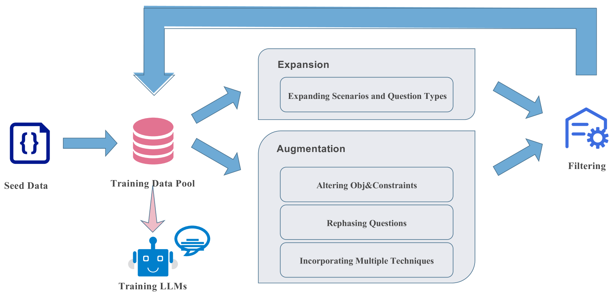
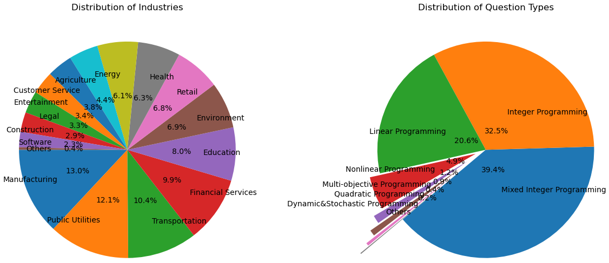

# ORLM：大型语言模型的优化建模训练

发布时间：2024年05月27日

`LLM应用

这篇论文主要探讨了如何使用开源的大型语言模型（LLMs）来解决运筹学（OR）中的优化问题，并提出了一个半自动化的流程来生成符合特定需求的训练数据。此外，还创建了一个工业基准来评估这些模型的性能。这些内容主要集中在LLM的实际应用层面，特别是在优化建模和数据隐私保护方面，因此将其归类为LLM应用。` `运筹学` `工业优化`

> ORLM: Training Large Language Models for Optimization Modeling

# 摘要

> 大型语言模型（LLMs）在自动化复杂运筹学（OR）优化建模中展现出强大能力，但目前方法依赖专有LLMs和提示工程，引发工业应用中的数据隐私担忧。为此，我们提出使用开源LLMs进行优化建模，并明确了OR LLMs训练数据的四个关键需求。我们开发了OR-Instruct，一个半自动化流程，专门生成符合这些需求的合成数据，并创建了首个工业基准IndustryOR，用于评估LLMs解决实际OR问题的能力。通过将OR-Instruct数据应用于7b大小的多种开源LLMs（ORLMs），我们显著提升了优化建模性能。表现最佳的ORLM在NL4OPT、MAMO及IndustryOR基准上均达到业界领先水平。相关代码和数据将公开于\url{https://github.com/Cardinal-Operations/ORLM}。

> Large Language Models (LLMs) have emerged as powerful tools for complex Operations Research (OR) in automating optimization modeling. However, current methodologies heavily rely on prompt engineering (e.g., multi-agent cooperation) with proprietary LLMs, raising data privacy concerns that could be prohibitive in industry applications. To tackle this issue, we propose training open-source LLMs for optimization modeling. We identify four critical requirements for the training dataset of OR LLMs, design and implement OR-Instruct, a semi-automated process for creating synthetic data tailored to specific requirements. We also introduce the IndustryOR benchmark, the first industrial benchmark for testing LLMs on solving real-world OR problems. We apply the data from OR-Instruct to various open-source LLMs of 7b size (termed as ORLMs), resulting in a significantly improved capability for optimization modeling. Our best-performing ORLM achieves state-of-the-art performance on the NL4OPT, MAMO, and IndustryOR benchmarks. Our code and data will be available at \url{https://github.com/Cardinal-Operations/ORLM}.

[Arxiv](https://arxiv.org/abs/2405.17743)