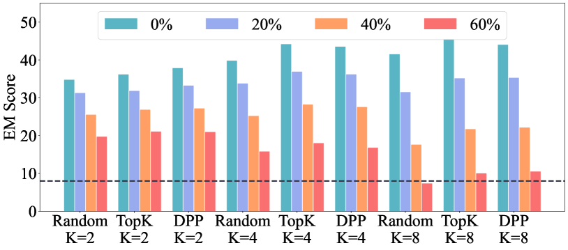
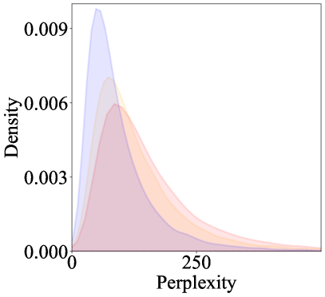
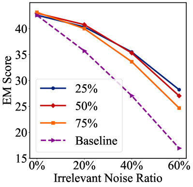
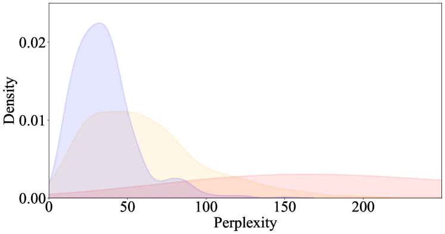

# 探究文本生成中情境学习对噪声的抗干扰能力

发布时间：2024年05月27日

`LLM理论

理由：这篇论文主要探讨了大型语言模型（LLMs）在情境学习（ICL）中的性能问题，特别是在文本生成任务中噪声标注的影响。论文提出了一种新的方法——局部困惑度排序（LPR），用于改进ICL在噪声环境下的性能。这种方法涉及对噪声标签导致的困惑度偏差的分析，并区分了固有困惑度与匹配困惑度。这些内容更多地关注于LLM的理论和方法改进，而不是具体的应用或Agent的行为，因此归类为LLM理论。` `文本生成`

> On the Noise Robustness of In-Context Learning for Text Generation

# 摘要

> 大型语言模型（LLMs）通过情境学习（ICL）在下游任务上表现出色，关键在于从众多标注示例中精选出高质量的演示。尽管有研究指出ICL在文本分类中对噪声演示具有较强的鲁棒性，但我们发现，在文本生成任务中，噪声标注却严重影响了ICL的性能。为此，我们提出了一种名为局部困惑度排序（LPR）的新方法，它通过选择更可能无噪声的近邻来替换噪声候选。该方法源于对噪声标签导致的困惑度偏差的分析，并区分了固有困惑度与匹配困惑度。LPR的核心在于通过语义空间中的邻近排序来分离匹配困惑度，从而在保持原有选择方法效力的同时，避免选入不匹配的输入-标签对。实验结果显示，LPR在噪声标注的基准测试中，将EM分数提升了高达18.75，证明了其有效性。

> Large language models (LLMs) have shown impressive performance on downstream tasks by in-context learning (ICL), which heavily relies on the quality of demonstrations selected from a large set of annotated examples. Recent works claim that in-context learning is robust to noisy demonstrations in text classification. In this work, we show that, on text generation tasks, noisy annotations significantly hurt the performance of in-context learning. To circumvent the issue, we propose a simple and effective approach called Local Perplexity Ranking (LPR), which replaces the "noisy" candidates with their nearest neighbors that are more likely to be clean. Our method is motivated by analyzing the perplexity deviation caused by noisy labels and decomposing perplexity into inherent perplexity and matching perplexity. Our key idea behind LPR is thus to decouple the matching perplexity by performing the ranking among the neighbors in semantic space. Our approach can prevent the selected demonstrations from including mismatched input-label pairs while preserving the effectiveness of the original selection methods. Extensive experiments demonstrate the effectiveness of LPR, improving the EM score by up to 18.75 on common benchmarks with noisy annotations.

[Arxiv](https://arxiv.org/abs/2405.17264)