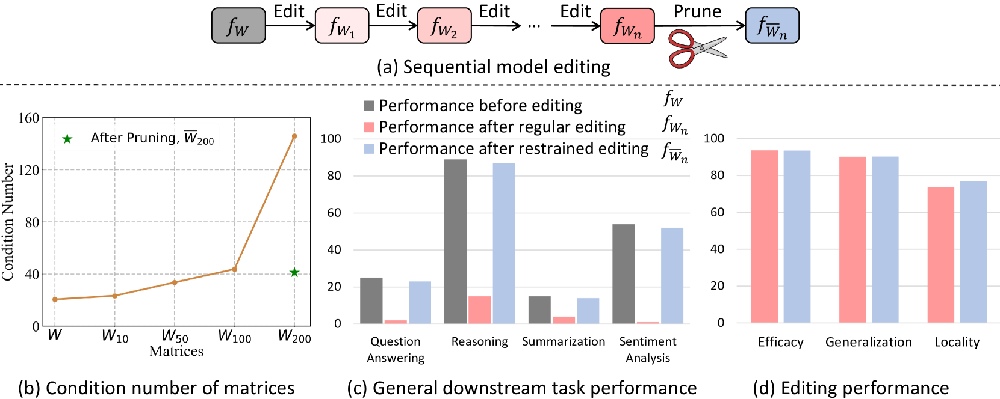
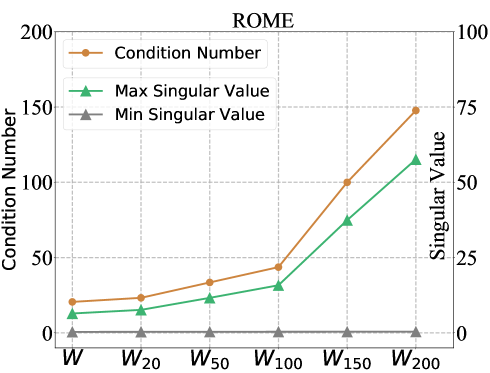
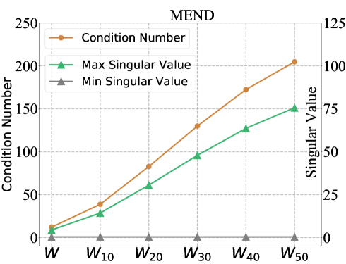
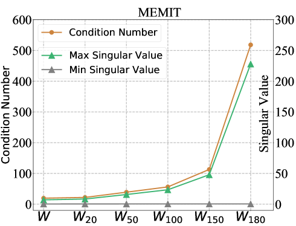

# 序列模型编辑中的扰动抑制

发布时间：2024年05月27日

`LLM理论

理由：这篇论文主要探讨了大型语言模型（LLMs）在模型编辑过程中的通用性问题，并提出了一种新的框架“编辑上限扰动抑制（PRUNE）”来解决这一问题。论文通过理论分析和实验验证，深入研究了模型编辑对LLMs性能的影响，这属于对LLM理论层面的研究。因此，将其归类为LLM理论是合适的。` `机器学习`

> Perturbation-Restrained Sequential Model Editing

# 摘要

> 模型编辑领域正崭露头角，旨在更新大型语言模型（LLMs）的知识库，无需繁琐的重新训练。但现有方法随着编辑次数增多，严重削弱了LLMs的通用性，这对持续学习构成挑战。本文首先理论分析指出，序列模型编辑中影响通用性的关键在于编辑矩阵的条件数，该数反映了数值敏感度，进而揭示了原始知识关联在编辑后的扰动程度。统计结果显示，编辑次数增多导致该因素值增大，加剧了通用性的退化。为此，我们提出了“编辑上限扰动抑制（PRUNE）”框架，通过条件数约束在序列编辑中实施。这些约束降低了编辑模型扰动的上限，保护了通用性。我们系统地运用三种流行编辑方法，在三个LLMs上进行了四个代表性下游任务的实验。评估表明，PRUNE在序列编辑中既能保持显著的通用性，又能有效维持编辑效果。相关代码和数据已公开于https://github.com/mjy1111/PRUNE。

> Model editing is an emerging field that focuses on updating the knowledge embedded within large language models (LLMs) without extensive retraining. However, current model editing methods significantly compromise the general abilities of LLMs as the number of edits increases, and this trade-off poses a substantial challenge to the continual learning of LLMs. In this paper, we first theoretically analyze that the factor affecting the general abilities in sequential model editing lies in the condition number of the edited matrix. The condition number of a matrix represents its numerical sensitivity, and therefore can be used to indicate the extent to which the original knowledge associations stored in LLMs are perturbed after editing. Subsequently, statistical findings demonstrate that the value of this factor becomes larger as the number of edits increases, thereby exacerbating the deterioration of general abilities. To this end, a framework termed Perturbation Restraint on Upper bouNd for Editing (PRUNE) is proposed, which applies the condition number restraints in sequential editing. These restraints can lower the upper bound on perturbation to edited models, thus preserving the general abilities. Systematically, we conduct experiments employing three popular editing methods on three LLMs across four representative downstream tasks. Evaluation results show that PRUNE can preserve considerable general abilities while maintaining the editing performance effectively in sequential model editing. The code and data are available at https://github.com/mjy1111/PRUNE.

[Arxiv](https://arxiv.org/abs/2405.16821)