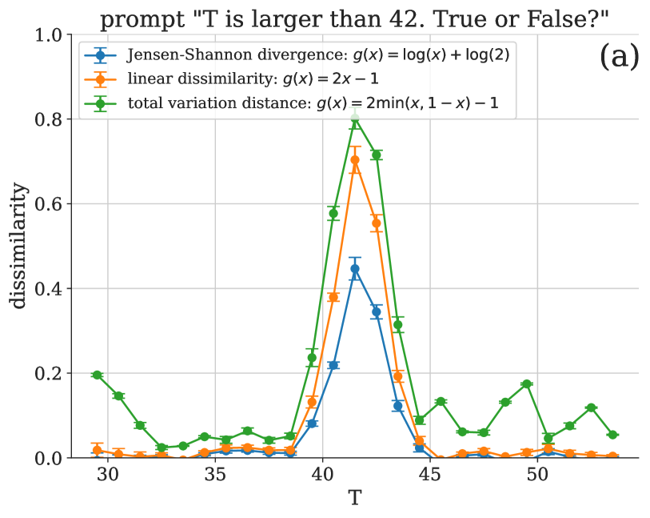
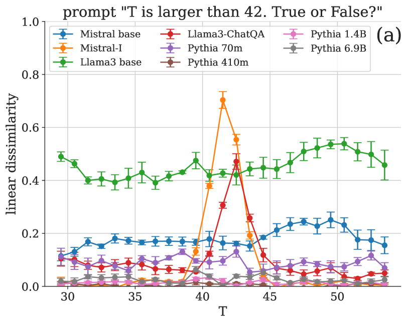
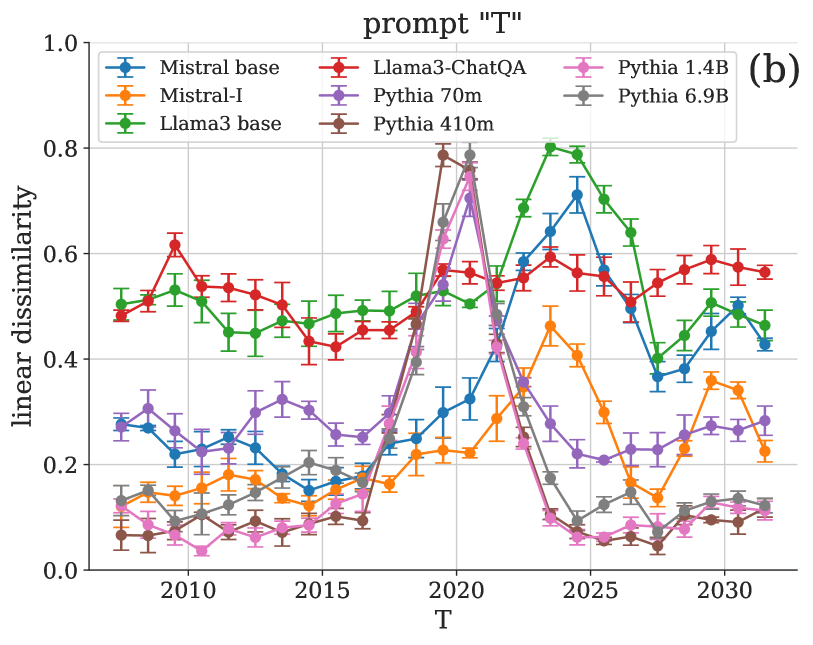
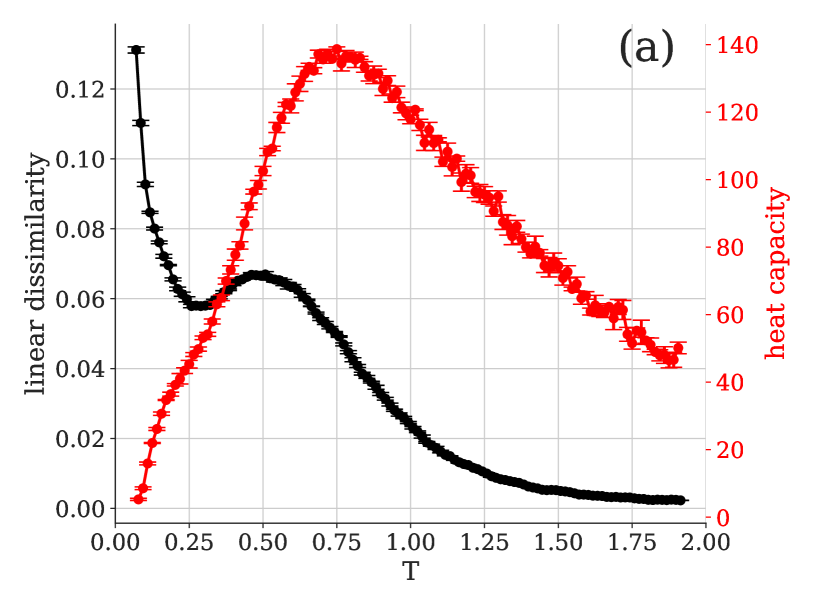
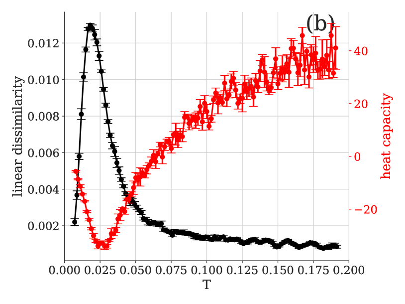
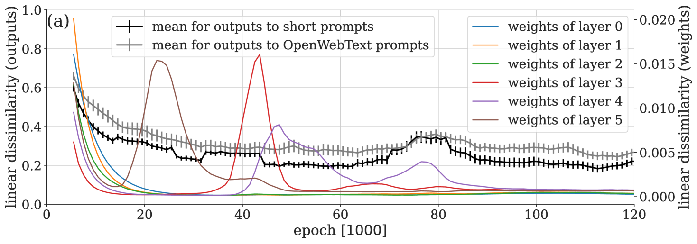
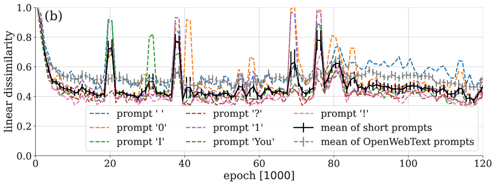

# 大型语言模型输出分布中的相变现象研究

发布时间：2024年05月27日

`LLM理论

理由：这篇论文探讨了大型语言模型（LLM）中的相变现象，并利用统计方法来分析和检测这些相变。这种研究侧重于理解LLM的内部机制和行为，特别是通过统计距离来衡量生成输出的分布变化，这属于对LLM理论层面的深入探讨。因此，它更适合归类于LLM理论。` `数据分析`

> Phase Transitions in the Output Distribution of Large Language Models

# 摘要

> 在物理系统中，通过调整温度等参数，可以触发物质状态的突变，即相变。类似的现象也在大型语言模型中显现。识别这些相变通常需要人类专家的洞察力，以及对系统特性的深入理解，以便聚焦于关键的低维属性进行分析。近期，物理学界提出了一系列统计方法，旨在从数据中自动检测相变。这些方法具有广泛的适用性，并已证明可用于研究大型语言模型的行为。具体而言，我们利用统计距离来衡量生成输出的分布变化，这种方法能够通过分析下一个标记的概率分布高效实现。这一灵活的方法不仅能够揭示语言模型中的新行为阶段，还能探索未知的转变路径，这在语言模型技术飞速进步的同时，显得尤为引人注目。

> In a physical system, changing parameters such as temperature can induce a phase transition: an abrupt change from one state of matter to another. Analogous phenomena have recently been observed in large language models. Typically, the task of identifying phase transitions requires human analysis and some prior understanding of the system to narrow down which low-dimensional properties to monitor and analyze. Statistical methods for the automated detection of phase transitions from data have recently been proposed within the physics community. These methods are largely system agnostic and, as shown here, can be adapted to study the behavior of large language models. In particular, we quantify distributional changes in the generated output via statistical distances, which can be efficiently estimated with access to the probability distribution over next-tokens. This versatile approach is capable of discovering new phases of behavior and unexplored transitions -- an ability that is particularly exciting in light of the rapid development of language models and their emergent capabilities.

[Arxiv](https://arxiv.org/abs/2405.17088)