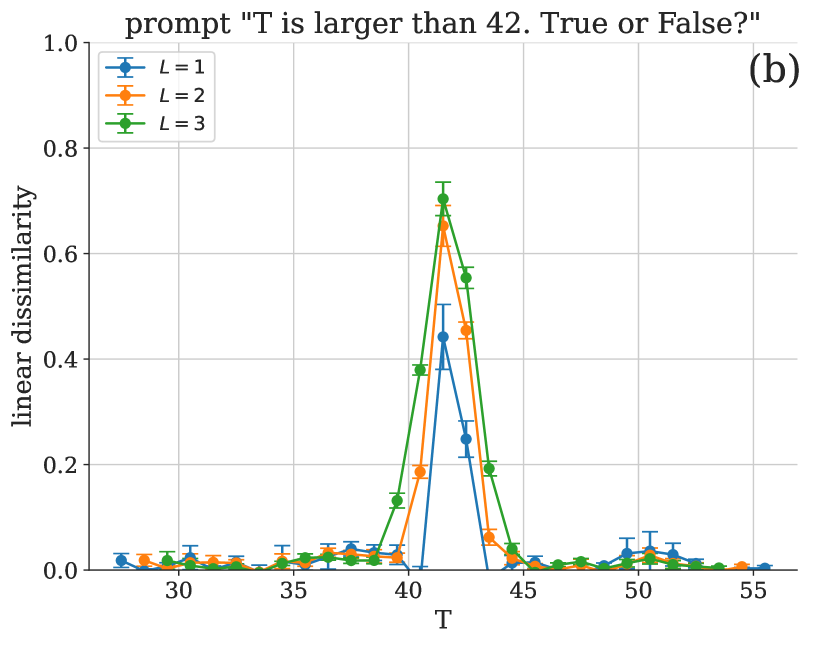

# 大型语言模型输出分布的相变现象

发布时间：2024年05月27日

`LLM理论

理由：这篇论文探讨了大型语言模型（LLM）中的相变现象，并提出了一种统计方法来自动检测这些相变。这种方法不依赖于特定系统的先验知识，而是通过分析生成输出的分布变化来揭示新的行为模式和转变路径。这种研究属于对LLM理论层面的探讨，因为它关注的是模型内部的行为和特性，而不是具体的应用或代理行为。因此，它被归类为LLM理论。` `物理学` `语言模型`

> Phase Transitions in the Output Distribution of Large Language Models

# 摘要

> 在物理系统中，通过调整温度等参数，可以引发物质状态的突然转变，即相变。类似现象在大语言模型中也已显现。识别这些相变通常需要人类分析和系统先验知识，以聚焦于关键的低维属性。物理学界新近提出的统计方法，能自动从数据中检测相变，且不特定于系统类型，现已证明适用于研究大型语言模型的行为。我们通过统计距离有效评估生成输出的分布变化，利用下一个标记的概率分布进行精确估计。这一灵活方法不仅能揭示新的行为模式，还能探索未知的转变路径，对于语言模型能力的迅猛发展和新兴特性的涌现，具有特别的吸引力。

> In a physical system, changing parameters such as temperature can induce a phase transition: an abrupt change from one state of matter to another. Analogous phenomena have recently been observed in large language models. Typically, the task of identifying phase transitions requires human analysis and some prior understanding of the system to narrow down which low-dimensional properties to monitor and analyze. Statistical methods for the automated detection of phase transitions from data have recently been proposed within the physics community. These methods are largely system agnostic and, as shown here, can be adapted to study the behavior of large language models. In particular, we quantify distributional changes in the generated output via statistical distances, which can be efficiently estimated with access to the probability distribution over next-tokens. This versatile approach is capable of discovering new phases of behavior and unexplored transitions -- an ability that is particularly exciting in light of the rapid development of language models and their emergent capabilities.

[Arxiv](https://arxiv.org/abs/2405.17088)