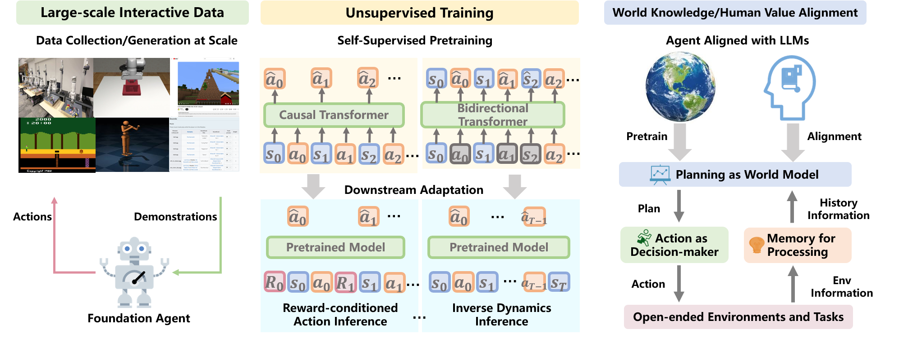
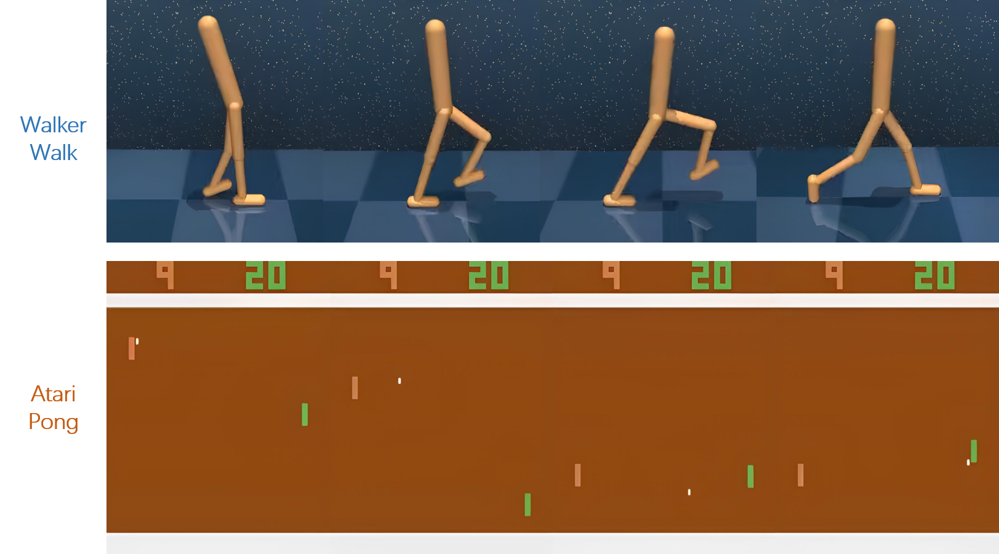

# 职位：基础代理——决策制定的新范式

发布时间：2024年05月27日

`Agent

这篇论文主要讨论了构建基础代理的概念，将其视为代理学习范式的一次革新，并探讨了其核心特性和挑战。论文中提到的基础代理的发展蓝图，包括数据采集、自监督预训练、适应性以及与大型语言模型（LLMs）的知识与价值对齐，都是围绕代理（Agent）的概念展开的。因此，这篇论文最符合Agent分类。` `人工智能` `决策支持系统`

> Position: Foundation Agents as the Paradigm Shift for Decision Making

# 摘要

> 决策制定依赖于感知、记忆与推理的精妙协作，以探寻最优策略。传统决策方法常受限于低效的样本利用和较差的泛化能力。然而，语言与视觉领域的基础模型已展现出对新任务的快速适应性。鉴于此，我们倡导构建基础代理，将其视为代理学习范式的一次革新。这一构想源于大型语言模型（LLMs）的成功，我们据此定义了基础代理的核心特性和挑战。我们还勾勒了基础代理的发展蓝图，涵盖从大规模交互数据的采集或生成，至自监督预训练与适应，再到与LLMs的知识与价值对齐。最后，我们明确了由此引发的关键研究问题，并通过实际案例展示了基础代理的发展趋势，旨在从技术和理论两方面推动该领域迈向更广阔的未来。

> Decision making demands intricate interplay between perception, memory, and reasoning to discern optimal policies. Conventional approaches to decision making face challenges related to low sample efficiency and poor generalization. In contrast, foundation models in language and vision has showcased rapid adaptation to diverse new tasks. Therefore, we advocate for the construction of foundation agents as a transformative shift in the learning paradigm of agents. This proposal is underpinned by the formulation of foundation agents with its fundamental characteristics and challenges motivated by the success of large language models (LLMs). Moreover, we specify the roadmap of foundation agents from large interactive data collection or generation, to self-supervised pretraining and adaptation, and knowledge and value alignment with LLMs. Lastly, we pinpoint critical research questions derived from the formulation and delineate trends for foundation agents supported by real-world use cases, addressing both technical and theoretical aspects to propel the field towards a more comprehensive and impactful future.

[Arxiv](https://arxiv.org/abs/2405.17009)