# 借助人类反馈优化提示策略

发布时间：2024年05月27日

`LLM应用

这篇论文探讨了基于人类反馈的提示优化（POHF），特别是在黑盒大型语言模型（LLM）的背景下。它提出了一种自动化POHF（APOHF）算法，该算法利用人类用户的偏好反馈来优化提示，从而提高LLM的性能。这种方法特别适用于那些难以通过数值评分来衡量提示质量的情况。论文通过实验展示了APOHF算法在多个应用领域的有效性，包括优化用户指令和文本到图像模型的提示调整。因此，这篇论文属于LLM应用类别，因为它专注于实际应用中的优化技术，而不是理论研究。` `人工智能` `用户体验`

> Prompt Optimization with Human Feedback

# 摘要

> 大型语言模型（LLMs）在众多任务中表现出色，但其性能严重依赖于输入提示，这催生了提示优化的新研究。然而，传统方法需依赖数值评分来衡量提示质量，这在人类与黑盒LLM互动时难以实现且不可靠。相比之下，获取人类用户的偏好反馈更为直接有效，即展示两个提示的输出，让用户选择更优者。本文探讨了基于人类反馈的提示优化（POHF），旨在通过人类偏好反馈优化黑盒LLM的提示。借鉴决斗式多臂老虎机的原理，我们设计了自动化POHF（APOHF）算法，该算法在每次迭代中智能选择提示对以征求用户偏好。APOHF算法在多个领域展现了其效能，包括优化用户指令、文本到图像模型的提示调整，以及通过人类反馈进一步优化响应。实验证明，APOHF能高效利用有限的反馈找到优质提示。代码已公开于\url{https://github.com/xqlin98/APOHF}。

> Large language models (LLMs) have demonstrated remarkable performances in various tasks. However, the performance of LLMs heavily depends on the input prompt, which has given rise to a number of recent works on prompt optimization. However, previous works often require the availability of a numeric score to assess the quality of every prompt. Unfortunately, when a human user interacts with a black-box LLM, attaining such a score is often infeasible and unreliable. Instead, it is usually significantly easier and more reliable to obtain preference feedback from a human user, i.e., showing the user the responses generated from a pair of prompts and asking the user which one is preferred. Therefore, in this paper, we study the problem of prompt optimization with human feedback (POHF), in which we aim to optimize the prompt for a black-box LLM using only human preference feedback. Drawing inspiration from dueling bandits, we design a theoretically principled strategy to select a pair of prompts to query for preference feedback in every iteration, and hence introduce our algorithm named automated POHF (APOHF). We apply our APOHF algorithm to various tasks, including optimizing user instructions, prompt optimization for text-to-image generative models, and response optimization with human feedback (i.e., further refining the response using a variant of our APOHF). The results demonstrate that our APOHF can efficiently find a good prompt using a small number of preference feedback instances. Our code can be found at \url{https://github.com/xqlin98/APOHF}.

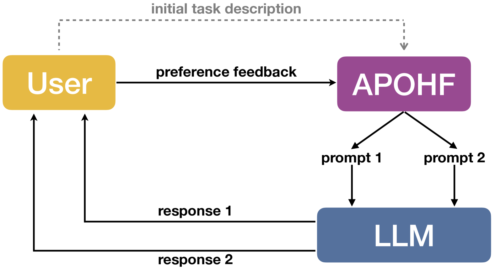

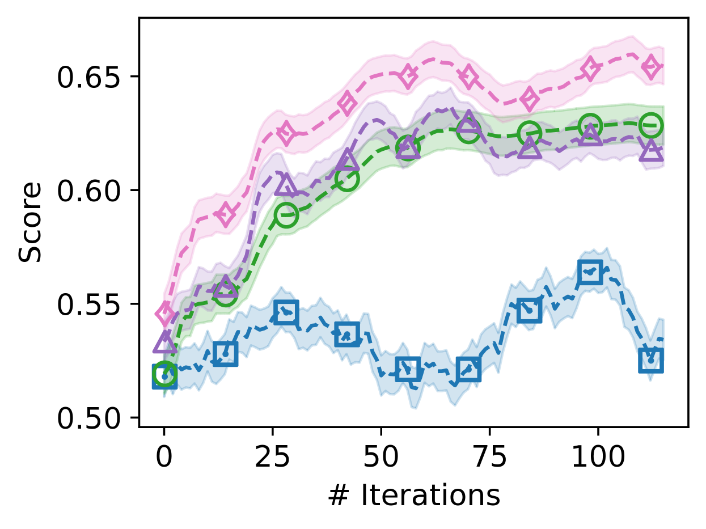

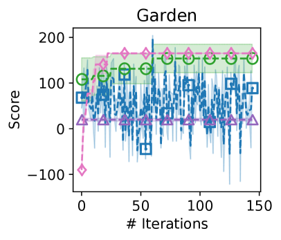

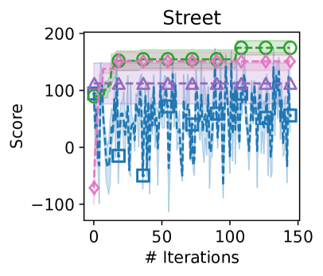

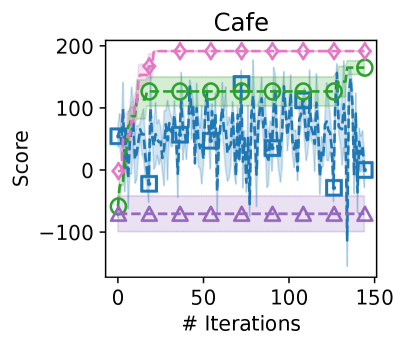

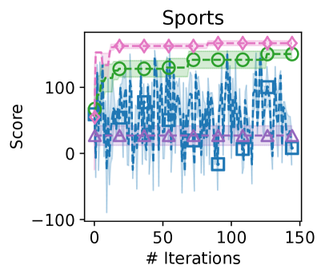

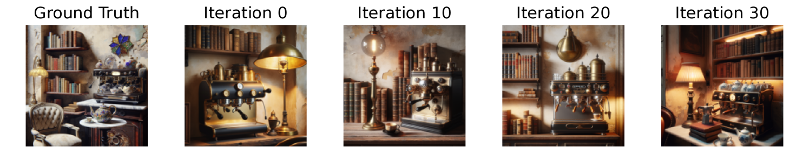

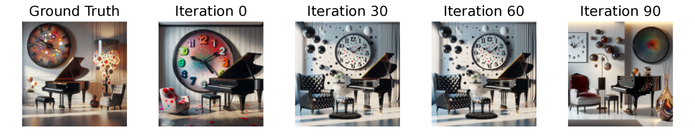

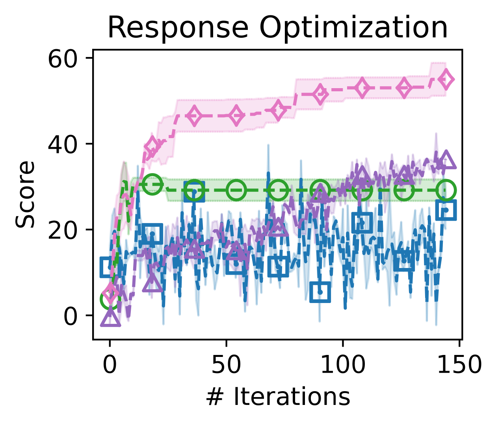

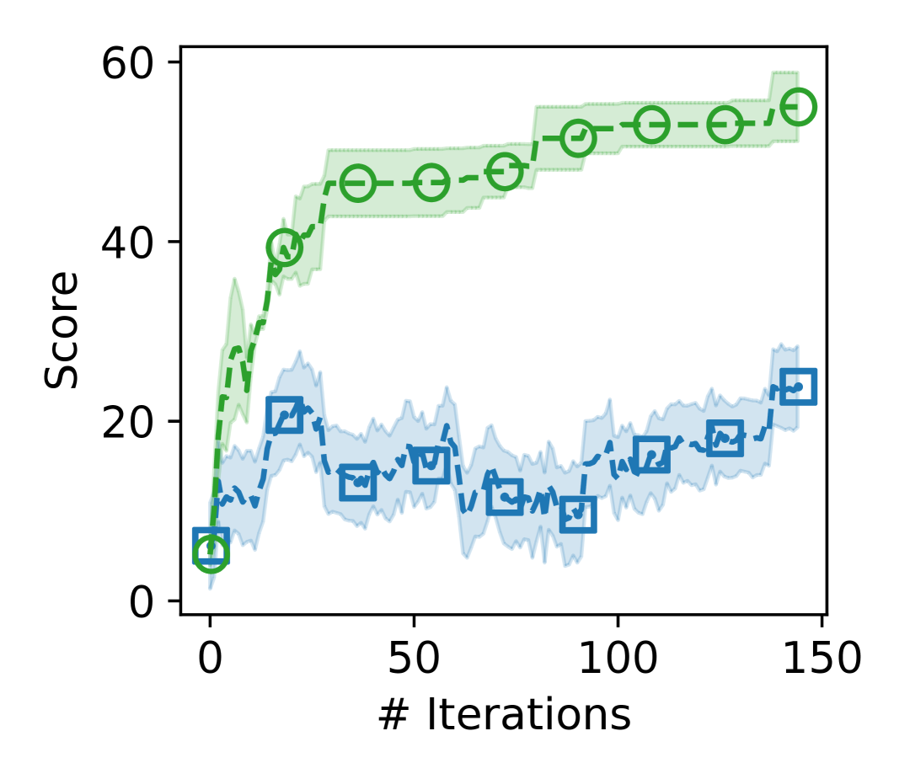

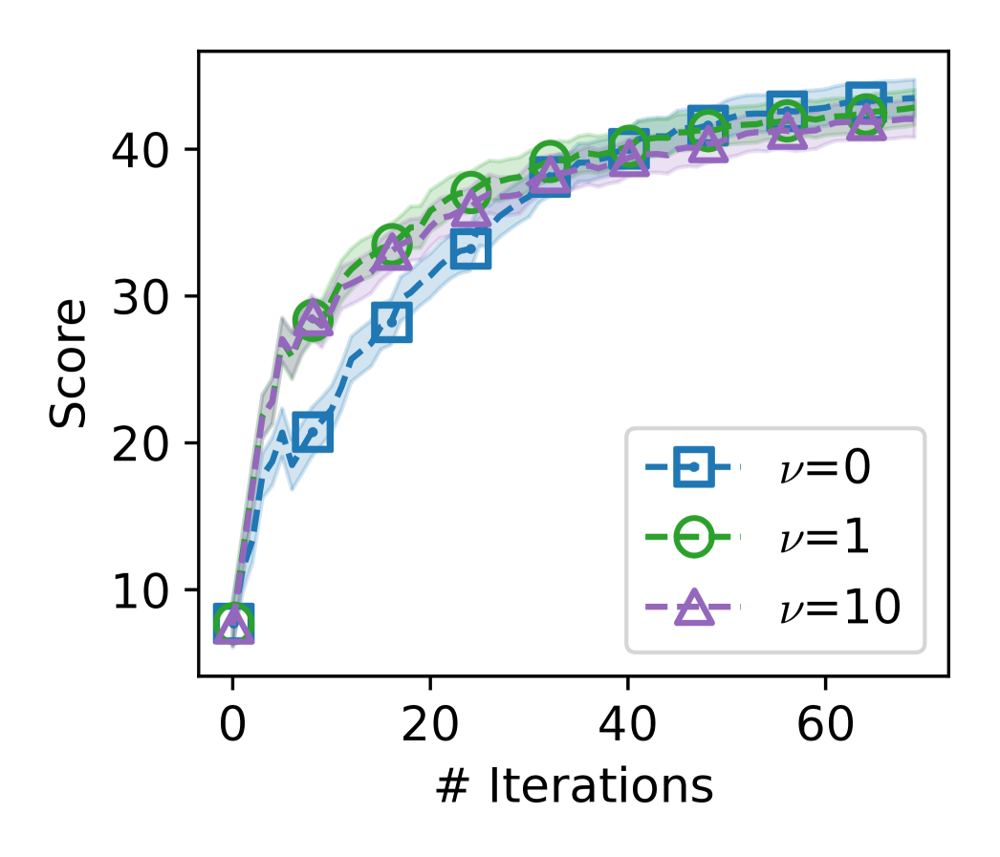

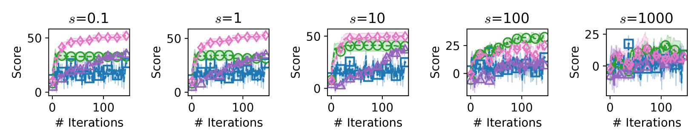

[Arxiv](https://arxiv.org/abs/2405.17346)