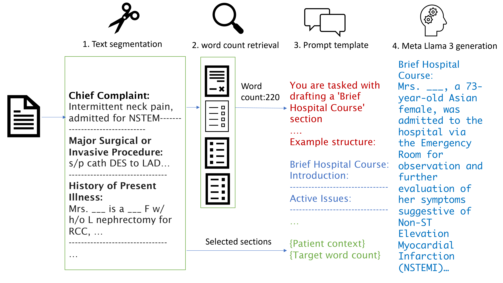
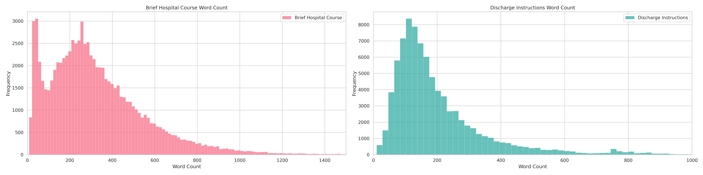
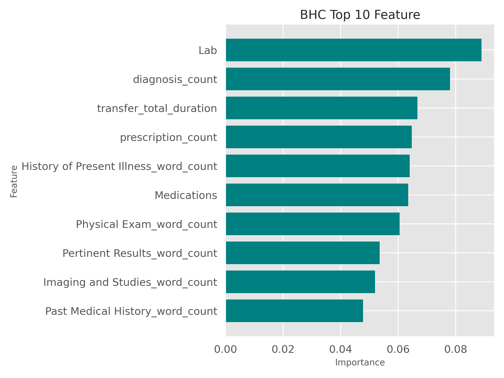
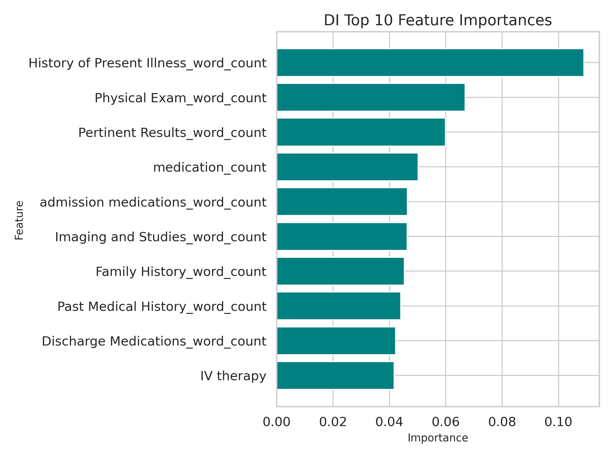

# QUB-Cirdan 参与的 "Discharge Me!" 项目，利用开源大型语言模型，成功实现了零-shot 出院信的自动生成。

发布时间：2024年05月27日

`RAG

理由：这篇论文摘要中提到了使用 Llama3 8B 模型结合零-shot 和 RAG（Retrieval-Augmented Generation）技术来生成出院摘要，这是直接应用 RAG 技术在生物医学 NLP 任务中的例子。RAG 是一种结合了检索和生成的方法，用于改进语言模型的性能，特别是在需要从大量信息中检索相关内容并生成连贯文本的场景中。因此，这篇论文属于RAG分类。`

> QUB-Cirdan at "Discharge Me!": Zero shot discharge letter generation by open-source LLM

# 摘要

> BioNLP ACL'24 共享任务旨在通过自动化关键出院文档来减轻医生的负担。我们采用 Llama3 8B 模型，结合零-shot 和 RAG 技术，精准生成出院摘要。我们的创新包括定制模板确保内容一致，以及 RAG 技术优化字数。此外，我们分享了探索过程中的失败实验，以启发未来研究。结果表明，我们的方法在多项评估中表现出色，既高效又有效。

> The BioNLP ACL'24 Shared Task on Streamlining Discharge Documentation aims to reduce the administrative burden on clinicians by automating the creation of critical sections of patient discharge letters. This paper presents our approach using the Llama3 8B quantized model to generate the "Brief Hospital Course" and "Discharge Instructions" sections. We employ a zero-shot method combined with Retrieval-Augmented Generation (RAG) to produce concise, contextually accurate summaries. Our contributions include the development of a curated template-based approach to ensure reliability and consistency, as well as the integration of RAG for word count prediction. We also describe several unsuccessful experiments to provide insights into our pathway for the competition. Our results demonstrate the effectiveness and efficiency of our approach, achieving high scores across multiple evaluation metrics.

[Arxiv](https://arxiv.org/abs/2406.00041)