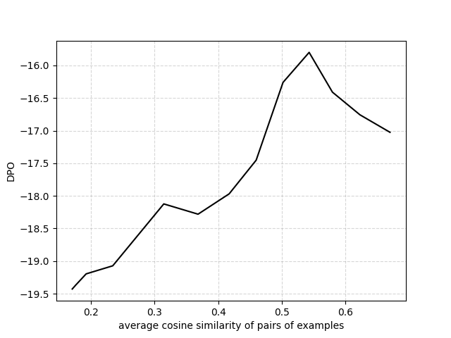

# RAGSys：将物品冷启动推荐系统模拟为检索与生成相结合的智能系统

发布时间：2024年05月27日

`RAG

这篇论文主要探讨了情境学习（ICL）中的演示检索系统，并特别强调了检索增强生成（RAG）在为大型语言模型（LLM）提供相关演示方面的作用。论文提出了一个新的评估方法来衡量演示检索系统的性能，并讨论了多样性和质量偏差对ICL效果的影响。因此，这篇论文更符合RAG分类，因为它专注于检索增强生成技术及其在LLM中的应用。` `推荐系统`

> RAGSys: Item-Cold-Start Recommender as RAG System

# 摘要

> 大型语言模型（LLM）虽潜力巨大，但通用知识常难满足特定领域需求。微调虽常用，却易导致灾难性遗忘和泛化障碍。情境学习（ICL）另辟蹊径，借助检索增强生成（RAG）为LLM提供少量学习任务的相关演示。本文深入探讨了ICL中演示检索系统的理想特质，指出其与项目冷启动推荐系统相似，更注重发现与信息增益而非严格相关性。我们创新性地提出了一种评估方法，通过LLM在NLP任务上的表现来衡量，摒弃了主观多样性评分。研究揭示，演示检索中的多样性与质量偏差对ICL效果至关重要，并凸显了推荐系统技术在此领域的应用前景。

> Large Language Models (LLM) hold immense promise for real-world applications, but their generic knowledge often falls short of domain-specific needs. Fine-tuning, a common approach, can suffer from catastrophic forgetting and hinder generalizability. In-Context Learning (ICL) offers an alternative, which can leverage Retrieval-Augmented Generation (RAG) to provide LLMs with relevant demonstrations for few-shot learning tasks. This paper explores the desired qualities of a demonstration retrieval system for ICL. We argue that ICL retrieval in this context resembles item-cold-start recommender systems, prioritizing discovery and maximizing information gain over strict relevance. We propose a novel evaluation method that measures the LLM's subsequent performance on NLP tasks, eliminating the need for subjective diversity scores. Our findings demonstrate the critical role of diversity and quality bias in retrieved demonstrations for effective ICL, and highlight the potential of recommender system techniques in this domain.

[Arxiv](https://arxiv.org/abs/2405.17587)