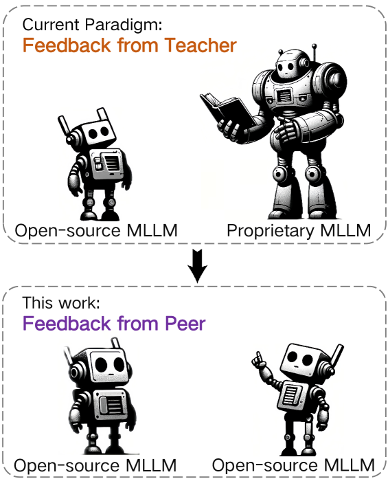

# RLAIF-V：借助开源AI反馈，确保多模态大型语言模型（MLLMs）与Super GPT-4V的可信度保持一致

发布时间：2024年05月27日

`RAG

理由：这篇论文主要讨论了通过反馈学习来提升多模态大型语言模型（MLLMs）的信任度，并提出了RLAIF-V框架，这是一个全开源的方法，旨在通过高质量反馈数据和在线反馈学习算法来优化模型性能。这种方法和框架与RAG（Retrieval-Augmented Generation）的概念相符，即通过增强检索和反馈机制来改进模型的生成能力。因此，这篇论文更适合归类于RAG。` `人工智能` `机器学习`

> RLAIF-V: Aligning MLLMs through Open-Source AI Feedback for Super GPT-4V Trustworthiness

# 摘要

> 通过反馈学习，多模态大型语言模型（MLLMs）的幻觉问题得到缓解，这得益于模型与人类偏好的对齐。传统的手动标注方法既耗时又费力，而新兴的自动标注模型则无需人工介入，展现出良好前景。但这些方法依赖于如GPT-4V等昂贵的专有模型，限制了其扩展性。这种依赖专有模型的做法虽能暂时缩小性能差距，但随着差距的逐渐缩小，社区正面临一个关键问题：如何用能力相当的标注模型来对齐MLLMs。本研究提出的RLAIF-V框架，采用全开源方式，旨在提升MLLMs的信任度，超越GPT-4V。RLAIF-V从高质量反馈数据和在线反馈学习算法两方面最大化利用开源反馈。在七个基准上的实验结果显示，RLAIF-V在不损害其他任务性能的前提下，显著提升了模型信任度。特别是，RLAIF-V的7B模型通过34B标注器，将物体幻觉降低了82.9%，总体幻觉降低了42.1%，超越了标注器模型。此外，RLAIF-V还展示了开源MLLMs自我对齐的潜力，12B模型通过自我反馈学习，实现了低于29.5%的总体幻觉率，远超GPT-4V的45.9%。这些发现为提升尖端MLLMs的效能开辟了一条充满希望的道路。

> Learning from feedback reduces the hallucination of multimodal large language models (MLLMs) by aligning them with human preferences. While traditional methods rely on labor-intensive and time-consuming manual labeling, recent approaches employing models as automatic labelers have shown promising results without human intervention. However, these methods heavily rely on costly proprietary models like GPT-4V, resulting in scalability issues. Moreover, this paradigm essentially distills the proprietary models to provide a temporary solution to quickly bridge the performance gap. As this gap continues to shrink, the community is soon facing the essential challenge of aligning MLLMs using labeler models of comparable capability. In this work, we introduce RLAIF-V, a novel framework that aligns MLLMs in a fully open-source paradigm for super GPT-4V trustworthiness. RLAIF-V maximally exploits the open-source feedback from two perspectives, including high-quality feedback data and online feedback learning algorithm. Extensive experiments on seven benchmarks in both automatic and human evaluation show that RLAIF-V substantially enhances the trustworthiness of models without sacrificing performance on other tasks. Using a 34B model as labeler, RLAIF-V 7B model reduces object hallucination by 82.9\% and overall hallucination by 42.1\%, outperforming the labeler model. Remarkably, RLAIF-V also reveals the self-alignment potential of open-source MLLMs, where a 12B model can learn from the feedback of itself to achieve less than 29.5\% overall hallucination rate, surpassing GPT-4V (45.9\%) by a large margin. The results shed light on a promising route to enhance the efficacy of leading-edge MLLMs.

[Arxiv](https://arxiv.org/abs/2405.17220)