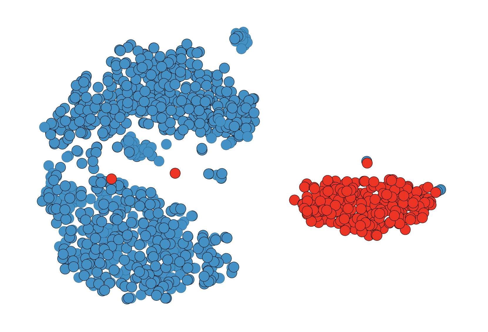

# ReMoDetect：奖励模型洞察大型语言模型的生成对齐

发布时间：2024年05月27日

`LLM应用

这篇论文主要探讨了大型语言模型（LLMs）生成文本的检测方法，特别是在对齐训练的背景下，如何通过奖励模型来识别和区分LLM生成的文本与人类编写的文本。论文提出的两种训练策略——持续偏好微调和对人类/LLM混合文本进行奖励建模，旨在增强奖励模型的检测能力，以应对假新闻等社会风险。这些内容直接关联到LLMs的应用层面，特别是在确保信息安全和质量控制方面的应用，因此归类为LLM应用。` `内容安全`

> ReMoDetect: Reward Models Recognize Aligned LLM's Generations

# 摘要

> 大型语言模型（LLMs）的强大功能和易用性带来了显著的社会风险，如假新闻的泛滥，这促使我们必须开发检测LLM生成文本（LGT）的方法以确保安全。面对众多LLMs，逐一检测变得不切实际，因此找出它们的共同特征至关重要。本文聚焦于近期LLMs的一个共性——对齐训练，即让LLMs生成更符合人类偏好的文本。我们发现，这些经过对齐训练的LLMs在追求最大化人类偏好的过程中，生成的文本甚至比人类编写的更受欢迎，这使得它们能被奖励模型轻易识别。基于此，我们提出了两种训练策略以增强奖励模型的检测能力：一是持续偏好微调，让奖励模型更倾向于识别对齐的LGTs；二是对人类/LLM混合文本进行奖励建模，这类文本作为LGTs和人类文本之间的中间偏好语料，有助于更精准地划定决策边界。我们在六个文本领域中测试了十二个对齐的LLMs，结果表明我们的方法达到了业界领先水平。相关代码已公开于https://github.com/hyunseoklee-ai/reward_llm_detect。

> The remarkable capabilities and easy accessibility of large language models (LLMs) have significantly increased societal risks (e.g., fake news generation), necessitating the development of LLM-generated text (LGT) detection methods for safe usage. However, detecting LGTs is challenging due to the vast number of LLMs, making it impractical to account for each LLM individually; hence, it is crucial to identify the common characteristics shared by these models. In this paper, we draw attention to a common feature of recent powerful LLMs, namely the alignment training, i.e., training LLMs to generate human-preferable texts. Our key finding is that as these aligned LLMs are trained to maximize the human preferences, they generate texts with higher estimated preferences even than human-written texts; thus, such texts are easily detected by using the reward model (i.e., an LLM trained to model human preference distribution). Based on this finding, we propose two training schemes to further improve the detection ability of the reward model, namely (i) continual preference fine-tuning to make the reward model prefer aligned LGTs even further and (ii) reward modeling of Human/LLM mixed texts (a rephrased texts from human-written texts using aligned LLMs), which serves as a median preference text corpus between LGTs and human-written texts to learn the decision boundary better. We provide an extensive evaluation by considering six text domains across twelve aligned LLMs, where our method demonstrates state-of-the-art results. Code is available at https://github.com/hyunseoklee-ai/reward_llm_detect.

[Arxiv](https://arxiv.org/abs/2405.17382)