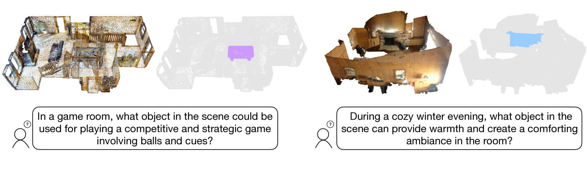
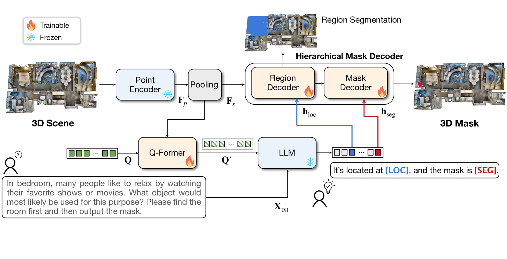
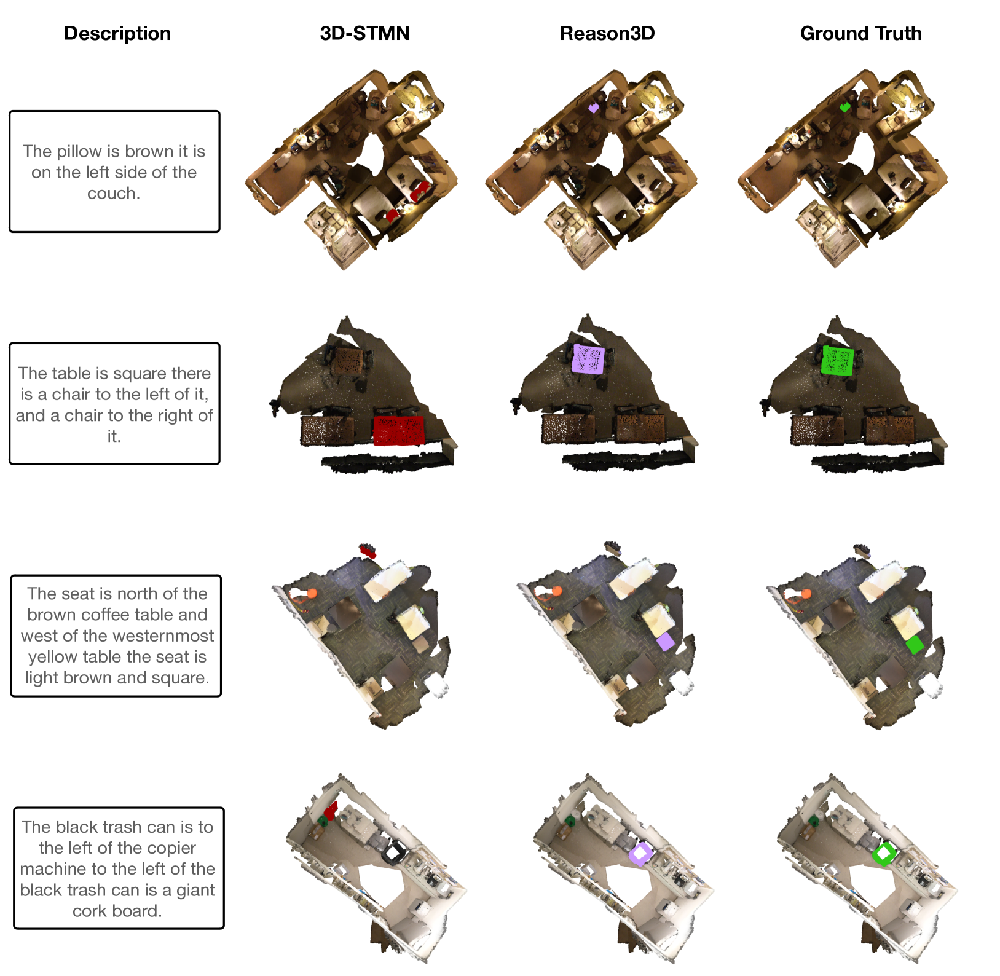
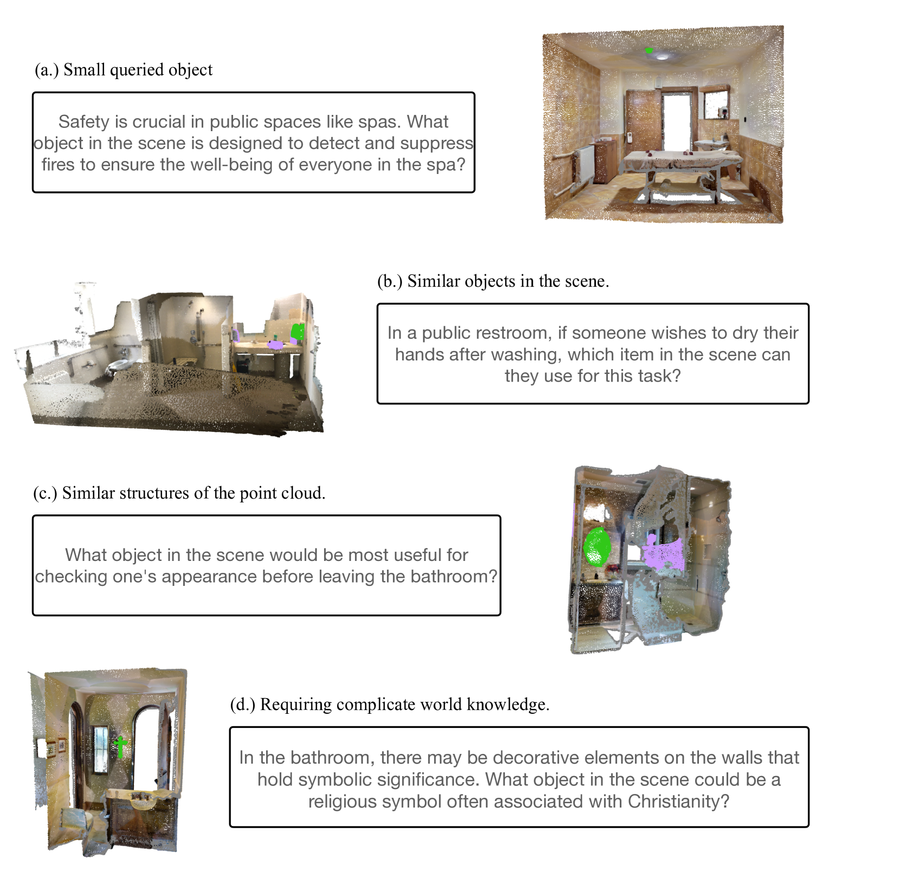

# Reason3D：借助大型语言模型，探索3D分割的搜索与推理之道

发布时间：2024年05月27日

`LLM应用

这篇论文介绍了一个专门为深度3D理解设计的创新型多模态大型语言模型（LLM），名为Reason3D。该模型通过结合点云数据和文本提示，能够输出文本响应及分割掩码，用于高级任务如3D推理分割、层次搜索、表达式引用及问答。论文中提到的层次掩码解码器设计，以及在ScanNet和Matterport3D等数据集上的实验结果，都展示了该模型在特定应用领域的优越性能。因此，这篇论文应归类于LLM应用，因为它专注于LLM在特定任务（即3D环境理解）中的实际应用和性能优化。` `3D视觉` `人工智能`

> Reason3D: Searching and Reasoning 3D Segmentation via Large Language Model

# 摘要

> 多模态大型语言模型（LLMs）在概念推理等领域展现出巨大潜力，但在3D环境理解方面的应用仍显不足。本文推出的Reason3D，是一款专为深度3D理解量身打造的创新LLM。它通过点云数据和文本提示输入，输出文本响应及分割掩码，助力3D推理分割、层次搜索、表达式引用及问答等高级任务。特别地，我们设计了一种层次掩码解码器，精准定位广阔场景中的小物体。该解码器先进行粗略定位，再逐步细化，显著提升了物体识别与分割的精确度。实验证明，Reason3D在ScanNet和Matterport3D等大型数据集上的3D表达式引用、问答及推理分割任务中表现卓越。代码与模型已公开，详情请访问：https://github.com/KuanchihHuang/Reason3D。

> Recent advancements in multimodal large language models (LLMs) have shown their potential in various domains, especially concept reasoning. Despite these developments, applications in understanding 3D environments remain limited. This paper introduces Reason3D, a novel LLM designed for comprehensive 3D understanding. Reason3D takes point cloud data and text prompts as input to produce textual responses and segmentation masks, facilitating advanced tasks like 3D reasoning segmentation, hierarchical searching, express referring, and question answering with detailed mask outputs. Specifically, we propose a hierarchical mask decoder to locate small objects within expansive scenes. This decoder initially generates a coarse location estimate covering the object's general area. This foundational estimation facilitates a detailed, coarse-to-fine segmentation strategy that significantly enhances the precision of object identification and segmentation. Experiments validate that Reason3D achieves remarkable results on large-scale ScanNet and Matterport3D datasets for 3D express referring, 3D question answering, and 3D reasoning segmentation tasks. Code and models are available at: https://github.com/KuanchihHuang/Reason3D.

[Arxiv](https://arxiv.org/abs/2405.17427)