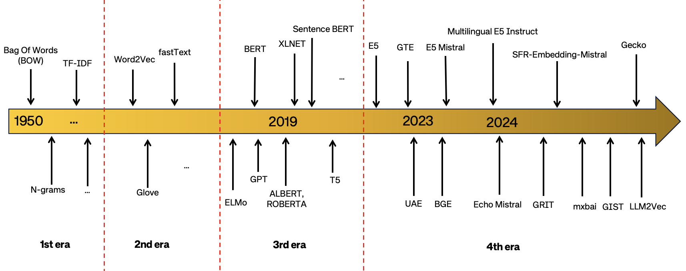
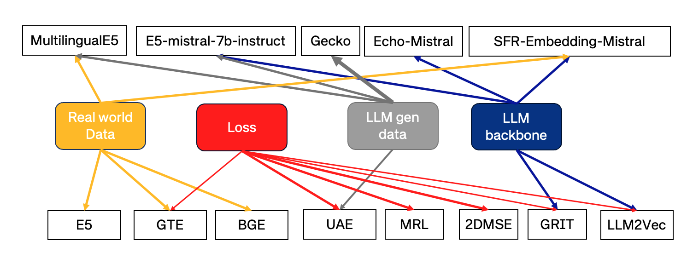
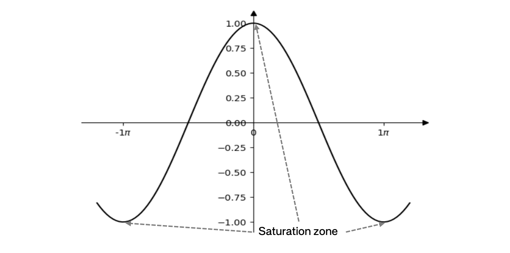
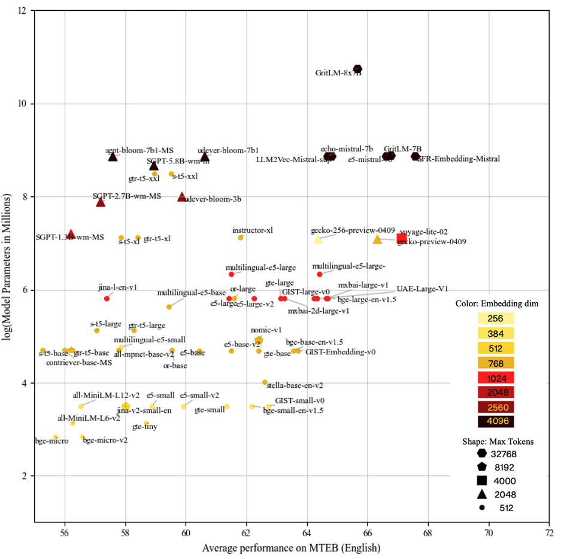

# 文本嵌入技术新进展：深度解析MTEB基准上的顶尖方法

发布时间：2024年05月27日

`RAG

这篇论文主要讨论了文本嵌入技术在大型语言模型（LLMs）如检索增强生成系统（RAGs）中的应用，以及这些技术在跨任务和跨领域泛化上的挑战和进步。由于论文的重点是分析和比较在大型文本嵌入基准（MTEB）上表现卓越的文本嵌入模型，并探讨这些技术在RAG等LLM应用中的发展和局限，因此将其归类为RAG。` `文本嵌入`

> Recent advances in text embedding: A Comprehensive Review of Top-Performing Methods on the MTEB Benchmark

# 摘要

> 文本嵌入技术因其对众多自然语言处理任务的关键作用，在工业界和学术界日益受到重视。随着大型语言模型（LLMs）如检索增强系统（RAGs）的应用兴起，通用文本嵌入的重要性愈发显著。以往的模型虽力求通用，却常在跨任务和跨领域泛化上遭遇挑战。近期，得益于训练数据的量、质、多样性的提升，以及利用LLMs生成合成数据和作为骨干网络，通用文本嵌入技术取得了显著进步。本文聚焦于大型文本嵌入基准（MTEB）上表现卓越的文本嵌入模型，深入比较分析，揭示了该领域的关键成就与局限，并提出了可能引领未来研究的新方向。

> Text embedding methods have become increasingly popular in both industrial and academic fields due to their critical role in a variety of natural language processing tasks. The significance of universal text embeddings has been further highlighted with the rise of Large Language Models (LLMs) applications such as Retrieval-Augmented Systems (RAGs). While previous models have attempted to be general-purpose, they often struggle to generalize across tasks and domains. However, recent advancements in training data quantity, quality and diversity; synthetic data generation from LLMs as well as using LLMs as backbones encourage great improvements in pursuing universal text embeddings. In this paper, we provide an overview of the recent advances in universal text embedding models with a focus on the top performing text embeddings on Massive Text Embedding Benchmark (MTEB). Through detailed comparison and analysis, we highlight the key contributions and limitations in this area, and propose potentially inspiring future research directions.

[Arxiv](https://arxiv.org/abs/2406.01607)