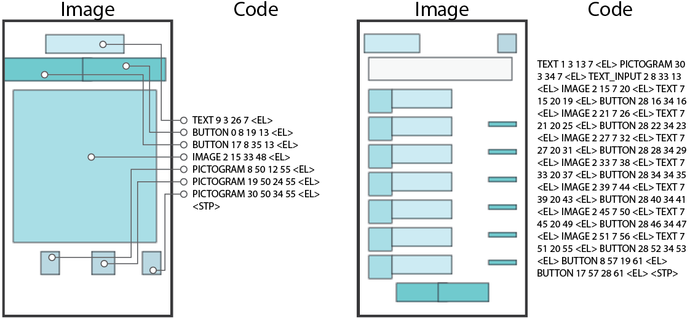
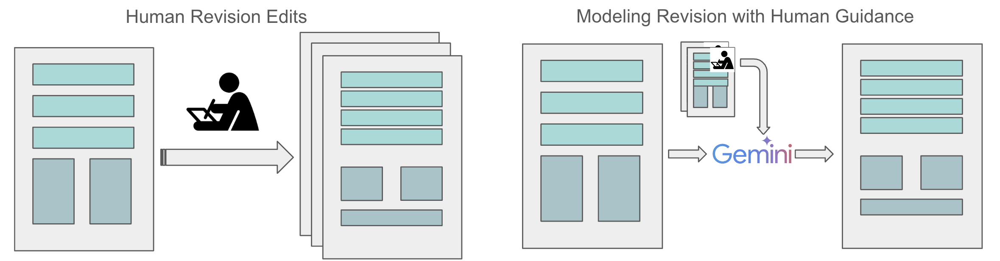
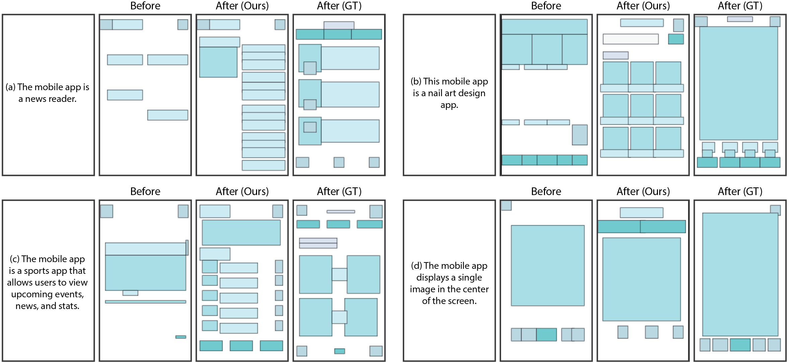
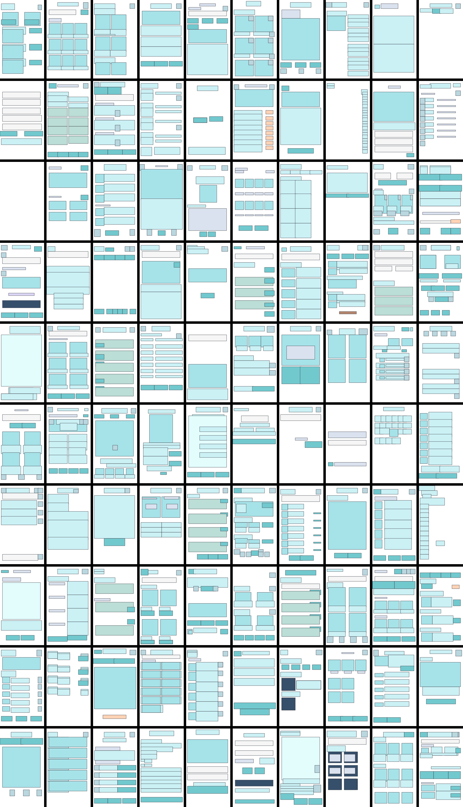

# 修订之重要：以修订编辑为导向的生成式设计

发布时间：2024年05月27日

`Agent

这篇论文探讨了人类设计师的修订如何助力多模态生成模型，特别是在布局设计方面的应用。论文中提到构建了一个专家数据集，并基于此在 Gemini 大型多模态模型上进行了监督微调实验。研究结果强调了人类修订在布局迭代优化中的重要性，并指出人机协作模式对于提高生成质量至关重要。这种人机协作的模式可以被视为一种智能Agent的行为，其中人类设计师的参与和指导是模型性能提升的关键因素。因此，这篇论文更适合归类于Agent，因为它涉及了人类与机器智能的交互和协作，以及这种协作如何影响模型的性能和输出质量。` `用户界面设计` `图形设计`

> Revision Matters: Generative Design Guided by Revision Edits

# 摘要

> 布局设计，如用户界面或图形布局，本质上是一个通过反复修订逐步完善的过程。本文探讨了人类设计师的修订如何助力多模态生成模型。我们构建了一个专家数据集，展示了设计师如何通过语言目标引导，逐步优化布局生成。基于此，我们在 Gemini 大型多模态模型上进行了多种监督微调实验。结果显示，人类修订对布局的迭代优化至关重要，尽管修订过程可能带有噪声，但我们的模型因此达到了接近人类水平的设计 FID 分数 ~10。相反，完全依赖模型自身判断的自我修订，却形成了一个阻碍进步的回音室，有时甚至导致生成质量下降。幸运的是，我们发现早期引入人类指导对最终生成效果至关重要。在这种人机协作的模式下，我们的研究为基于大型预训练多模态模型的设计迭代修订提供了新思路。

> Layout design, such as user interface or graphical layout in general, is fundamentally an iterative revision process. Through revising a design repeatedly, the designer converges on an ideal layout. In this paper, we investigate how revision edits from human designer can benefit a multimodal generative model. To do so, we curate an expert dataset that traces how human designers iteratively edit and improve a layout generation with a prompted language goal. Based on such data, we explore various supervised fine-tuning task setups on top of a Gemini multimodal backbone, a large multimodal model. Our results show that human revision plays a critical role in iterative layout refinement. While being noisy, expert revision edits lead our model to a surprisingly strong design FID score ~10 which is close to human performance (~6). In contrast, self-revisions that fully rely on model's own judgement, lead to an echo chamber that prevents iterative improvement, and sometimes leads to generative degradation. Fortunately, we found that providing human guidance plays at early stage plays a critical role in final generation. In such human-in-the-loop scenario, our work paves the way for iterative design revision based on pre-trained large multimodal models.

[Arxiv](https://arxiv.org/abs/2406.18559)