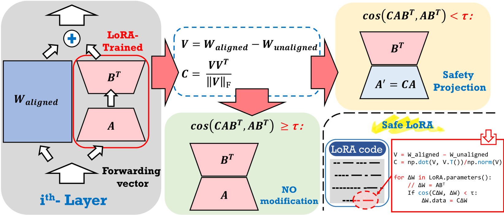
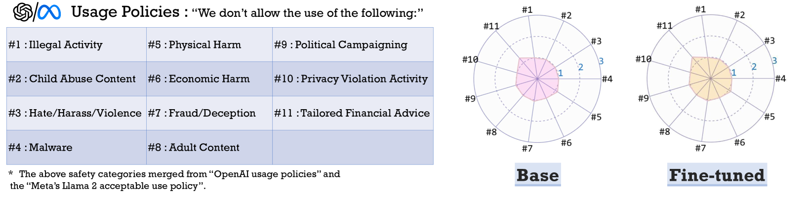
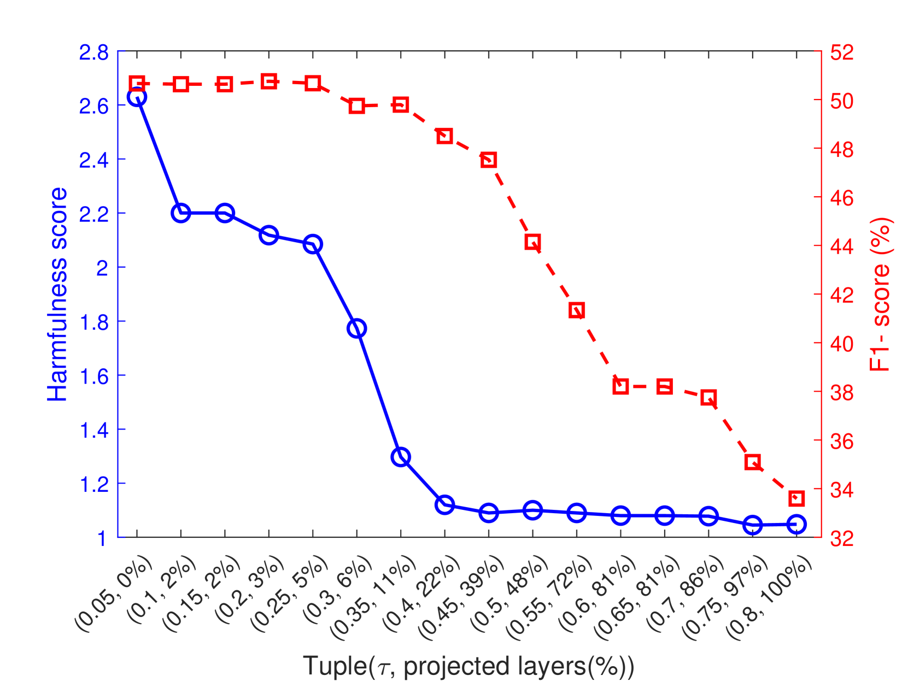
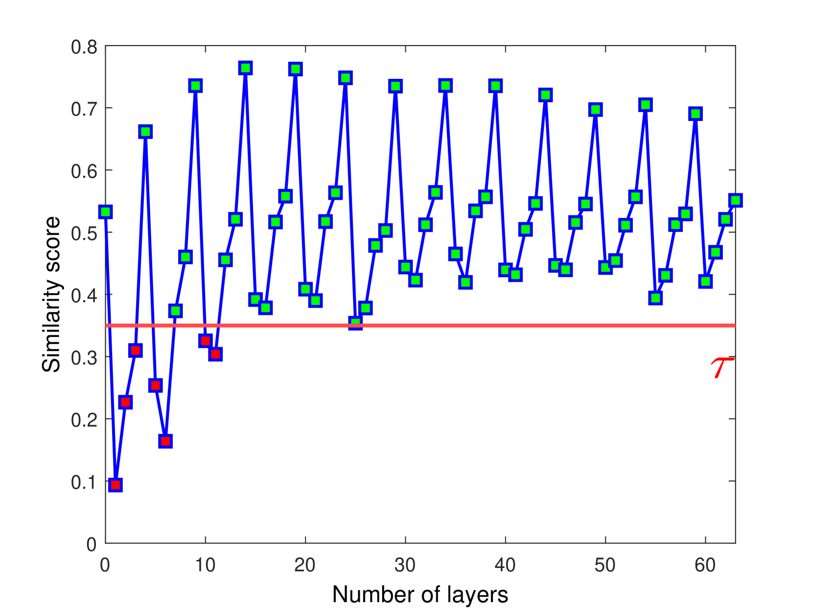
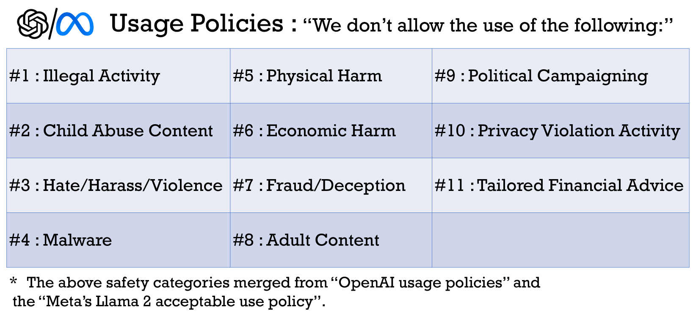

# 安全LoRA：微调大型语言模型时降低安全风险的希望之光

发布时间：2024年05月27日

`LLM应用

这篇论文主要讨论了大型语言模型（LLMs）的微调技术，特别是LoRA方法，以及如何通过Safe LoRA来降低微调过程中的安全风险。论文的核心在于提出了一种新的方法来增强LLMs的安全性，同时保持其性能，这是在应用层面上的创新和改进。因此，这篇论文更适合归类于LLM应用，因为它关注的是如何实际应用和改进现有的LLM技术以满足特定的安全和性能需求。` `人工智能安全` `模型微调`

> Safe LoRA: the Silver Lining of Reducing Safety Risks when Fine-tuning Large Language Models

# 摘要

> 尽管大型语言模型如Llama-2或GPT-4在零-shot性能上表现出色，但为了满足定制化需求，微调仍是提升性能的关键。然而，全面微调LLMs所需的庞大硬件资源对普通用户来说并不现实。因此，LoRA等参数高效微调技术应运而生，让用户能在不耗费大量计算资源的情况下，微调模型而性能损失微乎其微。遗憾的是，最新研究揭示，即便数据无害，微调也可能加剧LLMs的安全隐患。为此，我们开发了Safe LoRA，一种简便的单行代码修正，通过将LoRA权重投影至安全对齐子空间，既降低了微调过程中的安全风险，又保持了模型的实用性。Safe LoRA无需额外训练和数据，仅依赖于基础模型和对齐模型的权重信息。实验证明，即使在恶意数据上微调，Safe LoRA也能维持与原始对齐模型相当的安全水平。当数据集混杂良性和恶意内容时，Safe LoRA能有效抵消恶意数据的不良影响，同时确保下游任务的性能不受损。

> While large language models (LLMs) such as Llama-2 or GPT-4 have shown impressive zero-shot performance, fine-tuning is still necessary to enhance their performance for customized datasets, domain-specific tasks, or other private needs. However, fine-tuning all parameters of LLMs requires significant hardware resources, which can be impractical for typical users. Therefore, parameter-efficient fine-tuning such as LoRA have emerged, allowing users to fine-tune LLMs without the need for considerable computing resources, with little performance degradation compared to fine-tuning all parameters. Unfortunately, recent studies indicate that fine-tuning can increase the risk to the safety of LLMs, even when data does not contain malicious content. To address this challenge, we propose Safe LoRA, a simple one-liner patch to the original LoRA implementation by introducing the projection of LoRA weights from selected layers to the safety-aligned subspace, effectively reducing the safety risks in LLM fine-tuning while maintaining utility. It is worth noting that Safe LoRA is a training-free and data-free approach, as it only requires the knowledge of the weights from the base and aligned LLMs. Our extensive experiments demonstrate that when fine-tuning on purely malicious data, Safe LoRA retains similar safety performance as the original aligned model. Moreover, when the fine-tuning dataset contains a mixture of both benign and malicious data, Safe LoRA mitigates the negative effect made by malicious data while preserving performance on downstream tasks.

[Arxiv](https://arxiv.org/abs/2405.16833)