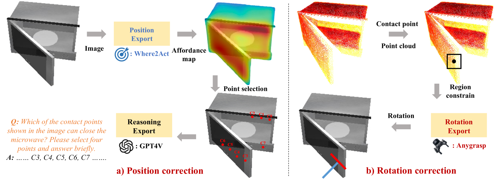
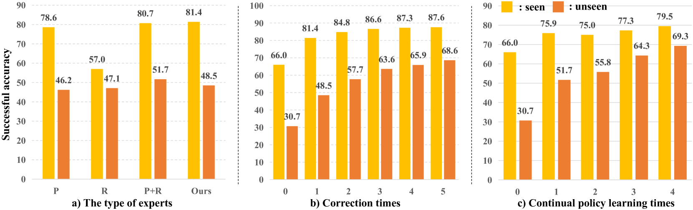

# 端到端机器人操作的自校正多模态大型语言模型

发布时间：2024年05月27日

`Agent

这篇论文主要描述了一个名为自校正（SC）-MLLM的系统，该系统是一个多模态大型语言模型（MLLMs），专门设计用于机器人操作策略的自我纠正。它能够预测末端执行器的姿态，并在执行失败时自主识别和纠正动作错误。此外，该系统还能主动获取专家反馈，并通过连续策略学习提升对不同场景的适应性。这种能力使得SC-MLLM成为一个能够自主执行任务并自我纠正错误的机器人代理，因此将其分类为Agent。` `机器人技术` `自动化`

> Self-Corrected Multimodal Large Language Model for End-to-End Robot Manipulation

# 摘要

> 面对新任务或物体时，机器人操作策略的表现往往不尽如人意。因此，自动检测并自我纠正错误动作的能力对实用机器人系统至关重要。近期，多模态大型语言模型（MLLMs）在视觉指令跟随及多任务推理上展现出潜力。为使MLLMs成为端到端机器人代理，我们开发了自校正（SC）-MLLM，使其不仅能预测末端执行器姿态，还能自主识别并纠正动作错误。我们通过参数高效微调，将姿态预测问题转化为语言建模，使模型在执行失败时能识别并纠正位置和旋转错误，并主动获取专家反馈。基于此，SC-MLLM重新评估失败场景并生成纠正动作。我们还设计了连续策略学习，提升模型对场景的适应性，减少专家干预。实验显示，SC-MLLM在操作精度上大幅超越前代，已知类别提升至79%，新颖类别提升至69%。

> Robot manipulation policies have shown unsatisfactory action performance when confronted with novel task or object instances. Hence, the capability to automatically detect and self-correct failure action is essential for a practical robotic system. Recently, Multimodal Large Language Models (MLLMs) have shown promise in visual instruction following and demonstrated strong reasoning abilities in various tasks. To unleash general MLLMs as an end-to-end robotic agent, we introduce a Self-Corrected (SC)-MLLM, equipping our model not only to predict end-effector poses but also to autonomously recognize and correct failure actions. Specifically, we first conduct parameter-efficient fine-tuning to empower MLLM with pose prediction ability, which is reframed as a language modeling problem. When facing execution failures, our model learns to identify low-level action error causes (i.e., position and rotation errors) and adaptively seeks prompt feedback from experts. Based on the feedback, SC-MLLM rethinks the current failure scene and generates the corrected actions. Furthermore, we design a continuous policy learning method for successfully corrected samples, enhancing the model's adaptability to the current scene configuration and reducing the frequency of expert intervention. To evaluate our SC-MLLM, we conduct extensive experiments in both simulation and real-world settings. SC-MLLM agent significantly improve manipulation accuracy compared to previous state-of-the-art robotic MLLM (ManipLLM), increasing from 57\% to 79\% on seen object categories and from 47\% to 69\% on unseen novel categories.

[Arxiv](https://arxiv.org/abs/2405.17418)