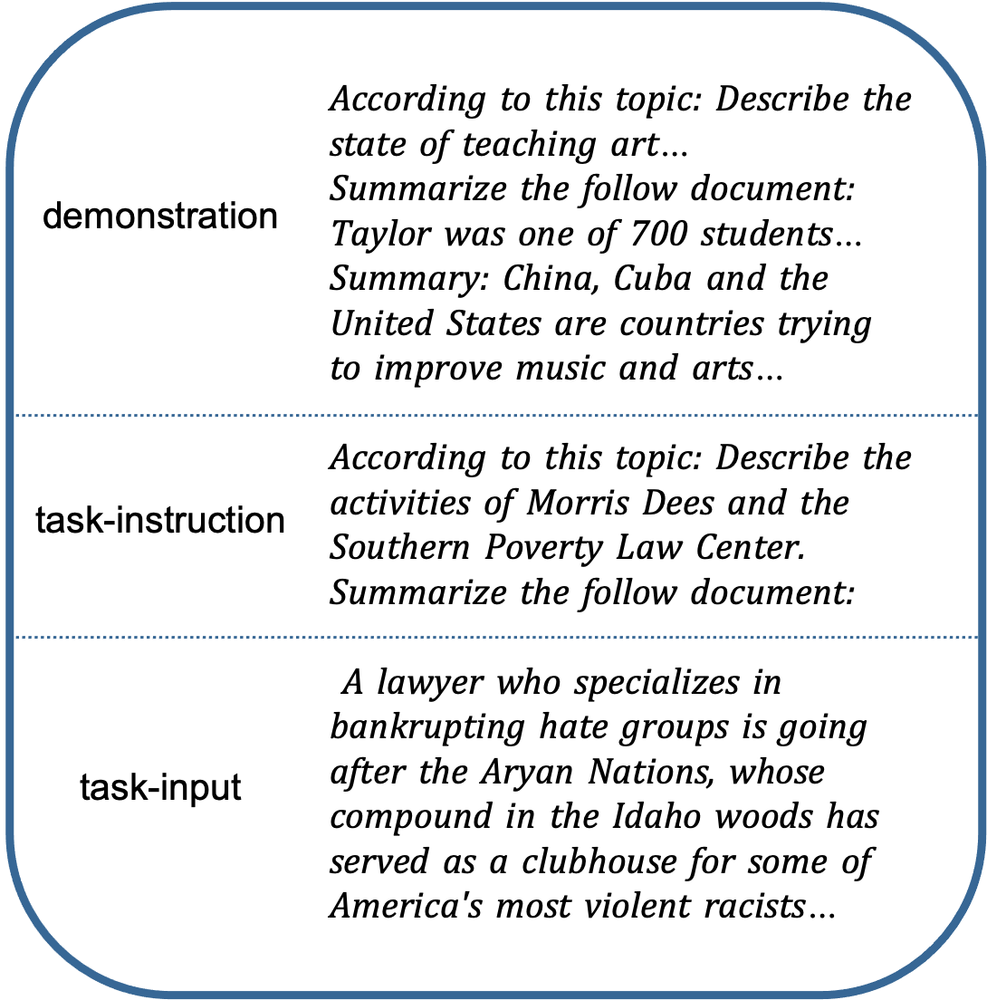
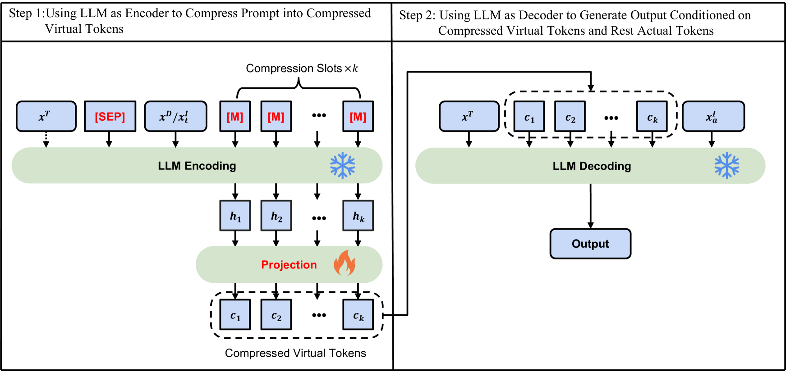
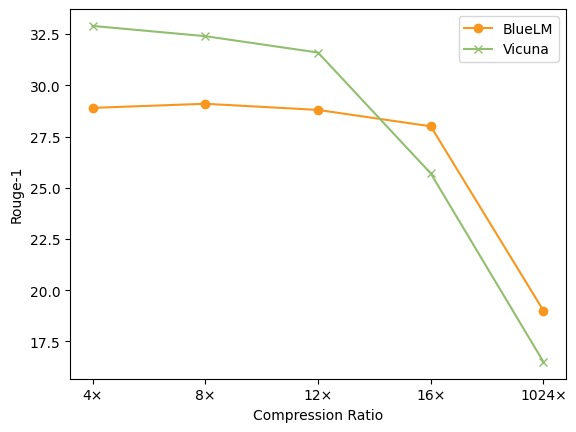

# SelfCP技术：借助冻结的大型语言模型，将冗长提示精简至原长的十二分之一。

发布时间：2024年05月27日

`LLM应用

这篇论文介绍了一种名为SelfCP的新方法，该方法利用大型语言模型（LLMs）自身的语言理解能力来压缩长提示，以降低硬件成本。SelfCP通过两次调用一个冻结的通用LLM来实现这一目标，首先作为编码器压缩提示，然后作为解码器生成响应。这种方法特别适用于需要长输入的任务，如总结，并且可以灵活地部署在不同的LLM架构上。因此，这篇论文属于LLM应用类别，因为它专注于开发和应用LLMs的新技术来解决实际问题。` `模型优化`

> SelfCP: Compressing Long Prompt to 1/12 Using the Frozen Large Language Model Itself

# 摘要

> 在使用大型语言模型（LLMs）时，长提示会带来高昂的硬件成本。不幸的是，许多任务，如总结，必然涉及长输入，而情境学习的普及又极易导致提示长度失控。受LLMs强大的语言理解能力启发，本文提出了SelfCP，一种利用LLM自身将长提示压缩为紧凑虚拟令牌的方法。SelfCP通过两次调用一个冻结的通用LLM实现：首先作为编码器压缩提示，随后作为解码器生成响应。具体操作是，在长提示中插入特殊令牌以指示压缩，并生成k个虚拟令牌。这些虚拟令牌随后与未压缩部分结合，一同输入LLM以生成最终响应。SelfCP不仅支持无条件压缩，也适用于有特定目标的提示压缩，适用于各类任务。由于编码器和解码器保持冻结状态，SelfCP仅包含17M可训练参数，便于在不同LLM架构间灵活部署。我们采用两种LLM架构实现了SelfCP，并在域内和域外任务中进行了测试。结果显示，压缩后的虚拟令牌能有效替代原提示的12倍长度。

> Long prompt leads to huge hardware costs when using Large Language Models (LLMs). Unfortunately, many tasks, such as summarization, inevitably introduce long task-inputs, and the wide application of in-context learning easily makes the prompt length explode. Inspired by the language understanding ability of LLMs, this paper proposes SelfCP, which uses the LLM \textbf{itself} to \textbf{C}ompress long \textbf{P}rompt into compact virtual tokens. SelfCP applies a general frozen LLM twice, first as an encoder to compress the prompt and then as a decoder to generate responses. Specifically, given a long prompt, we place special tokens within the lengthy segment for compression and signal the LLM to generate $k$ virtual tokens. Afterward, the virtual tokens concatenate with the uncompressed prompt and are fed into the same LLM to generate the response. In general, SelfCP facilitates the unconditional and conditional compression of prompts, fitting both standard tasks and those with specific objectives. Since the encoder and decoder are frozen, SelfCP only contains 17M trainable parameters and allows for convenient adaptation across various backbones. We implement SelfCP with two LLM backbones and evaluate it in both in- and out-domain tasks. Results show that the compressed virtual tokens can substitute $12 \times$ larger original prompts effectively

[Arxiv](https://arxiv.org/abs/2405.17052)