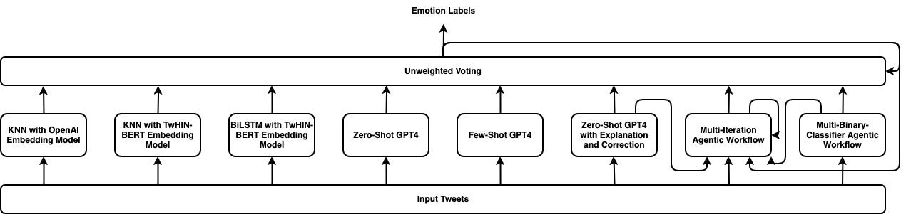
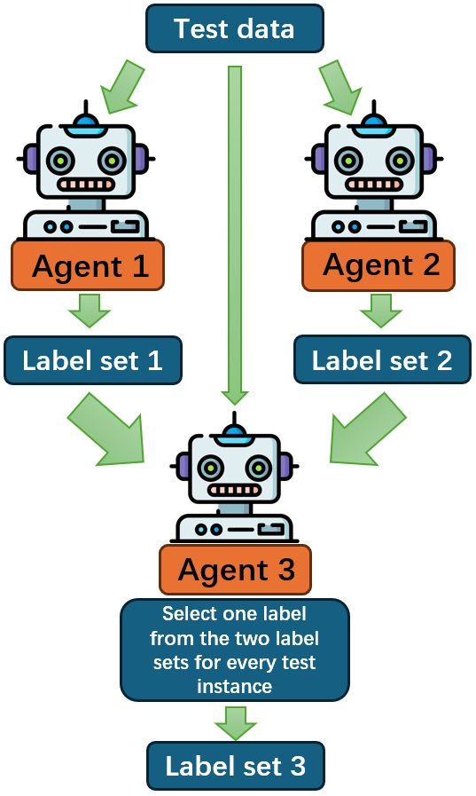

# TEII：借助大型语言模型的思考、解释、交互与迭代，攻克跨语言情感检测难题

发布时间：2024年05月27日

`Agent

这篇论文主要介绍了在跨语言情感检测任务中，作者探索了基于大型语言模型（LLM）的微调、零样本及小样本学习策略，并创新性地提出了多迭代代理工作流和多二元分类器代理工作流。这些代理工作流可以被视为Agent，因为它们在处理跨语言情感检测任务时，能够自主地进行决策和执行任务。因此，这篇论文更适合归类到Agent分类中。` `情感分析` `跨语言处理`

> TEII: Think, Explain, Interact and Iterate with Large Language Models to Solve Cross-lingual Emotion Detection

# 摘要

> 跨语言情感检测让我们得以洞察全球趋势、民意和社会动态。在跨语言情感检测可解释性（EXALT）挑战中，我们的系统在情感检测子任务上以0.6046的F1分数脱颖而出，超越基线0.16分以上，位列第二。我们探索了基于大型语言模型（LLM）的微调、零样本及小样本学习策略，以及非LLM技术的嵌入式BiLSTM和KNN方法。同时，我们创新性地提出了多迭代代理工作流和多二元分类器代理工作流。实验表明，LLM方法在多语言情感检测中表现出色，而将所有实验模型集成的策略更是将F1分数推向新高。

> Cross-lingual emotion detection allows us to analyze global trends, public opinion, and social phenomena at scale. We participated in the Explainability of Cross-lingual Emotion Detection (EXALT) shared task, achieving an F1-score of 0.6046 on the evaluation set for the emotion detection sub-task. Our system outperformed the baseline by more than 0.16 F1-score absolute, and ranked second amongst competing systems. We conducted experiments using fine-tuning, zero-shot learning, and few-shot learning for Large Language Model (LLM)-based models as well as embedding-based BiLSTM and KNN for non-LLM-based techniques. Additionally, we introduced two novel methods: the Multi-Iteration Agentic Workflow and the Multi-Binary-Classifier Agentic Workflow. We found that LLM-based approaches provided good performance on multilingual emotion detection. Furthermore, ensembles combining all our experimented models yielded higher F1-scores than any single approach alone.

[Arxiv](https://arxiv.org/abs/2405.17129)