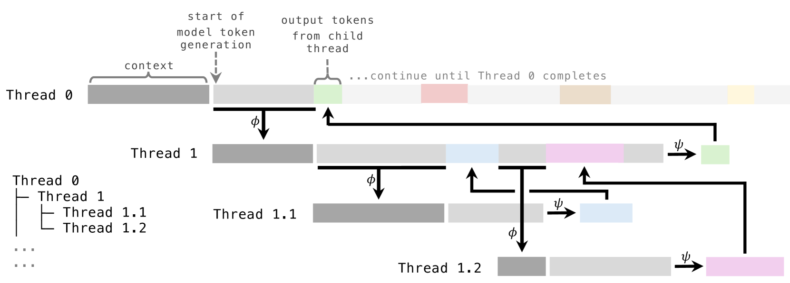
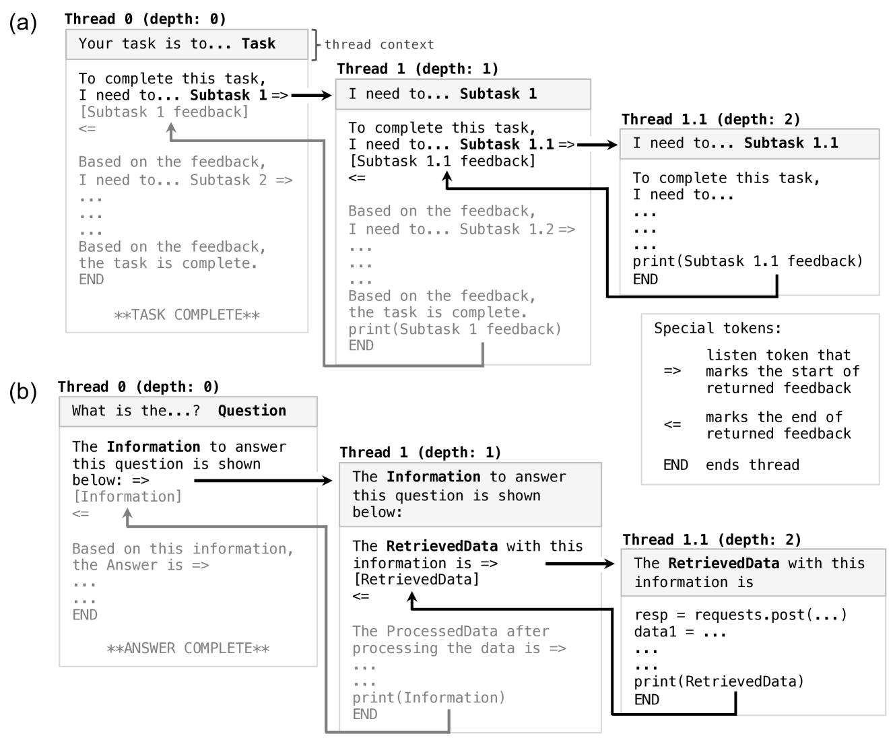
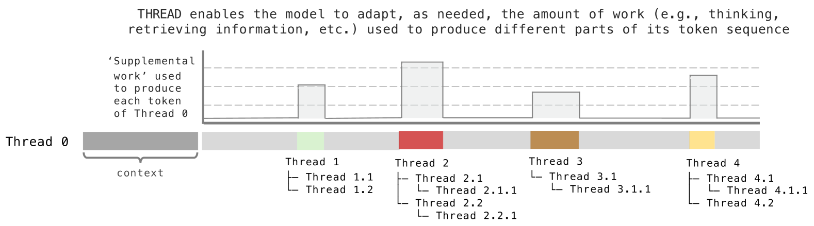
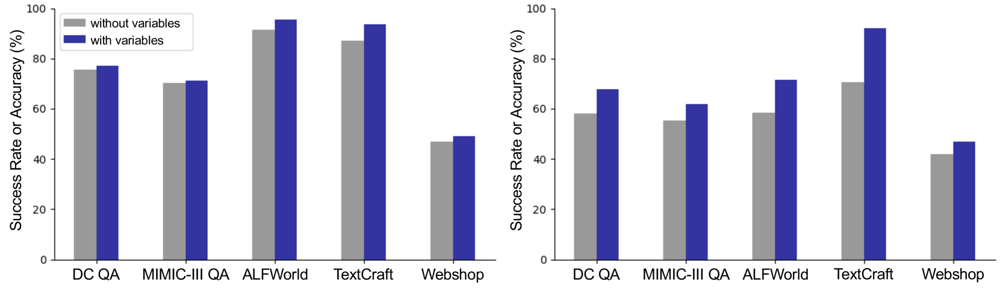
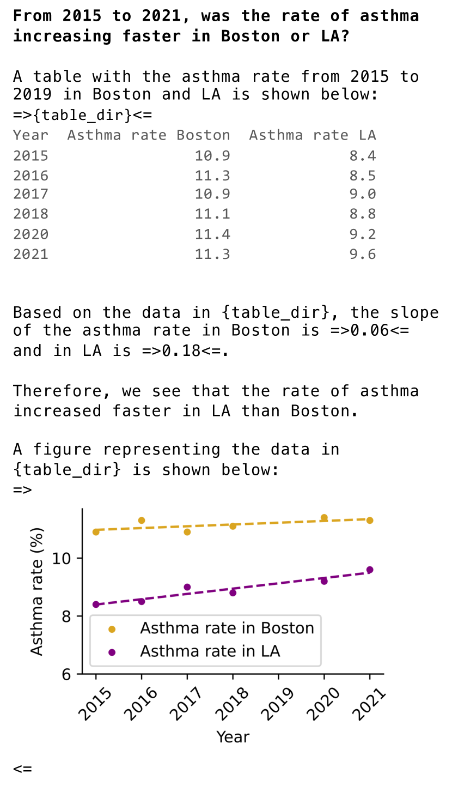

# 探讨递归生成：深入思考的线索

发布时间：2024年05月27日

`Agent

这篇论文介绍了一种名为“递归动态思考”（ThReaD）的新机制，该机制通过模拟线程的动态衍生和信息反馈过程，增强了大型语言模型（LLMs）处理复杂任务的能力。这种机制使得模型能够根据任务需求灵活调整处理步骤，并将复杂任务分解为更简单的子问题，由独立的子线程处理。这种自主决策和任务分配的能力，以及在多个测试中展现的卓越性能，表明该机制具有Agent的特性，即能够自主执行任务并适应不同的环境和挑战。因此，这篇论文应归类为Agent。` `人工智能` `问答系统`

> THREAD: Thinking Deeper with Recursive Spawning

# 摘要

> 大型语言模型（LLMs）虽在多场景下表现出色，但面对日益增长的数据量和复杂性，仍显力不从心。为此，我们创新性地提出了“递归动态思考”（ThReaD）机制。THREAD将模型生成过程比喻为一条执行线程，这条线程能根据上下文自主决定是完成任务还是动态衍生新线程。通过这种衍生，模型可以将思考、信息检索等任务分配给子线程，子线程仅向父线程反馈必要的信息。这一机制赋予了模型根据任务需求灵活调整中间处理步骤的能力。我们在LLM的任务解决和问答场景中应用了THREAD，其动态线程特性使得模型能够将复杂任务或问题层层分解，直至化为可由独立子线程轻松解决的简单子问题。THREAD在多个测试中展现了卓越性能，尤其是在GPT-4和GPT-3.5上，不仅在ALFWorld、TextCraft和WebShop等基准上取得了顶尖成绩，还成功应对了DataCommons QA和MIMIC-III ICU QA两个新挑战。更令人瞩目的是，THREAD在Llama-3-8b和CodeLlama-7b等小型模型上，相比现有技术提升了10%至50%的性能。

> Large language models (LLMs) have shown impressive capabilities across diverse settings, but still struggle as the length and complexity of the context increases. To address this challenge, we propose Thinking Recursively and Dynamically (ThReaD). THREAD frames model generation as a thread of execution that, based on the context, can run to completion or dynamically spawn new threads. By spawning, threads can offload work (e.g., thinking, retrieving information) to child threads, which only return tokens needed for the parent thread to do its work. In effect, this enables the model to adapt, as needed, the amount of intermediate work used to produce tokens. We apply THREAD in the settings of LLM task solving and question answering, where the dynamic threading allows the model to recursively decompose the given task or question into progressively simpler sub-problems that can be solved by separate child threads. We test THREAD, implemented using a few-shot learning approach, on diverse benchmarks for agent tasks and data-grounded question answering. THREAD achieves state-of-the-art performance with GPT-4 and GPT-3.5 on these benchmarks, including ALFWorld, TextCraft, and WebShop, along with two new benchmarks, DataCommons QA and MIMIC-III ICU QA. In addition, THREAD outperforms existing frameworks by 10% to 50% absolute points with smaller models, including Llama-3-8b and CodeLlama-7b.

[Arxiv](https://arxiv.org/abs/2405.17402)