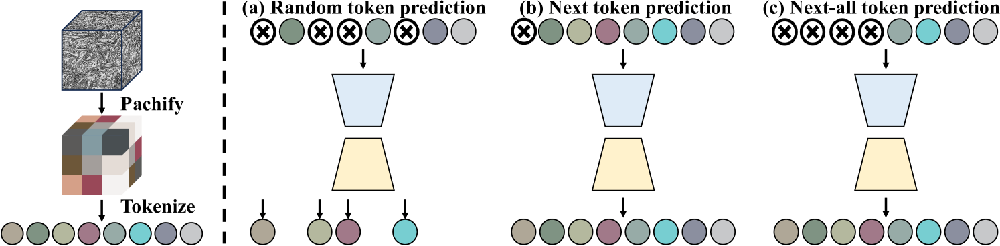
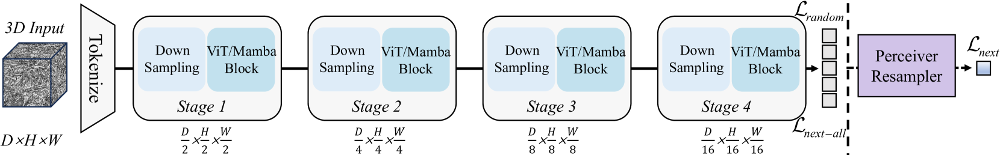
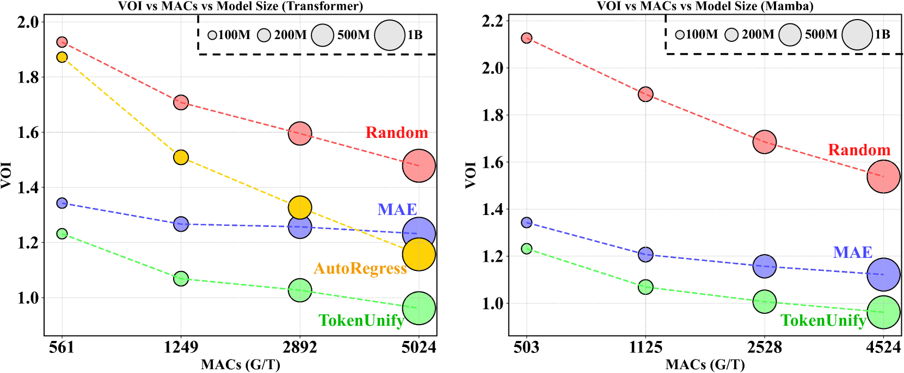
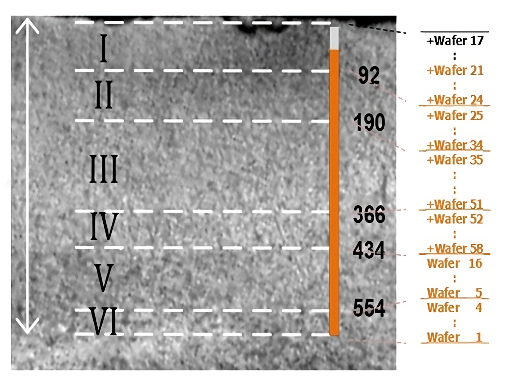
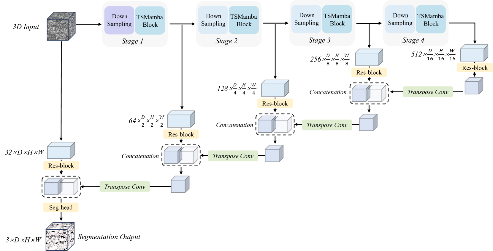

# TokenUnify：一种利用混合令牌预测进行高效自回归视觉预训练的新方法，旨在提升模型的可扩展性。

发布时间：2024年05月27日

`LLM应用

这篇论文介绍了一种新的预训练方法**TokenUnify**，该方法旨在解决视觉任务中自回归下一令牌预测的局限性，特别是在图像数据的非序列特性方面。通过融合不同的预测技术，TokenUnify能够有效缓解累积错误，并在视觉自回归任务中提供改进。此外，论文还介绍了一个大规模的电子显微镜图像数据集，用于支持长序列空间相关性的研究，并在神经元分割任务上展示了显著的性能提升。这种方法的应用和实验结果表明，它在连接语言和视觉模型预训练策略方面具有重要意义，因此属于LLM应用类别。` `神经科学` `图像处理`

> TokenUnify: Scalable Autoregressive Visual Pre-training with Mixture Token Prediction

# 摘要

> 自回归下一令牌预测虽为大型语言模型的标准预训练方法，但在视觉任务中因图像数据的非序列特性而受限，易产生累积错误。多数视觉模型依赖基于掩码自编码器（MAE）的预训练，却遭遇可扩展性难题。为此，我们创新性地提出了**TokenUnify**预训练方法，融合随机、下一及下一全令牌预测技术。理论分析表明，TokenUnify能有效缓解视觉自回归中的累积错误。结合TokenUnify，我们构建了一个包含超过1.2亿标注体素的大规模、超高分辨率电子显微镜（EM）图像数据集，专为长序列空间相关性设计，成为当前最大的神经元分割数据集，并设立了实验验证的统一标准。利用Mamba网络在长序列建模上的天然优势，TokenUnify不仅简化计算，更在EM神经元分割任务上实现了45%的性能飞跃，超越现有技术。此外，TokenUnify在可扩展性上显著优于MAE及传统自回归方法，成功连接了语言与视觉模型预训练策略的鸿沟。相关代码已公开于\url{https://github.com/ydchen0806/TokenUnify}。

> Autoregressive next-token prediction is a standard pretraining method for large-scale language models, but its application to vision tasks is hindered by the non-sequential nature of image data, leading to cumulative errors. Most vision models employ masked autoencoder (MAE) based pretraining, which faces scalability issues. To address these challenges, we introduce \textbf{TokenUnify}, a novel pretraining method that integrates random token prediction, next-token prediction, and next-all token prediction. We provide theoretical evidence demonstrating that TokenUnify mitigates cumulative errors in visual autoregression. Cooperated with TokenUnify, we have assembled a large-scale electron microscopy (EM) image dataset with ultra-high resolution, ideal for creating spatially correlated long sequences. This dataset includes over 120 million annotated voxels, making it the largest neuron segmentation dataset to date and providing a unified benchmark for experimental validation. Leveraging the Mamba network inherently suited for long-sequence modeling on this dataset, TokenUnify not only reduces the computational complexity but also leads to a significant 45\% improvement in segmentation performance on downstream EM neuron segmentation tasks compared to existing methods. Furthermore, TokenUnify demonstrates superior scalability over MAE and traditional autoregressive methods, effectively bridging the gap between pretraining strategies for language and vision models. Code is available at \url{https://github.com/ydchen0806/TokenUnify}.

[Arxiv](https://arxiv.org/abs/2405.16847)