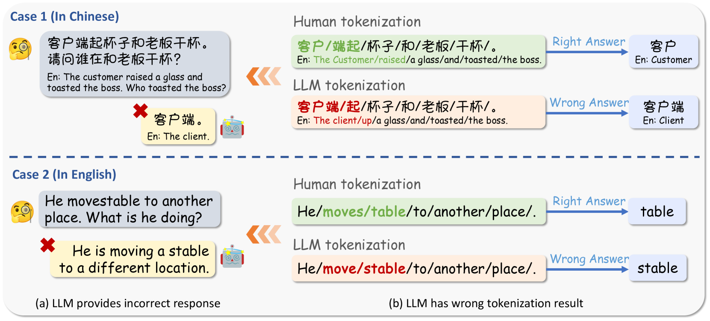
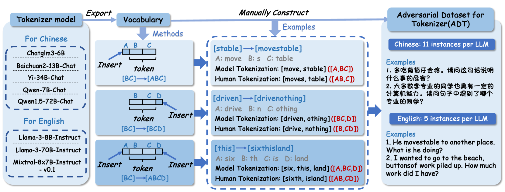
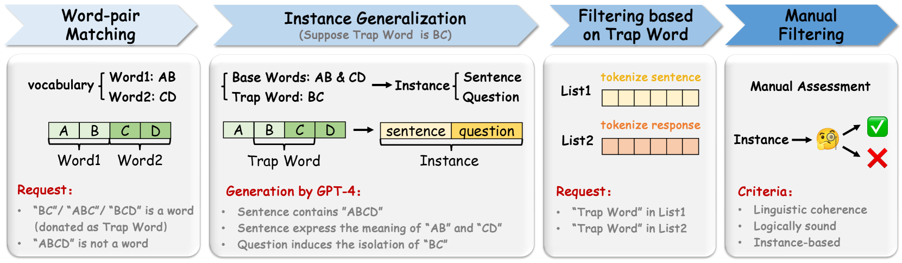

# 分词的重要性！通过挑战大型语言模型的分词机制来削弱其性能

发布时间：2024年05月27日

`LLM理论

这篇论文主要探讨了大型语言模型（LLMs）在tokenization过程中的问题，并创建了一个对抗性数据集ADT来测试和挑战这些模型的tokenization能力。研究的重点在于理解和改进LLMs的内部处理机制，即tokenization过程，这是LLMs理论研究的一部分，而非直接应用于实际场景或讨论模型的安全性。因此，它更符合LLM理论分类。` `数据集构建`

> Tokenization Matters! Degrading Large Language Models through Challenging Their Tokenization

# 摘要

> 大型语言模型（LLMs）在语言理解和生成上表现出色，但它们在特定查询上的回答往往不够准确。这一问题源于LLMs必须进行的tokenization步骤，这是其固有的限制。错误的tokenization阻碍了LLMs对输入的精确理解，导致输出不尽人意。为此，我们创建了一个名为$\textbf{ADT（Adversarial Dataset for Tokenizer）}$的对抗性数据集，旨在通过各种开源LLMs的词汇来测试其tokenization能力。ADT包括人工构建的ADT-Human和自动生成的ADT-Auto两个子集。实证研究表明，ADT能有效挑战包括GPT-4o、Llama-3、Qwen2.5-max在内的领先LLMs的tokenization，显著降低其性能。我们的自动数据生成方法高效且稳健，适用于所有开源LLMs。据我们所知，本研究首次探讨了LLMs在token分割上的脆弱性，为通过优化tokenization过程和算法提升LLMs能力提供了新的研究方向。

> Large Language Models (LLMs) have shown remarkable capabilities in language understanding and generation. Nonetheless, it was also witnessed that LLMs tend to produce inaccurate responses to specific queries. This deficiency can be traced to the tokenization step LLMs must undergo, which is an inevitable limitation inherent to all LLMs. In fact, incorrect tokenization is the critical point that hinders LLMs in understanding the input precisely, thus leading to unsatisfactory output. To demonstrate this flaw of LLMs, we construct an adversarial dataset, named as $\textbf{ADT (Adversarial Dataset for Tokenizer)}$, which draws upon the vocabularies of various open-source LLMs to challenge LLMs' tokenization. ADT consists of two subsets: the manually constructed ADT-Human and the automatically generated ADT-Auto. Our empirical results reveal that our ADT is highly effective on challenging the tokenization of leading LLMs, including GPT-4o, Llama-3, Qwen2.5-max and so on, thus degrading these LLMs' capabilities. Moreover, our method of automatic data generation has been proven efficient and robust, which can be applied to any open-source LLMs. To the best of our knowledge, our study is the first to investigating LLMs' vulnerability in terms of challenging their token segmentation, which will shed light on the subsequent research of improving LLMs' capabilities through optimizing their tokenization process and algorithms.

[Arxiv](https://arxiv.org/abs/2405.17067)