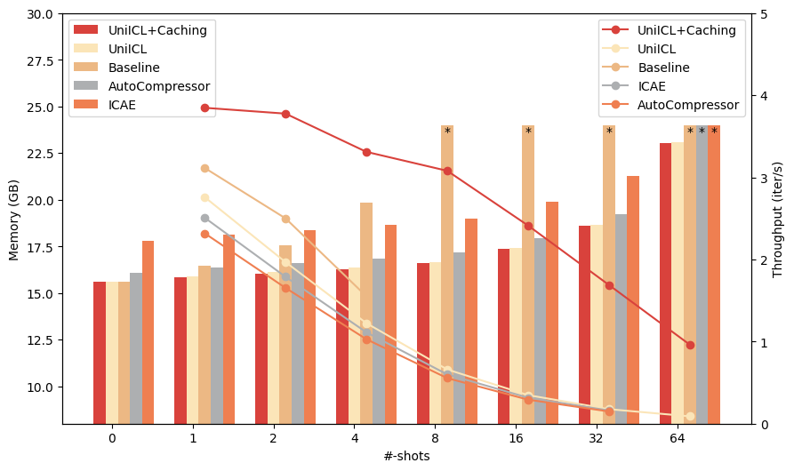
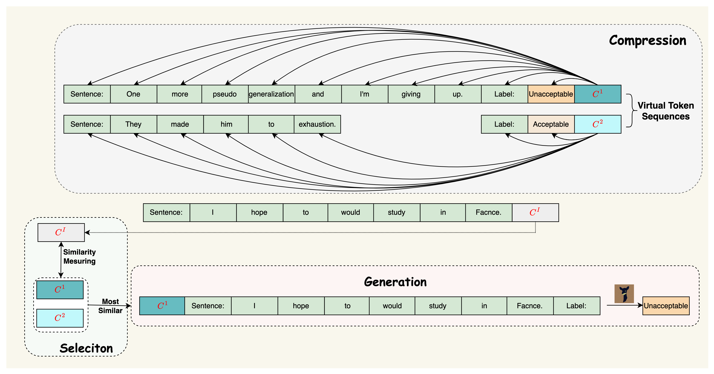
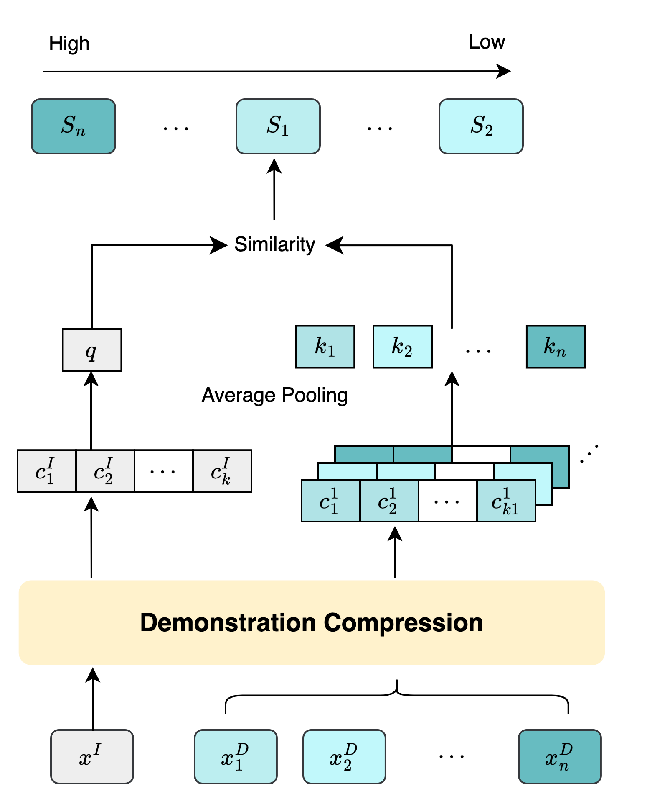
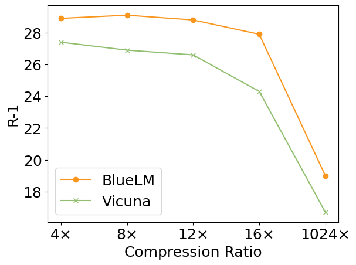

# 整合演示选择与压缩，优化情境学习策略

发布时间：2024年05月27日

`LLM应用

这篇论文介绍了一种名为 UniICL 的框架，该框架通过单一冻结的 LLM（大型语言模型）来整合演示选择、压缩及响应生成。这种方法特别关注于提高 ICL（In-Context Learning）的效率和性能，通过将演示和推理文本转化为虚拟令牌，并利用潜在空间的语义相似度来精选演示。此外，UniICL 在参数效率上表现出色，仅有 17M 可训练参数，并在实验中展示了其在不同任务和场景下的有效性。因此，这篇论文属于 LLM 应用类别，因为它专注于优化和应用 LLM 技术以解决实际问题。` `机器学习`

> Unifying Demonstration Selection and Compression for In-Context Learning

# 摘要

> ICL 使 LLMs 在多场景中展现出卓越的涌现能力，但引入演示往往导致提示长度剧增，给硬件带来压力。随机演示在 ICL 中的提升有限，因此需要从候选中精选演示。以往研究通过额外模块进行演示压缩或选择。本文提出的 UniICL 框架，通过单一冻结 LLM，整合了演示选择、压缩及响应生成。UniICL 先将演示与推理文本转化为虚拟令牌，再通过潜在空间的语义相似度精选演示，最后利用同一 LLM 生成响应。UniICL 参数高效，仅含 17M 可训练参数。实验覆盖了生成与理解任务的丰富与有限演示场景，证明了 UniICL 能有效整合 12 倍压缩、演示选择，并将 ICL 性能从 4-shot 提升至 64-shot，在 IMDb 上仅需 24 GB CUDA 分配。

> In-context learning (ICL) facilitates large language models (LLMs) exhibiting spectacular emergent capabilities in various scenarios. Unfortunately, introducing demonstrations easily makes the prompt length explode, bringing a significant burden to hardware. In addition, random demonstrations usually achieve limited improvements in ICL, necessitating demonstration selection among accessible candidates. Previous studies introduce extra modules to perform demonstration compression or selection independently. In this paper, we propose an ICL framework UniICL, which Unifies demonstration selection and compression, and final response generation via a single frozen LLM. Specifically, UniICL first projects actual demonstrations and inference text inputs into short virtual tokens, respectively. Then, virtual tokens are applied to select suitable demonstrations by measuring semantic similarity within latent space among candidate demonstrations and inference input. Finally, inference text inputs together with selected virtual demonstrations are fed into the same frozen LLM for response generation. Notably, UniICL is a parameter-efficient framework that only contains 17M trainable parameters originating from the projection layer. We conduct experiments and analysis over in- and out-domain datasets of both generative and understanding tasks, encompassing ICL scenarios with plentiful and limited demonstration candidates. Results show that UniICL effectively unifies $12 \times$ compression, demonstration selection, and response generation, efficiently scaling up the baseline from 4-shot to 64-shot ICL in IMDb with 24 GB CUDA allocation

[Arxiv](https://arxiv.org/abs/2405.17062)