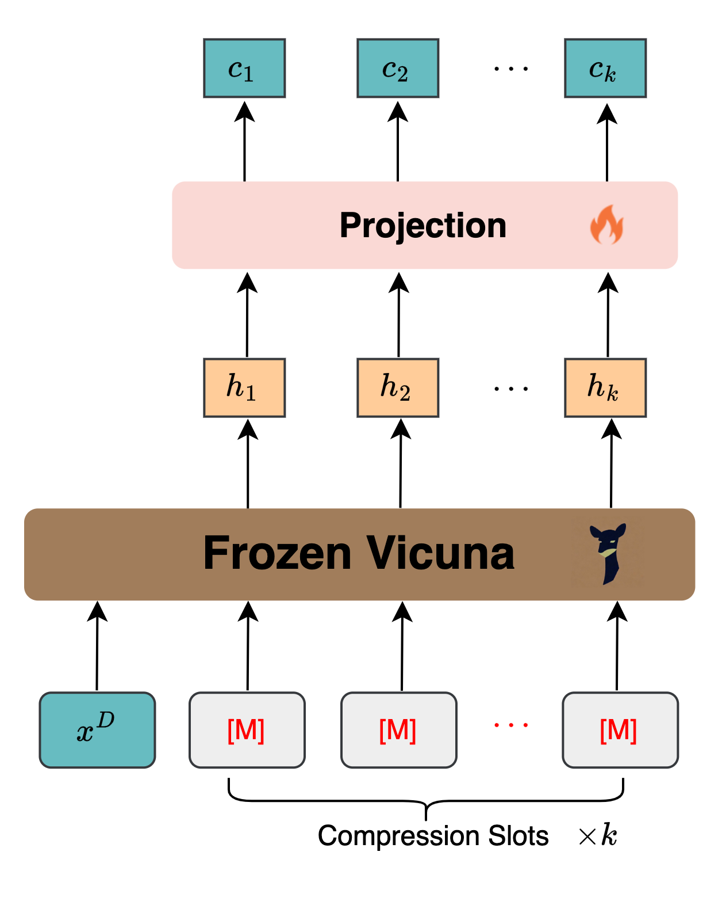
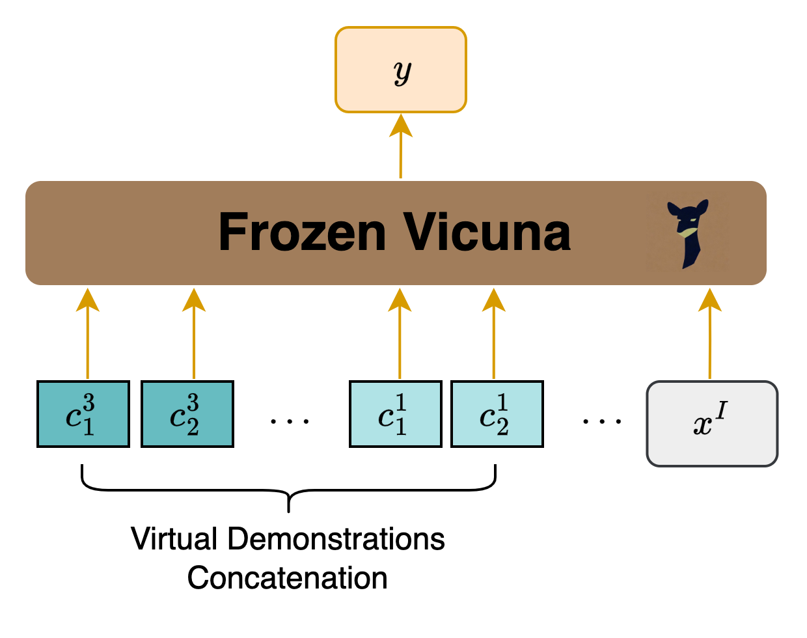
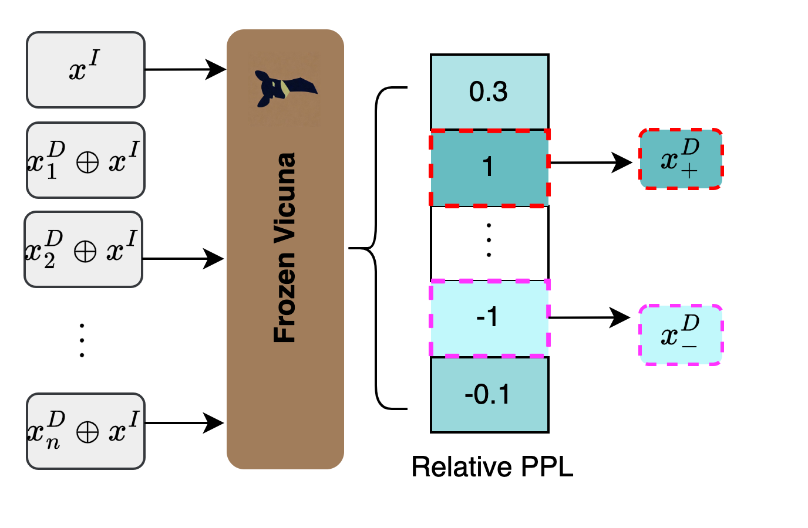

# 整合演示选择与压缩，优化情境学习策略

发布时间：2024年05月27日

`Agent

理由：这篇论文介绍了一个名为 UniICL 的框架，该框架通过单一冻结的 LLM（大型语言模型）来处理演示选择、压缩和响应生成，从而在多场景中提升 LLMs 的能力。这个框架可以被视为一个智能代理（Agent），因为它能够自主地处理输入数据，选择合适的演示，并生成响应，而无需额外的模块。此外，论文中提到的 UniICL 框架的高效性和经济性，以及其在多任务和多数据集上的实验验证，都表明它是一个能够在不同场景中自主执行任务的智能系统。因此，将其归类为Agent是合适的。` `模型优化`

> Unifying Demonstration Selection and Compression for In-Context Learning

# 摘要

> ICL 赋予 LLMs 在多场景中展现卓越能力，但演示的引入常导致提示长度剧增，增加硬件负担。随机演示在 ICL 中的提升有限，需在候选中精选。以往研究多依赖额外模块进行演示压缩或选择。本文提出的 UniICL 框架，通过单一冻结 LLM，巧妙融合演示选择、压缩与响应生成。UniICL 先将演示与输入文本映射至虚拟短令牌，再通过潜在空间的语义相似度筛选合适演示，最终与输入一同送入 LLM 生成响应。此框架仅含17M参数，高效且经济。实验覆盖多任务、多数据集，验证了 UniICL 在丰富与有限演示场景下的高效性，成功将 ICL 从4-shot 扩展至64-shot，在 IMDb 上仅需24 GB CUDA 资源。

> In-context learning (ICL) facilitates large language models (LLMs) exhibiting spectacular emergent capabilities in various scenarios. Unfortunately, introducing demonstrations easily makes the prompt length explode, bringing a significant burden to hardware. In addition, random demonstrations usually achieve limited improvements in ICL, necessitating demonstration selection among accessible candidates. Previous studies introduce extra modules to perform demonstration compression or selection independently. In this paper, we propose an ICL framework UniICL, which Unifies demonstration selection and compression, and final response generation via a single frozen LLM. Specifically, UniICL first projects actual demonstrations and inference text inputs into short virtual tokens, respectively. Then, virtual tokens are applied to select suitable demonstrations by measuring semantic similarity within latent space among candidate demonstrations and inference input. Finally, inference text inputs together with selected virtual demonstrations are fed into the same frozen LLM for response generation. Notably, UniICL is a parameter-efficient framework that only contains 17M trainable parameters originating from the projection layer. We conduct experiments and analysis over in- and out-domain datasets of both generative and understanding tasks, encompassing ICL scenarios with plentiful and limited demonstration candidates. Results show that UniICL effectively unifies $12 \times$ compression, demonstration selection, and response generation, efficiently scaling up the baseline from 4-shot to 64-shot ICL in IMDb with 24 GB CUDA allocation

[Arxiv](https://arxiv.org/abs/2405.17062)