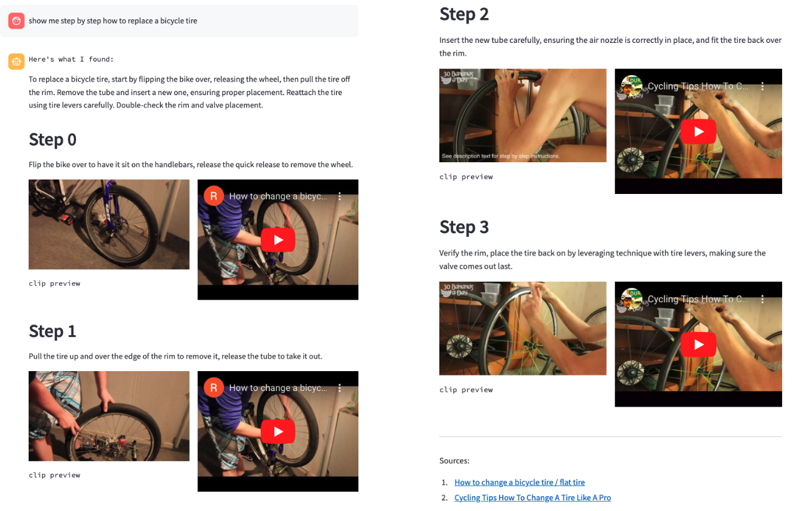
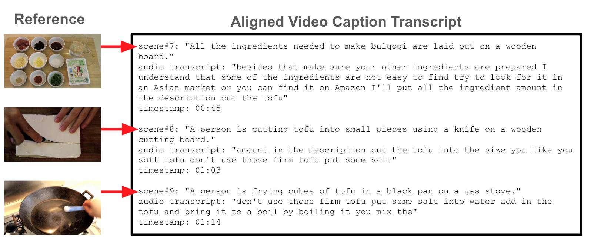
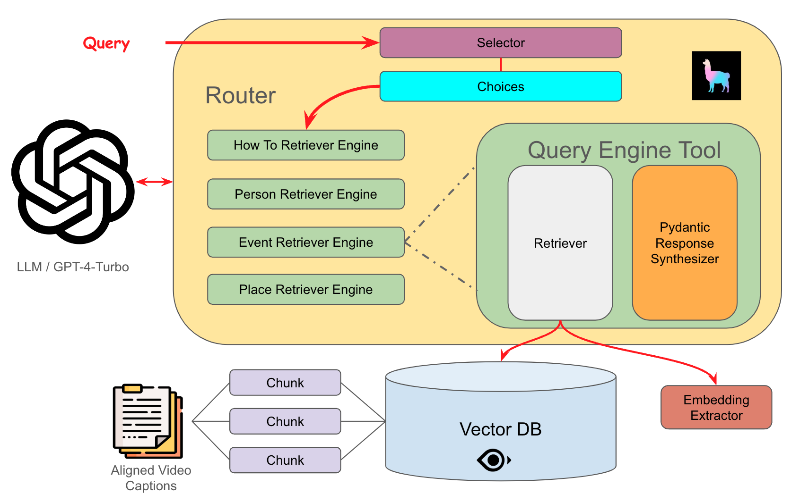

# 利用对齐视频字幕，实现视频内容的丰富检索与增强生成

发布时间：2024年05月27日

`RAG

该论文摘要描述了一种新颖的方法，即将“对齐的视觉标题”融入基于RAG（Retrieval-Augmented Generation）的聊天助手系统中。这种方法利用视觉标题来描述视频内容，并将其与大型语言模型（LLM）结合，以减少多模态LLM上下文空间的占用。此外，论文还提到了创建数据集和制定自动评估流程，这些都是为了促进RAG任务的发展。因此，这篇论文主要关注的是RAG技术在聊天助手系统中的应用，属于RAG分类。` `视频处理` `聊天助手`

> Video Enriched Retrieval Augmented Generation Using Aligned Video Captions

# 摘要

> 本研究提出了一种新颖的方法，即利用“对齐的视觉标题”将视频信息融入基于RAG的聊天助手系统。这些标题不仅能精准描述视频的视听内容，还因其文本形式而易于与LLM结合，且相比直接插入视频帧，它们占用更少的多模态LLM上下文空间。此外，通过微调或特定提示，视觉标题能灵活适应不同需求。为了促进该领域的发展，我们创建了一个数据集，并制定了针对RAG任务的自动评估流程。

> In this work, we propose the use of "aligned visual captions" as a mechanism for integrating information contained within videos into retrieval augmented generation (RAG) based chat assistant systems. These captions are able to describe the visual and audio content of videos in a large corpus while having the advantage of being in a textual format that is both easy to reason about & incorporate into large language model (LLM) prompts, but also typically require less multimedia content to be inserted into the multimodal LLM context window, where typical configurations can aggressively fill up the context window by sampling video frames from the source video. Furthermore, visual captions can be adapted to specific use cases by prompting the original foundational model / captioner for particular visual details or fine tuning. In hopes of helping advancing progress in this area, we curate a dataset and describe automatic evaluation procedures on common RAG tasks.

[Arxiv](https://arxiv.org/abs/2405.17706)